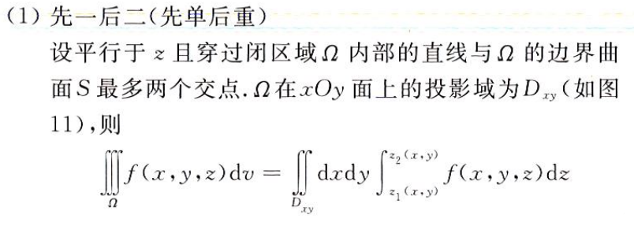
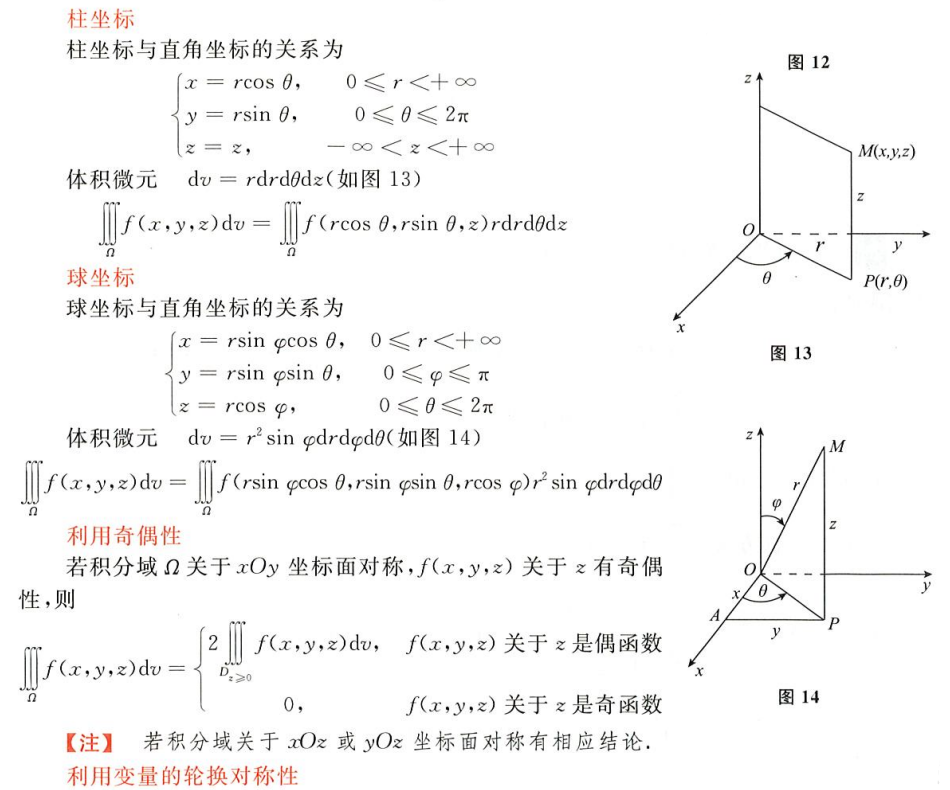
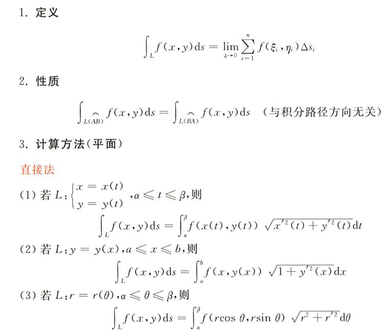
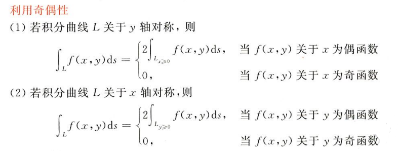
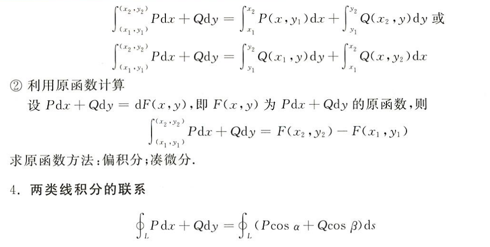
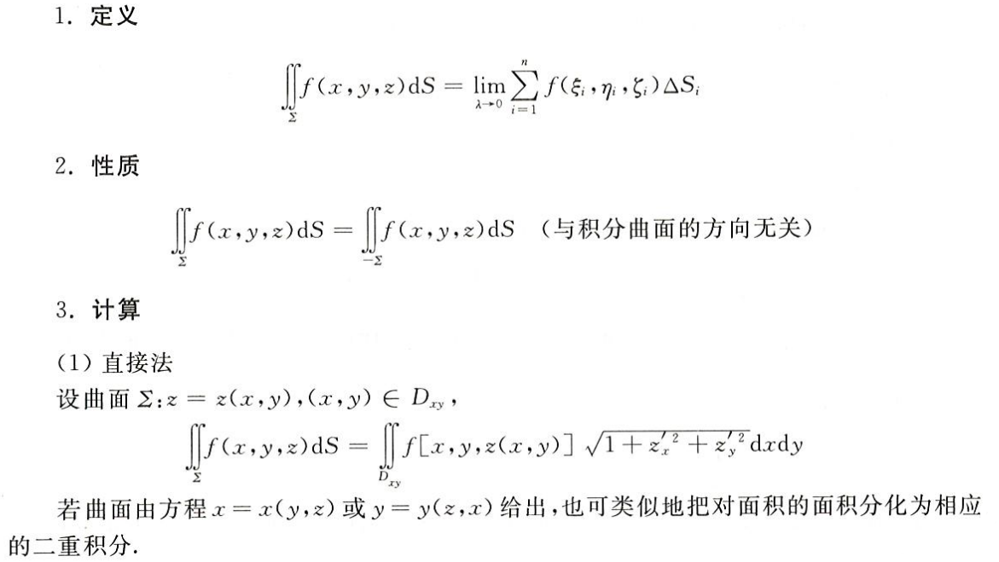
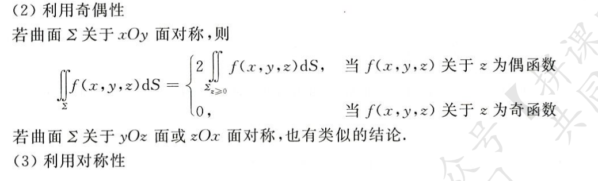
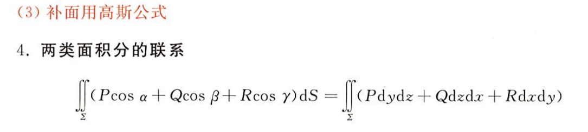

## 多元函数的极限和连续

### 二元函数定义

`z`为一个以`(x,y)`为自变量的二元函数，`(x,y)`指平面上的一个点，`D`为一个点集（可以视作一块面积），`f(x,y)`的值即为在点`(x,y)`处的高
$$
z = f(x,y)\quad(x, y)\in D
$$
通常`z`表示三维空间的一个曲面，这个曲面在二维空间`x-y`直角坐标系上的投影即为点集`D`

### 二元函数的极限和连续

当下式成立时
$$
|\lim_{x\rightarrow x_0,\,y\rightarrow y_0}f(x,y) - A| < \epsilon
$$
则说二元函数`f(x,y)`在`(x0,y0)`的极限为`A`

在一元函数中，对某点的极限，有左极限和右极限之分，即从左侧和右侧逼近该点的极限值，只有当二者相等时，我们说该点的极限值存在

相同的，对于二元函数，我们同样有着这种要求，但因为自变量由一维升至二维，逼近的方向从“左右”变成平面上的“四面八方”，即可以从直角坐标系的任一角度进行逼近，比如
$$
\lim_{x\rightarrow 0,\,y=x^2}\quad
\lim_{y\rightarrow 0,\,x=y^3}\quad
\lim_{x\rightarrow 0,\,y=ln(x+1)}
$$
只有当所有方向逼近`(x0,y0)`的极限均相等时，才可以说该二重极限存在

在实际做题时，若找不到一般方法证其全相等，就找两条不同的路径证明其重极限不存在😋

二元函数的连续即指其极限等于该点的函数值，当然，大前提是二重极限得存在（极限不存在不可能连续）
$$
\lim_{x\rightarrow x_0\,y\rightarrow y_0}f(x,y) = f(x_0, y_0)
$$
简而言之

- 重极限不存在，一定不连续
- 两条路径的同点极限不同，重极限不存在

## 多元函数的微分

### 二元函数的偏导数与全微分

连续、偏导和微分的关系

二元函数连续即指：其在点`(x0,y0)`的极限值等于函数值

二元函数偏导存在即指：其在`lim x->x0`处极限存在（无论 y 取值如何），y 的偏导同理

二元函数的全微分指以下极限存在
$$
\lim_{△x->0,\,△y->0} \frac{f(x_0+△x, y_0+△y)-f(x_0,y_0)-A△x-B△y}{\sqrt{x^2+y^2}}
$$
即表示分子与分母同阶，其中`A,B`为二元函数`f`的偏导数
$$
A = \frac{∂f}{∂x}\quad B = \frac{∂f}{∂y}
$$
由全微分的条件可知：只有当两个偏导数均存在，且原二元函数在该店连续，且上述分式极限存在时，才可以说二元函数可微

也就是说，二元函数连续，或偏导数均存在，是其可微的必要条件，但不充分

注意，该极限存在等价于二元函数的偏导数二阶可导，即下面两个偏导存在
$$
\frac{∂^2f}{∂x^2}\quad \frac{∂^2f}{∂y^2}
$$

### 复合函数的偏导数与全微分

对于二元函数复合一元函数
$$
\frac{dz}{dt} = \frac{∂z}{∂u}\frac{du}{dt} + \frac{∂z}{∂v}\frac{dv}{dt}
$$
对于二元函数复合二元函数
$$
\frac{∂z}{∂x} = \frac{∂z}{∂u}\frac{∂u}{∂x} + \frac{∂z}{∂v}\frac{∂v}{∂x}
$$
$$
\frac{∂z}{∂y} = \frac{∂z}{∂u}\frac{∂u}{∂y} + \frac{∂z}{∂v}\frac{∂v}{∂y}
$$

全微分形式不变性
$$
dz = \frac{∂z}{∂u}du + \frac{∂z}{∂v}dv = \frac{∂z}{∂x}dx + \frac{∂z}{∂y}dy
$$
高阶偏导数，当二阶混合偏导数均连续，存在
$$
\frac{∂^2z}{∂x∂y} = \frac{∂^2z}{∂x∂y}
$$

### 隐函数的偏导数与全微分

通过方程确定一个二元函数，通过对方程两侧求偏导并令其同时为 0，得到其驻点

## 极值和最值

### 无条件极值

就是求一个多元函数的驻点，比较
$$
AC-B^2 > 0
$$

- 若上式成立，则极值存在，若小于零，则极值不存在，否则需要讨论
- 另外，当极值存在时，若 A > 0，则为极小值，反之，则为极大值

通过比较极值和边界值，可以确定二元函数在区间内的最值

### 条件极值

比如要求
$$
D = x^2+y^2+z^2
$$
的极值，同时给定条件
$$
z^2 = x^2+y^2+xy+x-y+4
$$
这样要求的极值`D`即为一个条件极值

- 对于简单条件，可以对 D 中自变量 z 做一个等价替换，即替换为 x 和 y 的多项式，再令其偏导为零求其驻点
- 对于复杂条件，设拉格朗日方程，引入变量 λ ，对所有变量求偏导并令其为 0，解得驻点

就是在原有极值的基础上加了一个条件方程，限制自变量的取值

### 最值问题

要求一个函数的最值，和一元函数类似，考虑极值、边界值，只不过对于多元函数多了边界上的条件极值

- 首先考虑二元函数在定义域内（不包含边界）的无条件极值
- 再考虑边界上的条件极值
- 最后考虑边界值

老老实实解拉格朗日方程的极值

## 方向导数、梯度及几何应用

> 仅数一要求

### 方向导数与梯度

梯度实际上就是各个偏导在某点的值构成的矩阵，如对于函数`z = xy+x+y`，其在`(1,1)`处的梯度为
$$
grad\,f(1,1) = [\frac{∂z}{∂x}|_{(1,1)}\,,\,\frac{∂z}{∂y}|_{(1,1)}] = [2,2]
$$
多元函数的方向导数，即给出多元函数`z`和一个方向`l`，这个方向就是一个矩阵，你譬如`[1,1,1]`就是一个从`(0,0,0)`指向点`(1,1,1)`的方向，那么`z`关于这个方向`l`，存在方向导数
$$
\frac{∂z}{∂l} = grad\,f(x_0,y_0)\,l^T
$$
如函数`z=xy+x+y`关于`l=[1,1]`的方向导数为
$$
\frac{∂z}{∂l} = grad\,f(1,1)\,l^T = [2,2]\times
\begin{bmatrix}
1\\1
\end{bmatrix}
= 2\times1+2\times1 = 4
$$
同时这个梯度啊（也是一个方向向量），实际上就是曲面在该点的法向量，如上式中方向`[2,2]`就是函数`z`在点`(1,1)`的法向量，可以根据方向和经过点列出相应垂直方程（点斜式）

### 几何应用

切平面方程：点斜式
$$
\frac{∂f(x_0, y_0)}{∂x}(x-x_0) + \frac{∂f(x_0, y_0)}{∂y}(y-y_0) + (z-z_0) = 0
$$
空间曲线的切线：参数方程
$$
参数方程
\begin{cases}
x = x(t)\\
y = y(t)\\
z = z(t)
\end{cases}
\Rightarrow
三个方向切线\begin{cases}
x = x_0 + x'(t_0)(t-t_0)\\
y = y_0 + y'(t_0)(t-t_0)\\
z = z_0 + z'(t_0)(t-t_0)
\end{cases}
$$

## 重积分

### 二重积分

#### 定义和性质

二重积分定义：以二元函数的定义域为底面，以函数值`z`构成的曲面为顶的曲顶柱体的体积，不管在什么坐标系下，一定要深谙这一原则进行积分

比较定理
$$
若(x,y)\in D,\,f(x,y)\leq g(x,y),\,则\iint_Df(x,y)d\sigma\leq \iint_Dg(x,y)d\sigma
$$
估值定理：其中`S`是定义域`D`的面积，`m,M`分别是`f`在`D`上的最小 / 最大函数值
$$
mS\leq \iint_Df(x,y)d\sigma \leq MS
$$
中值定理
$$
∃(\xi,\eta)\in D\,,\,使\,f(\xi,\eta)\,S = \iint_Df(x,y)d\sigma
$$

#### 计算

> 直角坐标系

二重积分计算：我的理解就是，一个反常积分外加一个定积分，首先将切片（也就是面积）积分，然后对切片在某个方向上积分，得到体积

- 对于二重积分，在直角坐标系下，无非只有两种积法，一个横着积，一个竖着积

- 首先是积反常积分，其上下限由穿过的曲线决定，这个曲线仅由另一积分变量表示

  如，从下往上积分依次经过曲线`y=0`和`y+2x=3`，则反常积分的上下限为`0`和`3-2x`，其余复杂曲线同理

- 在具体情况下，积分的先后次序会决定积分的难易程度，要注意区别，当然更多是看经验

- 对于复杂的积分域，可采用分割的方法逐一积分再相加

在被积函数连续时，累次积分的顺序不改变其积分结果

> 极坐标系下积分

极坐标系下积分
$$
\iint_Df(x,y)dxdy = \iint_Df(rcos\theta, rsin\theta)rdrd\theta
$$
很显然，这里的转换涉及到很多，首先是一个积分上下限的转换，对于同样的一块面积`D`，需要用**角度**和**线段长度**进行表示

再就是积分对象的转换

- 在直角坐标系下，先对某一个方向上的切片进行高度积分，再垂直于这一方向积分得到体积

- 在极坐标系中，也是对切片进行积分，切片的底为线段长度`r`，高为函数值`f`，于是第一个反常积分的积分对象为`rf(x,y)`，对线段长度`r`进行积分

  然后再对这一切片在角度范围内“横扫”，得到体积

这一积分常适用于
$$
x^2+y^2\quad \frac{x^2}{a^2}+\frac{y^2}{b^2}
$$
等情况，可以有效简化积分

> 利用被积函数奇偶性进行积分

二重积分的奇偶性比一重要复杂，首先是一个被积域的对称，再是函数值的对称，为什么说是对称，因为要同时考虑关于`x`轴和关于`y`轴的奇偶

发挥一下空间想象力，对称的山和盆地

### 三重积分

直角坐标下

先一后二：先对垂直的**直线**求微分，然后在 x-y 面积上积分，得体积

先二后一：在求 x-y 平面上**面的微分**，然后再垂直方向上积分得体积

柱坐标（空间上的极坐标）、球坐标和奇偶性求解

## 曲线积分

### 对弧长的线积分

第一类线积分，对被积函数在曲线上积分（被积区间为一条曲线）

利用直接法直接求参数方程、直角坐标和极坐标下得曲线积分

利用奇偶性简化曲线积分

利用对称性简化曲线积分

### 对坐标的线积分

第二类线积分：对被积函数分别在曲线的 x 和 y 坐标上积分，首先明确积分区间是一条曲线，这里的做法实际上是把曲线垂直划分在 x 和 y 上进行积分再相加（这里通常会涉及到两条封闭的曲线）

利用直接法直接求解参数方程坐标的线积分

格林公式

在空间曲线上积分：斯托克斯公式（亚托克斯公式）

## 曲面积分

### 对面积的面积分

第一类面积分：对空间被积函数在封闭曲面上积分

直接法：就是将 z 用 x 和 y 表示，将被积函数表示为二元，此时就变成了一个二重积分，这里将 z 化掉的方法很讲究

利用奇偶性、对称性简化积分

### 对坐标的面积分

第二类面积分：有方向，被积区间为曲面上侧取正号，曲面下侧取负号，要考虑曲面与 z 轴正方向的夹角，锐角为正

高斯公式

## 多元积分应用

> 物理题

## 散度与旋度

略
