## 重积分

### 二重积分

#### 定义和性质

二重积分定义：以二元函数的定义域为底面，以函数值`z`构成的曲面为顶的曲顶柱体的体积，不管在什么坐标系下，一定要深谙这一原则进行积分

比较定理
$$
若(x,y)\in D,\,f(x,y)\leq g(x,y),\,则\iint_Df(x,y)d\sigma\leq \iint_Dg(x,y)d\sigma
$$
估值定理：其中`S`是定义域`D`的面积，`m,M`分别是`f`在`D`上的最小 / 最大函数值
$$
mS\leq \iint_Df(x,y)d\sigma \leq MS
$$
中值定理
$$
\exist(\xi,\eta)\in D\,,\,使\,f(\xi,\eta)\,S = \iint_Df(x,y)d\sigma
$$

#### 计算

> 直角坐标系

二重积分计算：我的理解就是，一个反常积分外加一个定积分，首先将切片（也就是面积）积分，然后对切片在某个方向上积分，得到体积

- 对于二重积分，在直角坐标系下，无非只有两种积法，一个横着积，一个竖着积

- 首先是积反常积分，其上下限由穿过的曲线决定，这个曲线仅由另一积分变量表示

  如，从下往上积分依次经过曲线`y=0`和`y+2x=3`，则反常积分的上下限为`0`和`3-2x`，其余复杂曲线同理

- 在具体情况下，积分的先后次序会决定积分的难易程度，要注意区别，当然更多是看经验

- 对于复杂的积分域，可采用分割的方法逐一积分再相加

在被积函数连续时，累次积分的顺序不改变其积分结果

> 极坐标系下积分

极坐标系下积分
$$
\iint_Df(x,y)dxdy = \iint_Df(rcos\theta, rsin\theta)rdrd\theta
$$
很显然，这里的转换涉及到很多，首先是一个积分上下限的转换，对于同样的一块面积`D`，需要用**角度**和**线段长度**进行表示

再就是积分对象的转换

- 在直角坐标系下，先对某一个方向上的切片进行高度积分，再垂直于这一方向积分得到体积

- 在极坐标系中，也是对切片进行积分，切片的底为线段长度`r`，高为函数值`f`，于是第一个反常积分的积分对象为`rf(x,y)`，对线段长度`r`进行积分

  然后再对这一切片在角度范围内“横扫”，得到体积

这一积分常适用于
$$
x^2+y^2\quad \frac{x^2}{a^2}+\frac{y^2}{b^2}
$$
等情况，可以有效简化积分

> 利用被积函数奇偶性进行积分

二重积分的奇偶性比一重要复杂，首先是一个被积域的对称，再是函数值的对称，为什么说是对称，因为要同时考虑关于`x`轴和关于`y`轴的奇偶

发挥一下空间想象力，对称的山和盆地

### 三重积分

直角坐标下

先一后二：先对垂直的**直线**求微分，然后在 x-y 面积上积分，得体积

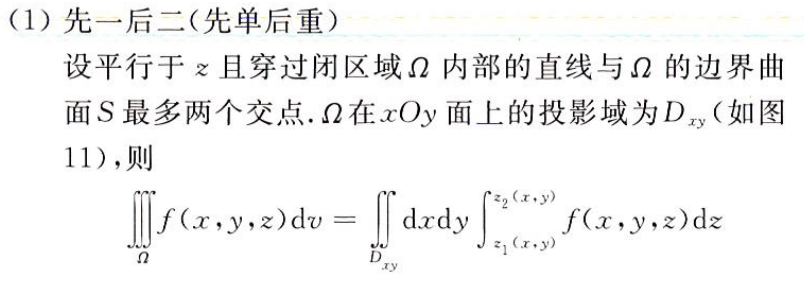

先二后一：在求 x-y 平面上**面的微分**，然后再垂直方向上积分得体积

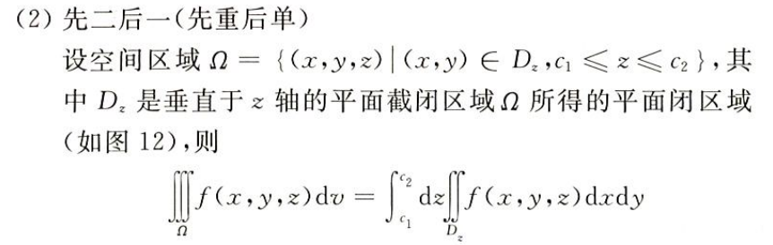

柱坐标（空间上的极坐标）、球坐标和奇偶性求解

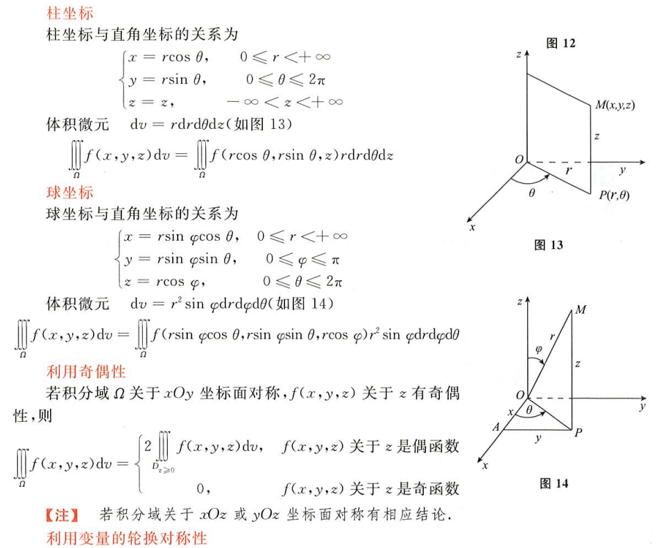

## 曲线积分

### 对弧长的线积分

第一类线积分，对被积函数在曲线上积分（被积区间为一条曲线）

利用直接法直接求参数方程、直角坐标和极坐标下得曲线积分

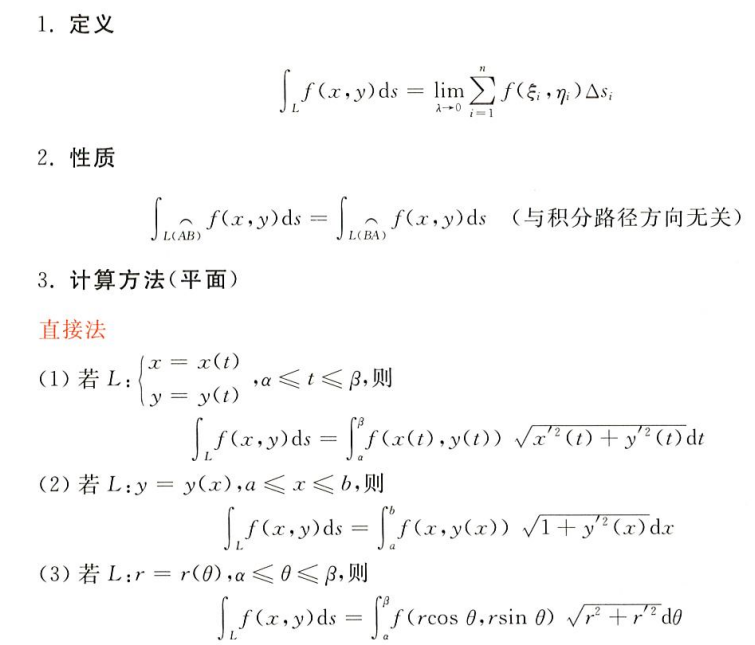

利用奇偶性简化曲线积分

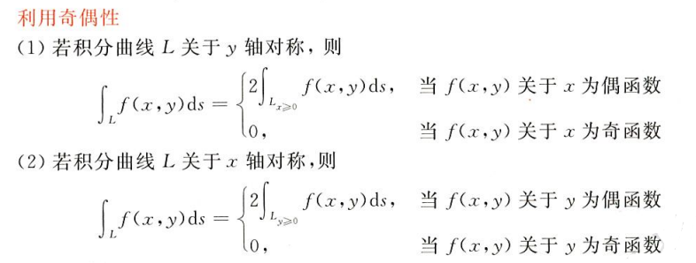

利用对称性简化曲线积分

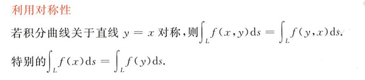

### 对坐标的线积分

第二类线积分：对被积函数分别在曲线的 x 和 y 坐标上积分，首先明确积分区间是一条曲线，这里的做法实际上是把曲线垂直划分在 x 和 y 上进行积分再相加（这里通常会涉及到两条封闭的曲线）

利用直接法直接求解参数方程坐标的线积分

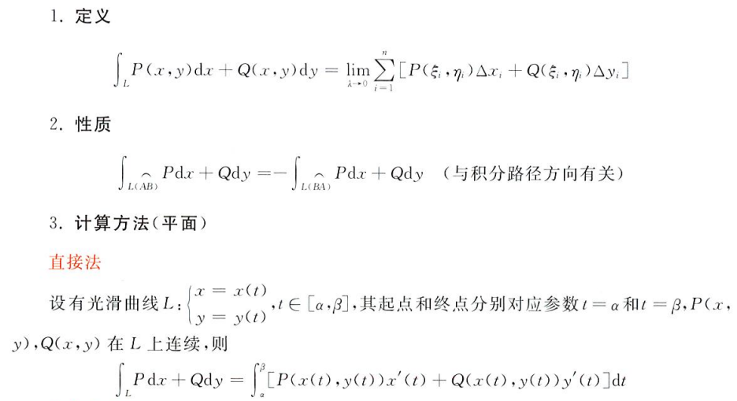

格林公式

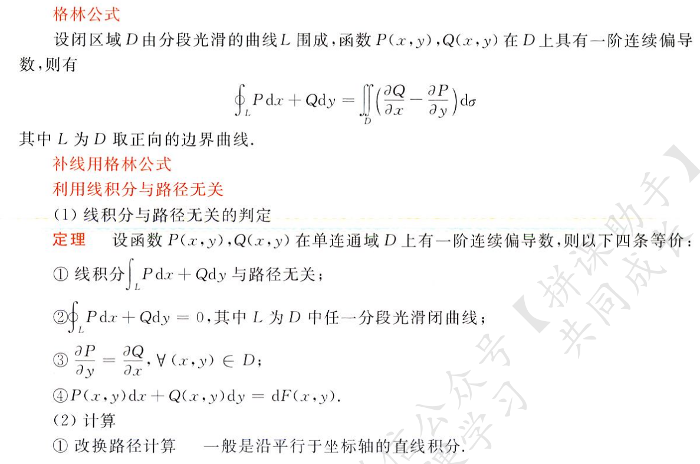

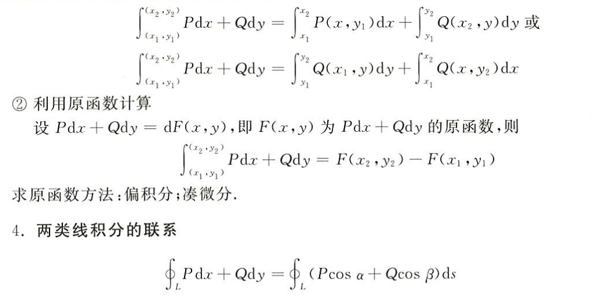

在空间曲线上积分：斯托克斯公式（亚托克斯公式）

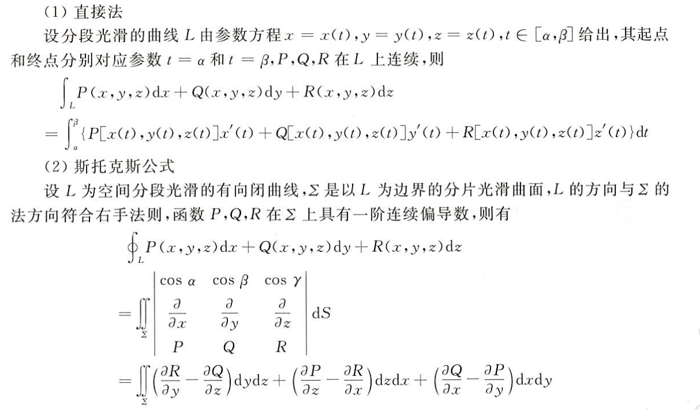

## 曲面积分

### 对面积的面积分

第一类面积分：对空间被积函数在封闭曲面上积分

直接法：就是将 z 用 x 和 y 表示，将被积函数表示为二元，此时就变成了一个二重积分，这里将 z 化掉的方法很讲究

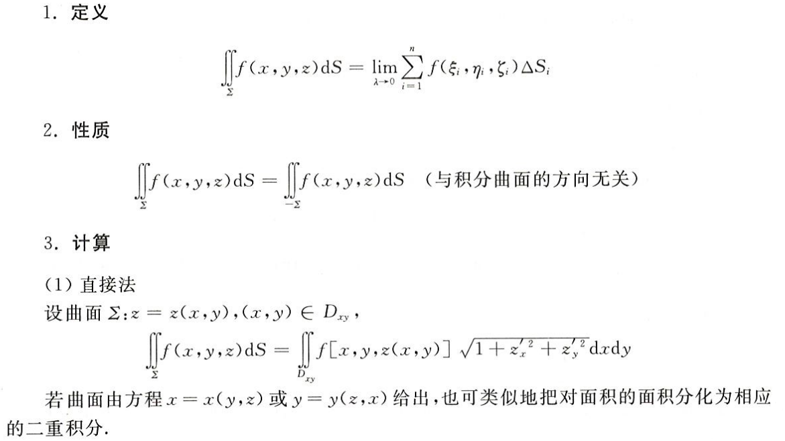

利用奇偶性、对称性简化积分

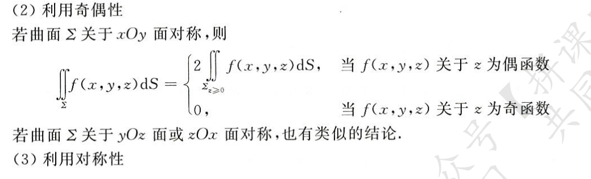

### 对坐标的面积分

第二类面积分：有方向，被积区间为曲面上侧取正号，曲面下侧取负号，要考虑曲面与 z 轴正方向的夹角，锐角为正

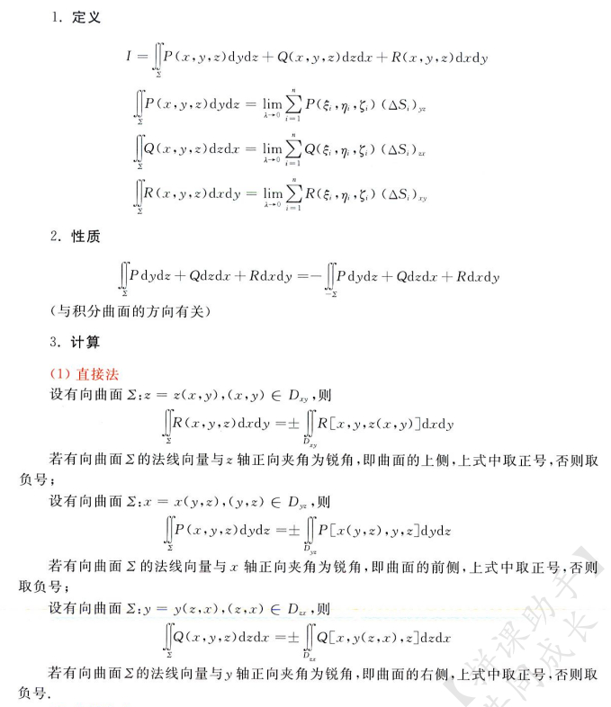

高斯公式

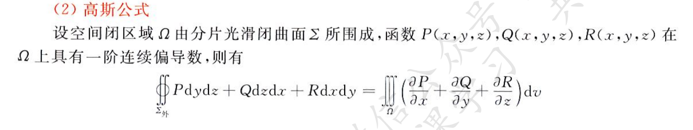

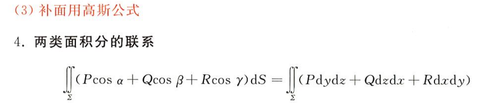

## 多元积分应用

> 物理题

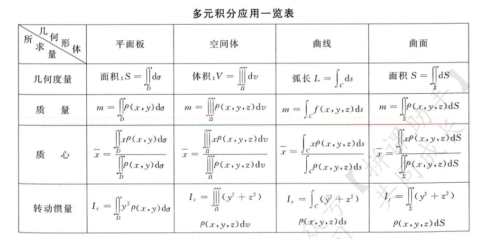

## 散度与旋度

### 散度

### 旋度

