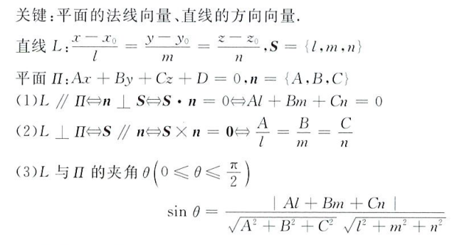
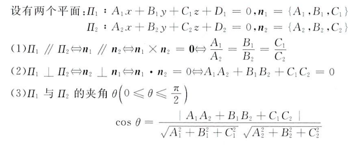
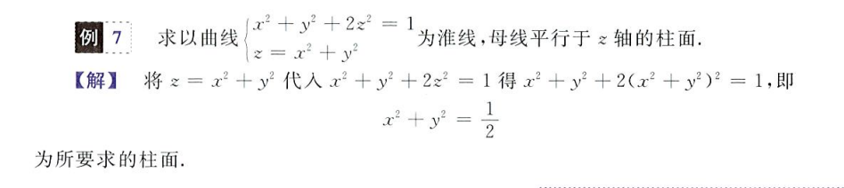
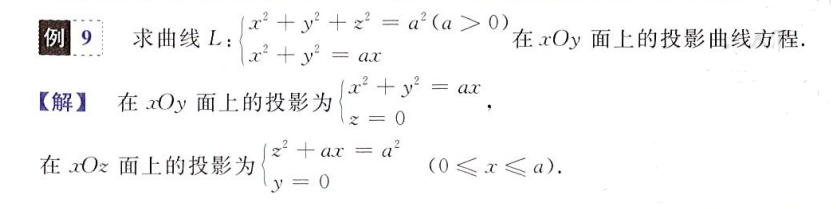

## 向量代数

### 向量定义

向量定义：和线代保持一致，就是一个高维数，如`a = (a1,a2,a3)`

特殊向量：单位向量（模为 1），零向量（模为 0）

加法
$$
a + b = (a_1+b_1,\,a_2+b_2,\,a_3+b_3)
$$
数乘
$$
ka = (ka_1,\,ka_2,\,ka_3)
$$

向量的所有运算规律和矩阵保持一致

### 向量乘积

#### 数量积

数量积：就是矩阵乘法，也叫点积，几何意义为向量`a`在向量`b`上的投影`a'`乘以向量`b`，参考夹角力做，表示向量之间的实际作用效果
$$
ab = (a,b) = ab^T = a_1b_1+a_2b_2+a_3b_3
$$
模长
$$
|a| = \sqrt{aa} = \sqrt{a_1^2+a_2^2+a_3^2}
$$
向量夹角
$$
cos\alpha = \frac{ab}{|a|\,|b|}
$$
通过数量积判定垂直
$$
ab = 0 \iff a\bot b \iff cos\alpha = 0\,(\alpha = \frac{\pi}{2})
$$

#### 向量积

向量积：记作`axb`，结果是一个向量 c，该向量垂直于向量 a、b 确定的平面，且数值上有
$$
|c| = |a|\,|b|\,sin\alpha\,(\alpha为a,b夹角)
$$
实际上是一个右手定则，从向量 a 握向 b，大拇指朝向即为`axb`向量的方向

在代数上，`axb`为一个带方向的行列式
$$
a\times b =
\left | \begin{matrix}
i&j&k\\
a_1&a_2&a_3\\
b_1&b_2&b_3
\end{matrix} \right | =
(a_2b_3-a_3b_2)i+(a_3b_1-a_1b_3)j+(a_1b_2-a_2b_1)k
$$
几何意义

- c 天然是 a b 平面的一条垂线
- 当向量积为 0，说明两向量平行，`sinα = 0`
- 向量积在数值上（即`|c|`），等于以向量 a、b 为邻边的平行四边形的面积（平行四边形高为`bsinα`）

**注意叉乘是一个行列式，符合一切行列式运算的规则**，如置换两列位置换号，同列的公因子可以提出等等

#### 混合积

三个向量的数量积等于前两个向量的向量积和第三个向量的数量积
$$
abc = (a\times b)c =
\left [ \begin{matrix}
a_1&a_2&a_3\\
b_1&b_2&b_3\\
c_1&c_2&c_3
\end{matrix} \right ]
$$
同理，这个混合积满足行列式的运算规则

且有几何意义

- 当`abc=0`说明平面 ab 的垂线同时垂直于向量 c，于是向量 abc 在同一平面上
- 混合积在数值上等于以向量 a、b、c 为棱的平行六面体体积

## 空间解析几何

### 空间平面与直线方程

> 空间平面抓法向量，空间直线抓方向向量

#### 空间平面方程

> 一般式，点法式，截距式

平面方程：在三个方向上都是一阶线性，于是是平面，就像二维的一阶线性，一定是直线，而不是曲线
$$
Ax+By+Cz = D
$$
法向量为
$$
n = [\frac{∂f}{∂x},\frac{∂f}{∂y},\frac{∂f}{∂z}] = [A,B,C]
$$
三个确定的法向量其实就可以确定一个平面的倾斜角度，再用一个点即可确定任一平面，在一般式里面，用常数 D 来确定这个经过的点

点法式：过`(x0,y0,z0)`的平面方程

- 法向量为`(A,B,C)`
- 过点`(x0,y0,z0)`

法向量和经过的一个点即可确定一个平面
$$
A(x-x_0)+B(y-y_0)+C(z-z_0) = 0
$$

截距式：过`(a,0,0), (0,b,0), (0,0,c)`的平面方程

- 法向量同样是确定的，为`(1/a, 1/b, 1/c)`
- 一定过三个截距点

法向量和经过的一个点确定平面
$$
\frac{x}{a}+\frac{y}{b}+\frac{z}{c}=1
$$

其法向量为`(1/a, 1/b, 1/c)`

#### 空间直线方程

> 一般式，对称式，参数式

一般式：两个空间平面的交线确定一条空间直线
$$
\begin{cases}
A_1x+B_1y+C_1z = D_1\\
A_2x+B_2y+C_2z = D_2
\end{cases}
$$
一般式求方向向量：其实就是一个**解齐次线性方程组**的过程

因为已知两平面方程，可以轻易得到两平面的法向量
$$
\beta_1 = (A_1,B_2,C_3)\quad \beta_2 = (A_2,B_2,C_2)
$$
因为直线是平面的交线，自然同时位于两个平面上，于是一定垂直于这两条法向量，设`l = (x1,x2,x3)`，则有
$$
\begin{cases}
A_1x_1+B_1x_2+C_1x_3 = D_1\\
A_2x_1+B_2x_2+C_2x_3 = D_2
\end{cases}
$$
这他妈就是一个齐次线性方程组，其系数矩阵为
$$
A = \left [ \begin{matrix}
A_1&B_1&C_1\\
A_1&B_2&C_2
\end{matrix} \right ]
$$
一定可以解得`l`的一个基础解系，随便取一个特解即为这条空间直线的方向向量

对称式
$$
\frac{x-x_0}{l}=\frac{y-y_0}{m}=\frac{z-z_0}{n}
$$
其方向向量为`(l,m,n)`，为什么？？

参数式
$$
\begin{cases}
x = x_0+lt\\
y = y_0+mt\\
z = z_0+nt
\end{cases}
$$

其方向向量为`(l,m,n)`

### 空间平面、直线间关系

> 一定要结合线代知识考虑计算

#### 直线、平面的关系

关系：平行、垂直、夹角

直线与平面的关系

平面与平面的关系

直线与直线的关系

这里的一系列计算可以不严格按照高数的方法，可以采用线代的方式求解齐次线性方程组来判定直线方向

#### 点到直线、平面的距离

> 就是点积/叉积除以模长之积

点到面的距离：`(x0,y0,z0)`到`Ax + By + Cz + D = D`的距离
$$
d = \frac{|Ax_0+By_0+Cz_0+D|}{\sqrt{A^2+B^2+C^2}}
$$
点到直线的距离

直线为对称式，过点`(x1,y1,z1)`，方程为
$$
\frac{x-x_1}{l}=\frac{y-y_1}{m}=\frac{z-z_1}{n}
$$
点`(x0,y0,z0)`到直线距离为
$$
d = \frac{|\,(x_1-x_0,y-y_0,z-z_0)\times (l,m,n)\,|}{\sqrt{l^2+m^2+n^2}}
$$

### 曲面与空间曲线方程

曲面方程

显函数形式
$$
z = f(x,y)\quad (x,y)\in D\subset R^2
$$
隐函数形式
$$
F(x,y,z) = 0
$$
参数方程形式
$$
\begin{cases}
x = x(u,v)\\
y = y(u,v)\\
z = z(u,v)
\end{cases} \quad
(u,v)\in D_{uv}\subset R^2
$$
空间曲线方程

一般式：两曲面交线
$$
\begin{cases}
F(x,y,z) = 0\\
G(x,y,z) = 0
\end{cases}
$$
参数方程形式
$$
\begin{cases}
x = x(t)\\
y = y(t)\\
z = z(t)
\end{cases}
\quad t \in D\subset R^1
$$

### 旋转曲面方程与柱面

旋转面：一条平面曲线绕平面上一条直线旋转

设 L 是`yOz`平面上一条曲线,其方程是
$$
\begin{cases}
f(y,z) = 0\\
x = 0
\end{cases}
$$
则 L 绕 y 轴旋转所得旋转面方程为
$$
f(y，土\sqrt{x^2+z^2})= 0
$$
L绕 x 轴旋转所得旋转面方程为
$$
f(士\sqrt{x^2+y^2},z)= 0
$$
类似地可写出`xOy`面或`xOz`面上的曲线绕其所在坐标面上的坐标轴旋转所产生的旋转面方程

柱面：平行于定直线并沿定曲线 П 移动的直线 L 形成的轨迹

淮线为
$$
\begin{cases}
f(x,y) = 0\\
z = 0
\end{cases}
$$
母线平行于 z 轴的柱面方程为 f(x,y) = 0

淮线为
$$
\begin{cases}
F(x,y,z) = 0\\
G(x,y,z) = 0
\end{cases}
$$
母线平行于 z 轴的柱面方程为 F 和 G 消去变量 z 得到的二元方程 H(x,y)

左为柱面，中为淮线，右为母线

投影

### 常用二次曲面方程

圆柱面
$$
x^2+y^2 = R
$$

