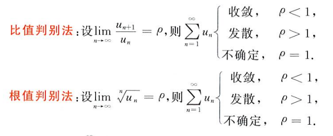
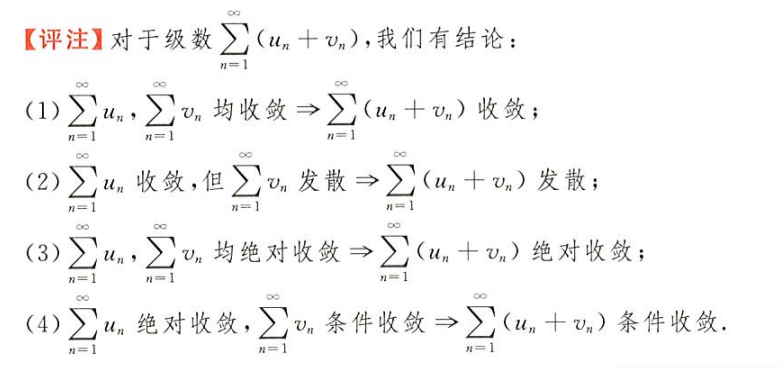
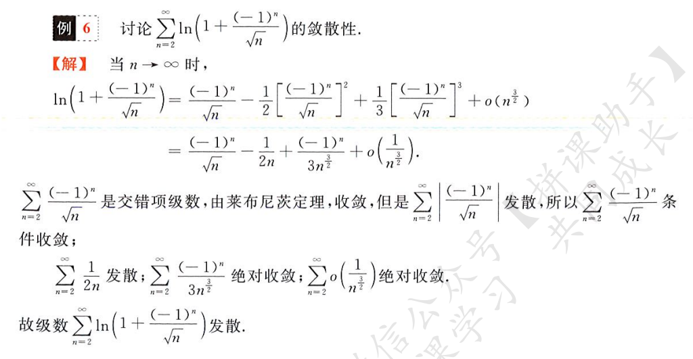
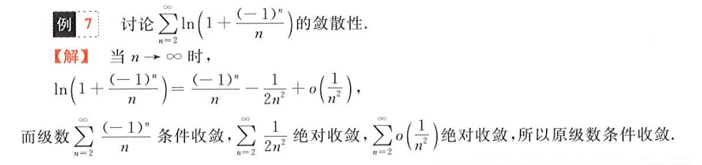
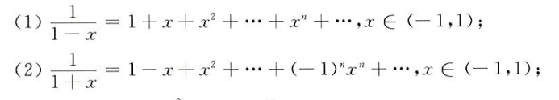
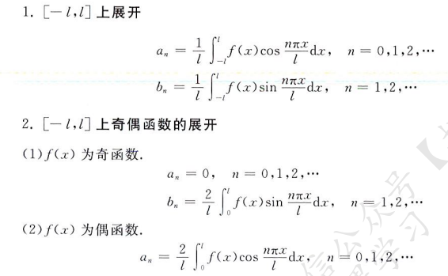
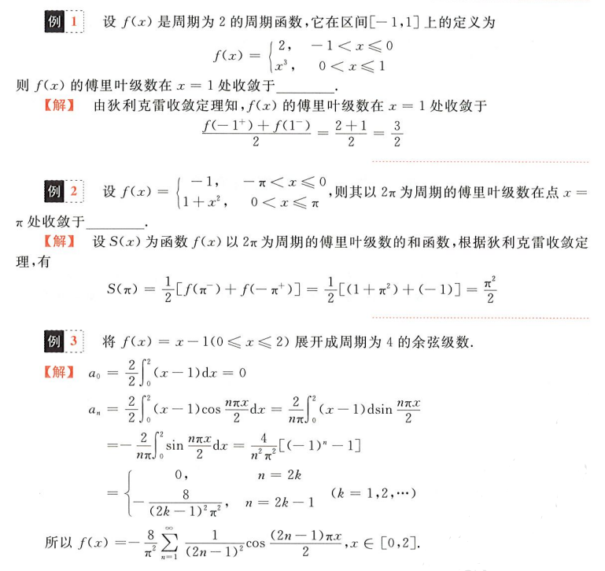

## 常数项级数

### 级数的概念与性质

级数，可以理解为阶梯上升的项数之和，无穷级数，即为无穷项的数列之和
$$
\sum_{n=1}^\infty{a_n} = a_1+...+a_n+...
$$
级数的部分和
$$
S_n = \lim_{n\rightarrow\infty}\sum_{i=1}^na_i = a_1+...+a_n\quad n\rightarrow\infty
$$
级数的余项
$$
r_n = a_{n+1}+...
$$
当无穷级数收敛（类似于函数有界的概念），则有
$$
S_n = \alpha\in R
$$
此时定有无穷级数等于其部分和且其余项等于 0
$$
S = S_n\quad r_n = 0
$$
且必有
$$
a_n = 0\quad n\rightarrow\infty
$$
级数的一些性质

### 正项级数的判敛准则

> 对于正项级数的判敛：比，商，根

正项级数，级数每一项均大于 0，则称之为正项级数，即 an > 0 恒成立

比较判敛法：若两个级数 a 和 b
$$
\lim_{n\rightarrow\infty}\frac{a_n}{b_n} = l \in R
$$
当 l 取值

- 为 0，则当 b 收敛，a 一定收敛
- 为无穷，则当 b 发散，a 一定也发散
- ∈(0, ∞)，则这两个级数收敛性保持一致

在应用时，可以将原级数化为其等价无穷小/大，再对等价的级数进行判敛以达到简化的作用

比值判敛和根值判敛

正项级数收敛的必要条件
$$
\lim_{n\rightarrow\infty}a_n = 0
$$

### 交错级数

对于级数的每一项，其正负交错，这样的级数称为交错级数，设有正项级数 an，则有交错级数
$$
\lim_{n\rightarrow\infty} \sum_{i=1}^n(-1)^{n-1}a_n
$$
对于交错级数的判敛，较正项级数而言，更为松散，只需满足莱布尼兹准则

1. 级数单调递减（不严格）
2. 级数的第无穷个项趋近 0

此时我们可以判定交错级数是收敛的

### 绝对收敛及性质

由上述正项级数和交错级数我们可以知道，交错级数实际上比正项级数更容易收敛，于是对于一个交错级数，如果其自身收敛，但其绝对值级数发散，则我们称这个交错级数**条件收敛**

相应的，若若一个级数的绝对值收敛，则称之为**绝对收敛**，并且，由于正项级数的收敛更为严格，他的绝对值都收敛了，那么这个级数无论如何都将是收敛的（不管是交错的还是正项的）

于是，绝对收敛的判定和正项级数、交错级数判敛过程基本雷同

- 先试试其本身是否收敛，若不收敛，打住，他一定发散了
- 再加上绝对值试试是否仍收敛，若收敛，则为绝对收敛，若不收敛，则为条件收敛

判敛方法一样：比，商，根

条件收敛的性质，当条件收敛时，单正和单负项的和都将是发散的

在判敛时，可以运用泰勒展开（极限和泰勒展开息息相关）对原级数进行代换（化为一个多项式），并且对于多项式级数，有如下规则

这是必然的，复习一下泰勒展开式
$$
ln(1+x) = x-\frac{x^2}{2}+\frac{x^3}{3}+...+(-1)^{n-1}\frac{x^n}{n}
$$
举个栗子

再举个栗子

注意对交错级数的判敛，只需要考虑 an 即可（将前面的 -1 的指数去掉判断）（运用莱布尼兹准则）

## 幂级数

### 函数项级数及收敛域与和函数

将常数级级数中的 an 化为一个关于 x 的函数，原级数则化为函数项级数，如
$$
\sum_{n=1}^\infty a_n(x)
$$
注意这里的 x 是固定的，当 x 固定后，级数自然只有一个变量，即为 n，当然，这里的 x 也是一个变量，只不过在初始时便被确定下来

从编程的角度，这像一个函数数组（常数项级数为 double 数组），函数变量有两个，一个是数组下标 n，一个是初始常量 x

当 x = x0 且使得函数项级数收敛，即
$$
\sum_{n=1}^\infty a_n(x_0) = S\in R
$$
则我们称 x0 是函数项级数的一个**收敛点**，所有收敛点构成的集合（一个一维区间）为函数项级数的**收敛域**

对于每一个收敛点 xi，函数项级数有其和函数 S(xi)
$$
S(x_i) = \sum_{n=1}^\infty a_n(x_i)
$$

### 幂级数

当函数项级数的函数是**幂函数**的形式，如
$$
a_n(x-x_0)^n
$$
其中 an 为一个关于 n 的多项式，x^n 即为 x 的 n 次幂，二者相乘构成级数中的第 n 项，则完整的级数为
$$
\sum_{n=0}^\infty a_n(x-x_0)^n = a_1(x-x_0)+a_2(x-x_0)^2+...+a_n(x-x_0)^n
$$
我们将这样的级数称为**幂级数**（因为级数的每一项为关于 x 的幂函数，同时有一个关于 n 的函数）

当 x0 = 0，自然有幂级数
$$
\sum_{n=0}^\infty a_nx^n
$$
阿尔贝定理：幂级数的收敛半径 R 为
$$
\lim_{n\rightarrow\infty}|\frac{a_{n+1}}{a_n}| = ρ\quad R = \frac{1}{ρ}
$$
这和无穷级数收敛的判断是统一的，如果加上 x 的幂项，即为
$$
\lim_{n\rightarrow\infty}|\frac{a_{n+1}}{a_n}|\times|\frac{x^{n+1}}{x^n}| = C < 1
$$
即得
$$
|x| < |\frac{a_{n+1}}{a_n}|
$$
收敛半径的意思为，当 |x| < R 时，该幂级数收敛，自然 x 有对应的收敛域 (-R, +R)，值得注意的是，这里能不能取到 R 需要具体问题具体分析

### 幂级数的性质

运算性质

- 两个幂级数相加减：其收敛域为其交集，即为收敛域更小的那一个（如果都从 0 展开的话），其和函数为两个幂级数和函数的和/差
- 两个幂级数相乘：收敛域同样为其交集，和函数为二者和函数之乘积
- 两个幂级数相除：将构成一个全新的系数，其收敛与否尚未可知，需要重新求解

求导和积分性质，非常之重要且难捏（幂级数 - 和函数 - 收敛半径）

这个和函数到底是个什么东西？？？

### 函数的幂级数展开

就是泰勒展开，用一个幂级数来表示一个函数（多项式展开），下式在 x = x0 处进行展开
$$
f(x) = \sum_{n=1}^\infty\frac{f^{(n)}(x_0)}{n!}(x-x_0)^n = f(x_0)+f'(x_0)(x-x_0)+...+f^{(n)}(x_0)(x-x_0)^n+...
$$
当在 x = 0 处进行展开时称作麦克劳林展开，两个新加的麦克劳林展开（还有之前求极限的时候那几个泰勒展开`sinx, cosx, e^x-1, ln(1+x), (1+x)^a-1`）

在解题时，就是导来导去，把幂级数（泰勒展开）转换为函数（和函数），代入在收敛域内的 x 取值得到幂级数值

举几个梨子

## 傅里叶级数

### 傅里叶系数与傅里叶级数

傅里叶试图用周期性的正交函数来表示所有的周期函数，毫无疑问他成功了，在傅里叶变换中选取了 sinx 和 cosx 两个正交的周期函数来表示任意周期为 2π 的周期函数

### 傅里叶级数的收敛性

狄利克雷收敛定理

### 周期为 2π 的函数的展开

把你妈展了

### 周期为 2l 的函数的展开

呵呵

两个栗题

