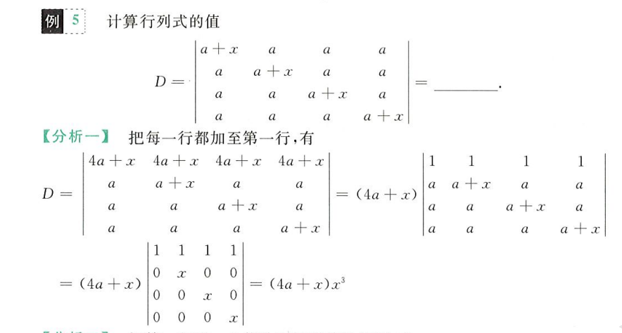
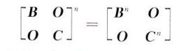
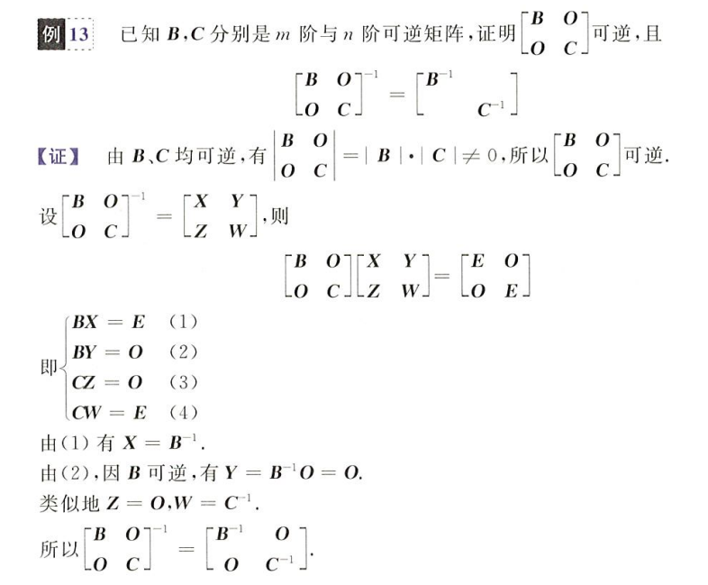

## 行列式概念及性质

### 行列式定义

行列式是**一个数**，他是不同行不同列元素乘积的代数和

如三阶行列式的对角线法计算法

逆序和逆序数

对于`4321`，其每位上的逆序分别为`3,2,1`，因为`4>3>2>1`，所以对于 4 来说，后三位均是逆序，其逆序自然为 3，同理，在这个序列中，3 的逆序为 2，2 的逆序为 1

逆序数指的是序列所有元素逆序之和，如上述序列逆序数为`3+2+1 = 6`，为偶数

- 逆序数为偶数，序列为**偶排列**
- 否则为奇排列

展开公式法计算行列式

$$
|A| = \sum_{j_1j_2...j_n}(-1)^{\tau(j_1j_2...j_n)}a_{1j_1}a_{2j_2}...a_{nj_n}
$$

其中

$$
\tau(j_1j_2...j_n)
$$

为序列`j1 j2 ... jn`的逆序数，就是说，若序列为偶排列，则为正，否则为负

注意对角线法可以列出所有的行列式序列，每个序列的符号通过逆序数来确定

### 行列式性质

所有行都可以等价于列，因为行列置换后行列式等价，行等于列

$$
|A| = |A^T|
$$

两行互换位置，行列式值变号

$$
\left | \begin{matrix}
a_{11}&a_{12}\\
a_{21}&a_{22}
\end{matrix}
\right | =
-\left |
\begin{matrix}
a_{12}&a_{11}\\
a_{22}&a_{21}
\end{matrix}
\right |
$$

某整行的公因子可以提出

$$
\left |
\begin{matrix}
ka_{11}&a_{12}\\
ka_{21}&a_{22}
\end{matrix}
\right | =
k\left |
\begin{matrix}
a_{11}&a_{12}\\
a_{21}&a_{22}
\end{matrix}
\right |
$$

存在某行全为 0 的行列式值为 0

$$
\left |
\begin{matrix}
a_{11}&a_{12}&0\\
a_{21}&a_{22}&0\\
a_{31}&a_{32}&0
\end{matrix}
\right |
= 0
$$

存在某两行线性相关，行列式值为 0

$$
\left |
\begin{matrix}
a_{11}&a_{12}&ka_{12}\\
a_{21}&a_{22}&ka_{22}\\
a_{31}&a_{32}&ka_{32}
\end{matrix}
\right |
= 0
$$

其中第二列和第三列线性相关，`A2 = kA3`

行列式的线性加法不改变值，什么是线性加法？就是某一行的整数倍加到另一行上，如

$$
\left |
\begin{matrix}
a_{11}&a_{12}&a_{13}\\
a_{21}&a_{22}&a_{23}\\
a_{31}&a_{32}&a_{33}
\end{matrix}
\right | =
\left |
\begin{matrix}
a_{11}&a_{12}&a_{13}+ka_{12}\\
a_{21}&a_{22}&a_{23}+ka_{22}\\
a_{31}&a_{32}&a_{33}+ka_{32}
\end{matrix}
\right |
$$

这也侧面印证了，若两行线性相关，则行列式值为 0 的结论，因为线性相关的行一定能通过线性加法得到全为 0 的行，从而行列式值一定为 0

行列式的拆分

$$
\left |
\begin{matrix}
a_{11}&a_{12}&b_{1}+c_{1}\\
a_{21}&a_{22}&b_{2}+c_{2}\\
a_{31}&a_{32}&b_{3}+c_{3}
\end{matrix}
\right | =
\left |
\begin{matrix}
a_{11}&a_{12}&b_{1}\\
a_{21}&a_{22}&b_{2}\\
a_{31}&a_{32}&b_{3}
\end{matrix}
\right |
+
\left |
\begin{matrix}
a_{11}&a_{12}&c_{1}\\
a_{21}&a_{22}&c_{2}\\
a_{31}&a_{32}&c_{3}
\end{matrix}
\right |
$$

## 行列式计算

### 行列式按行展开

余子式

$$
|M_{ij}| = |A|去掉第i行第j列所对应行列式
$$

代数余子式

$$
(-1)^{i+j}|M_{ij}|
$$

行列式按第 i 行展开，m 为行列式 A 的列数

$$
|A| = \sum_{j=1}^{m}a_{ij}(-1)^{i+j}|M_{ij}|
$$

行展开，就是行列式一整行的元素乘上**其对应的**代数余子式的总和，等于原行列式的值（列同理）

注意一整行的元素乘上**另一行的**代数余子式的总和恒为零

栗子一

可以通过倍加凑出只有一个非零元素的行，然后按行展开简化计算

栗子二

通过行列式方程按行展开解未知数

### 拆分法

通过拆开矩阵元素，删去含全零行的行列式，计算保留项，以此简化计算（行列式来自于栗子一）

栗子二的拆分法

### 爪形处理

就是通过倍加凑出上下三角行列式或斜对角线行列式，以简化计算

#### 上三角

上/下三角行列式（对角线行列式）
$$
\left |
\begin{matrix}
a_{11}&a_{12}&a_{13}\\
0&a_{22}&a_{23}\\
0&0&a_{33}
\end{matrix}
\right | =
a_{11}a_{22}a_{33}
$$
所谓的爪形处理，就是凑上三角行列式以简化计算，行列式来自栗子一

栗子二的爪形处理

#### 副对角线

副对角线行列式
$$
\left |
\begin{matrix}
0&0&a_{13}\\
0&a_{22}&a_{23}\\
a_{31}&a_{32}&a_{33}
\end{matrix}
\right | =
(-1)^{\frac{n(n-1)}{2}}a_{13}a_{22}a_{31}
$$
#### 拉普拉斯

> 上三角行列式和副对角线行列式的**分块矩阵形式**

拉普拉斯行列式
$$
\left |
\begin{matrix}
A&0\\
0&B
\end{matrix}
\right | = |A|\,|B|
\\-------\\
\left |
\begin{matrix}
0&A\\
B&0
\end{matrix}
\right | = (-1)^{mn}|A|\,|B|
$$
其中`m`和`n`分别为行列式`A`和`B`的阶数

### 范德蒙行列式

范德蒙行列式
$$
\left |
\begin{matrix}
1&1&1\\
x_{1}&x_{2}&x_{3}\\
x_{1}^2&x_{2}^2&x_{3}^2
\end{matrix}
\right | =
(x_3-x_2)\times(x_3-x_1)\times(x_2-x_1)
$$
推广到 n 阶，即为
$$
\prod_{1\leq j<i\leq n}(x_i-x_j)
$$
 通过数学归纳法可以证明

范德蒙行列式计算
$$
\begin{aligned}
|A| &= \left |
\begin{matrix}
1&1&1\\
2&-1&-3\\
4&1&9
\end{matrix}
\right | \Rightarrow x_1 = 2,x_2=-1,x_3=-3\\
&=(x_3-x_1)(x_3-x_2)(x_2-x_1)\\
&=(-5)(-2)(-3)\\
&=-30
\end{aligned}
$$
我发现行列式等式证明的题，是不是喜欢用数学归纳法，确实比较适配

**总结来说**

行列式计算

- 化简展开：按照行列式的性质，一般使用线性加法得到足够多的 0，然后按行展开，降阶行列式，然后使用对角线法直接计算
- 凑特殊行列式求解：拉普拉斯行列式，上三角行列式，范德蒙行列式

解方程

- 首先一定涉及行列式的计算，这是前提，将行列式化简和凑特殊行列式计算出来，然后视作一个一元多次方程求解未知数`λ`

证明题：通常来说，是证明一个等式行列式为 n 阶时始终成立，可以考虑用数学归纳法，请参考范德蒙行列式的证明，从`n-1`阶推导`n`阶成立得证

## 行列式解非齐次方程组

> 克拉默法则

对于非齐次线性方程

$$
\begin{cases}
a_{11}x_1+...+a_{1n}x_n = b1\\
a_{21}x_1+...+a_{2n}x_n = b2\\
...\\
a_{n1}x_1+...+a_{nn}x_n = bn\\
\end{cases}
$$

克拉默法则：针对线性方程组的系数矩阵，若其系数矩阵对应行列式值不为 0（行列式不存在线性相关的行），说明方程组只有一个唯一解，且解为

$$
x_i = \frac{|A_i|}{|A|}
$$

其中`Ai`为第`i`列替换为`B`的行列式，如`A1`为

$$
\left |
\begin{matrix}
b_{1}&a_{12}&...&a_{1n}\\
b_{2}&a_{22}&...&a_{2n}\\
...\\
b_{n}&a_{n2}&...&a_{nn}
\end{matrix}
\right |
$$

应用到齐次方程组上（即`b1=b2=..=bn=0`），若其系数行列式值不为 0，则说明其只有一个解，一定是`x1=x2=...=xn=0`，即只存在全 0 解

相应的，只有当系数行列式值等于 0 时，说明系数行列式存在线性相关的行（行列式性质），齐次方程组才存在非 0 解，也就是说存在线性相关的项

这里的逻辑有点乱，但是是正确的，就是说，行列式为 0，通过行列式性质可知，行列式存在线性相关的行（即`ai = kaj`），所对应的齐次方程组的解`xi`和`xj`就可以不为 0，如
$$
a_i = ka_j\,,\,\,x_j = -kx_i \Rightarrow a_ix_i + a_jx_j = 0
$$
这样就有了不全为 0 的解

求解非齐次方程组特解：`xi = |Ai| / |A|`

## 矩阵的概念及计算

始终牢记，线性代数是一门研究有限维空间内**线性映射**的学科

### 矩阵分类

矩阵`A`，其行列式记作`|A|`，当然只有方阵才有对应行列式

| 矩阵分类   | 矩阵特征                                                     |
| ---------- | ------------------------------------------------------------ |
| `mxn`矩阵  | m 行 n 列的矩阵                                              |
| `n`阶方阵  | n 行 n 列的矩阵，有对应行列式`|A|`                           |
| 零矩阵     | 所有元素全为 0 的矩阵（区分于行列式，行列式实际上就是一个数值，其为 0 和矩阵为 0 是完全不同的概念） |
| 同型矩阵   | 行列数相等，即尺寸一样的矩阵                                 |
| 单位阵`E`  | 主对角线上全为 1，其余位置全为 0 的矩阵，有`AE = EA = A`     |
| 数量阵     | 即为单位阵的数乘，`kE`                                       |
| 对角阵     | 除主对角线上其余位置全为 0 的矩阵                            |
| 转置矩阵   | 行列位置变换（区分与行列式，行列式行列互换值不变）           |
| 对称阵     | 自身与其转置矩阵完全相等                                     |
| 反对称阵   | 其转置矩阵等于自身的负矩阵，即数乘`-1`就为其转置阵           |
| 矩阵多项式 | 对于多项式`f(x) = a0 + a1x + a2x^2 + ... + anx^n`，将其自变量更换为矩阵`A`，即得到对应的矩阵多项式 |

### 各类矩阵的性质

单位阵
$$
AE = EA = A
$$
对角阵
$$
AB = BA =
\left [
\begin{matrix}
b_{1}a_{1}&0\\
0&b2a_{2}
\end{matrix}
\right ] <=> a_1b_1 = b_1a_1\\
-------------------\\
A^n =
\left [
\begin{matrix}
a_{1}&0\\
0&a_{2}
\end{matrix}
\right ] ^n =
\left [
\begin{matrix}
a_{1}^n&0\\
0&a_{2}^n
\end{matrix}
\right ]
$$
转置阵
$$
(A+B)^T = A^T+B^T\quad
(AB)^T = B^TA^T\quad
(A^T)^T = A
$$
矩阵多项式，涉及矩阵的阶乘（也就是乘法）
$$
f(A) = a_mA^m + a_{m-1}A^{m-1} + ... + a_1A + a_0
$$

### 矩阵的运算

加法：仅限于同型矩阵，就是每一个位置的元素相加

数乘：常数 k 乘以矩阵 A，即将常数 k 乘到 A 的每一个元素上

乘法：只有当**左矩阵的列数等于右矩阵的行数**时才能相乘，结果为一个新的矩阵

- 单行乘以单列得到一个一维矩阵，就是一个数值
- 就是左矩阵的行元素依次乘上右矩阵的列元素再相加，得到一个新元素
- 乘法是矩阵运算中最重要也是最基本的，他不满足交换律，没有消去律，**有零因子**（即两个不为 0 的矩阵可以相乘得到零矩阵）

矩阵的乘法满足结合律，但注意左乘和右乘一定不能交换位置
$$
AB+AC = A(B+C)
$$
数乘满足交换律，结合律
$$
kmA  = mkA\quad kA+kB = k(A+B)
$$
这里矩阵满足结合律，意味着下式成立
$$
(A+B)(C+D) = AC+AD+BC+BD
$$
矩阵基础运算

利用矩阵结合律求解方程

### 矩阵和方程组

用矩阵表示方程组，向量乘以向量

用矩阵计算表示方程组，如对于方程组
$$
\begin{cases}
a_{11}x_1+a_{12}x_2+...+a_{1n}x_n = b_1\\
a_{21}x_1+a_{22}x_2+...+a_{2n}x_n = b_2\\
......\\
a_{n1}x_1+a_{n2}x_2+...+a_{nn}x_n = b_n\\
\end{cases}
$$
将其系数矩阵提出，有
$$
A = 
\left [ \begin{matrix}
a_{11}&a_{12}&...&a_{1n}\\
a_{21}&a_{22}&...&a_{2n}\\
...\\
a_{n1}&a_{n2}&...&a_{nn}
\end{matrix} \right ]
$$
未知数矩阵提出，有
$$
X = 
\left [ \begin{matrix}
x_1\\x_2\\...\\x_n
\end{matrix} \right ]
$$
由矩阵乘法，得
$$
Ax =
\left [ \begin{matrix}
b_1\\b_2\\...\\b_n
\end{matrix} \right ]
= B
$$
将系数矩阵`A`模块化处理，令其为
$$
A = [A_1,A_2,...,A_n]
$$
就有
$$
A_1x_1+A_2x_2+...+A_nx_n = B
$$

## 伴随矩阵和可逆矩阵

### 伴随矩阵定义及性质

> 用于求解逆矩阵

伴随矩阵，回顾一下代数余子式，对于行列式`|A|`，其在`i,j`的代数余子式为
$$
A_{ij} = (-1)^{i+j}M_{ij}
$$
其中`Mij`为行列式`|A|`除去第 i 行第 j 列的新行列式的值

对于**方阵**`A`，其对应行列式为`|A|`，其伴随矩阵为
$$
A^* =
\left [ \begin{matrix}
A_{11}&A_{21}&...&A_{n1}\\
A_{12}&A_{22}&...&A_{n2}\\
...\\
A_{1n}&A_{2n}&...&A_{nn}
\end{matrix} \right ]
$$
**其中每一个元素都是对应转置位置的代数余子式**，每行的代数余子式竖着放构成的矩阵

举个栗子

伴随矩阵的性质：建议一个个推一下

### 可逆矩阵定义及性质

> 重要矩阵，逆矩阵和原矩阵相乘可得单位阵

可逆矩阵，若
$$
AB = BA = E
$$
则说`A`和`B`互为可逆矩阵，记作
$$
A^{-1} = B\quad B^{-1} = A
$$
n 阶矩阵可逆的充要条件

这里一定是不能出现线性相关的向量，很自然的，若有线性相关，则必有一行可以转化为零向量，该行矩阵相乘结果恒为 0，不可能出现单位阵 E

逆矩阵的运算性质

### 求解逆矩阵

对角矩阵的逆
$$
\left |
\begin{matrix}
a_{1}&0&0\\
0&a_{2}&0\\
0&0&a_{3}
\end{matrix}
\right | ^{-1} = 
\left |
\begin{matrix}
1/a_{1}&0&0\\
0&1/a_{2}&0\\
0&0&1/a_{3}
\end{matrix}
\right |
$$
一维矩阵的逆
$$
|a|^{-1} = |\frac{1}{a}|
$$
定义法：直接找出矩阵`B`使得`AB = E`，则`B`就是`A`的逆矩阵

公式法
$$
A^{-1} = \frac{1}{|A|}A^*
$$

行变换法
$$
(A|E) \stackrel{初等行变换}{\rightarrow} (E|A^{-1})
$$

分块矩阵法
$$
\left [ \begin{matrix}
A&0\\
0&B
\end{matrix} \right ] ^{-1} =
\left [ \begin{matrix}
A^{-1}&0\\
0&B^{-1}
\end{matrix} \right ]
\\-----------\\
\left [ \begin{matrix}
0&A\\
B&0
\end{matrix} \right ] ^{-1} =
\left [ \begin{matrix}
0&B^{-1}\\
A^{-1}&0
\end{matrix} \right ]
$$

结合矩阵乘法结合律考察

## 初等变换和初等矩阵

### 初等变换与初等矩阵的概念

初等变换

- 倍乘初等矩阵：用非零常数 k 乘以矩阵 A 的某一行每个元素
- 互换初等矩阵：两行交换位置
- 倍加初等矩阵：用某行的 k 倍加在另一行上

初等矩阵即由单位阵 E 经由**一次**初等变换得到的矩阵

等价矩阵：A 经由有限次初等变换得到矩阵 B，则称 A 和 B 互为等价矩阵

### 初等变换与初等矩阵的性质

> 初等变换后的矩阵和原先矩阵等价，初等矩阵乘以矩阵等同于在该矩阵上做初等矩阵相应的初等变换

初等矩阵的转置仍是初等矩阵

初等矩阵均是可逆矩阵，且其逆矩阵均是初等矩阵

用初等矩阵 P 乘以矩阵 A，相当于对 A 作出相应的初等行变换，如
$$
\left [ \begin{matrix}
1&0\\
1&1
\end{matrix} \right ]
\left [ \begin{matrix}
1&2\\
3&4
\end{matrix} \right ]
$$
相当于把第二个矩阵的第一行加在第二行上，得
$$
\left [ \begin{matrix}
1&2\\
1+3&2+4
\end{matrix} \right ]
$$
如果是右乘，即
$$
\left [ \begin{matrix}
1&2\\
3&4
\end{matrix} \right ]
\left [ \begin{matrix}
1&0\\
1&1
\end{matrix} \right ]
$$
相当于把第二列加在第一列上，得
$$
\left [ \begin{matrix}
1+2&2\\
3+4&4
\end{matrix} \right ]
$$
也就是说，左乘对应行变换，右乘对应列变换

利用初等矩阵进行初等变换，几个栗子

### 行阶梯矩阵、行最简矩阵

> 由于初等变换后的矩阵和之前的等价，于是我们选择一种简便的矩阵，行阶梯矩阵或行最简矩阵代替原先的复杂矩阵，进行一系列计算

主元：矩阵每个行向量的第一个非零元素称作该行的主元

行阶梯矩阵：全零行位于矩阵底部，非零行的主元列指标 j 随行指标 i 的增大而严格递增，就是说，越往下的主元必须越靠右，这样的矩阵为行**阶梯**矩阵

行最简矩阵：每个行向量的主元为 1，每个主元所在列向量除主元外均为 0 的行阶梯矩阵

求行最简矩阵方法

- 先从上往下，从左往右将主元所在列之下元素全化为 0
- 再从下往上，从右往左将主元所在列之上元素全化为 0

求行变换对应初等矩阵：`(A|E) ——> (B|P)`，则有`AP = B`，`P`即为`A`行变换到`B`的初等矩阵

## 分块矩阵

> 降阶的感觉，分块的概念最早出现在**拉普拉斯行列式**

分块矩阵定义

不同于行列式，行列式的分块是为了简化计算，如凑出全 0 阵，利用拉普拉斯进行求解

矩阵的分块更加自由，行列不受限制，由于不同的需求，同一个矩阵可以用迥异的方法分块，如

每一个小块称作**分块矩阵的子矩阵**

分块矩阵运算

加减、乘法和转置

阶乘运算

逆运算

举个栗子

- 证明矩阵可逆：对应行列式不为 0
- 根据矩阵的运算以及逆矩阵的定义证明两矩阵互相可逆

通过分块可以有效地简化计算

分的随意一点，注意**副对角线矩阵逆运算**的性质

## 方阵的行列式

方阵行列式的性质：设有 n 阶矩阵 A

转置：转置矩阵行列式等于原矩阵

数乘：`k`乘在矩阵的每个元素上，行列式每行提出一个`k`，共`n`行
$$
|kA| = k^n|A|
$$
乘法和阶乘
$$
|AB| = |A|\,|B|\quad |A^2| = |A|^2
$$
伴随：理解不了
$$
|A^*| = |A|^{n-1}
$$
逆运算：行列式是一个数，指`-1`为其倒数
$$
|A^{-1}| = |A|^{-1}
$$
分块矩阵

举俩栗子

这里注意一个逆矩阵和伴随阵的相互替换
$$
A^{*} = |A|\,A^{-1}
$$
