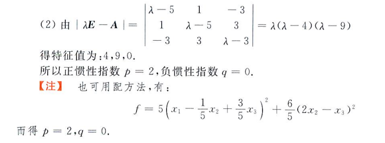

## 特征值、特征向量

> 特征值在我看来，实际上是一个高维矩阵在单维空间上的某种映射，携带自身的一些特性，而特征向量是特征值对应的一组显性表示

### 特征值、特征向量定义

对于矩阵`A`，若
$$
A\alpha = \lambda\alpha
$$
则 λ 为 A 的一个特征值，α 为特征值 λ 对应的一个特征向量

上述等式等价于
$$
(A-\lambda E)\alpha = 0
$$
我们可以发现这其实是一个齐次线性方程组，系数矩阵为`A-λE`，未知数为特征向量 α，这个方程组有解

- 则系数矩阵秩小于 n
- 系数矩阵对应行列式值为 0

根据行列式值为 0，在已知 A 的情况下，很显然可以解出行列式中唯一的未知数 λ，自此解决特征值和特征向量的问题

我们称`|A-λE|`为 A 的特征多项式，`|A-λE| = 0`为 A 的特征方程

### 求解特征值、特征向量

总的来说，求解特征值和特征向量的方法为：

- 设 λ，列出特征方程，解出 λ
- 代入 λ，得到齐次线性方程组的系数矩阵`A-λE`，求解方程组，得到基础解系
- 方程组的通解即为特征值对应的特征向量，一一列出即可

特征值的一些性质（`tr(A)`为矩阵 A 的迹，为主对角线元素之和）
$$
\sum\lambda_i = \sum_{i=1}^n a_{ii} = tr(A)\quad \Pi\lambda_i = |A|\\
$$
特征值的运算
$$
A^{-1}\Rightarrow\frac{1}{\lambda}\quad A^*\Rightarrow |A|\frac{1}{\lambda}\quad 3A+2E\Rightarrow3\lambda+2\quad A^2\Rightarrow\lambda^2
$$
在求解特征值的特征向量时，发现重根的特征值对应的特征向量，可能是一个，也可能是两个，取决于`A-λE`的秩

## 相似矩阵

### 相似矩阵概念及性质

若对于矩阵`A`，存在可逆矩阵`P`，使得
$$
P^{-1}AP = B
$$
则 A 与 B 相似，记作
$$
A\sim B
$$
相似矩阵性质：反身性，对称性，传递性

特征多项式相等
$$
|A-\lambda E| = |B-\lambda E|\\
$$
特征值相同
$$
\lambda_A = \lambda_B\Rightarrow |A|=|B|=\Pi\lambda\quad\sum_{i=1}^na_ii=\sum_{i=1}^nb_ii=\sum\lambda
$$
A 和 B 秩相同
$$
r(A) = r(B)
$$
一些推论，当 A B 相似时，有
$$
A^n \sim B^n\quad A^{-1}\sim B^{-1}\quad A+kE\sim B+kE
$$

### 相似对角化

> 特征值、特征向量求解的高阶形式

当`A~B`且 B 为一个对角矩阵（除主对角线上元素均为 0）时，我们称 A 可被相似对角化，B 为 A 的相似对角型

A 能被相似对角化的充要条件

- 方阵 A 有 n 个不同的特征值
- 矩阵 A 每个特征值的重根数均等于其特征向量分量的个数，如二重根对应两个线性无关的特征向量

已知矩阵 A，求解相似对角阵 B 以及过度矩阵 P
$$
P^{-1}AP = B
$$
首先明确一点，**若一个矩阵可以被相似对角化，其相似对角型的主对角线元素均为其特征值**（重根占多个元素位），如
$$
B = \left [ \begin{matrix}
\lambda_{1}&0\\
0&\lambda_{2}
\end{matrix} \right ]
$$

设 λ1 的特征向量为 α1，λ2 的特征向量为 α2，则有
$$
A\alpha_1 = \lambda_1\alpha_1\quad A\alpha_2 = \lambda_2\alpha_2
$$
设
$$
P = (\alpha_1,\alpha_2)
$$
则
$$
AP = A(\alpha_1,\alpha_2) = (A\alpha_1,A\alpha_2) = (\lambda_1\alpha_1,\lambda_2\alpha_2)
$$
根据矩阵乘法的性质
$$
PB = (\alpha_1,\alpha_2)
\left [ \begin{matrix}
\lambda_{1}&0\\
0&\lambda_{2}
\end{matrix} \right ] =
(\lambda_1\alpha_1,\lambda_2\alpha_2) = AP
$$
哦哟，这不就是相似矩阵的定义吗，两边同时乘一个`P^{-1}`，得
$$
P^{-1}AP = B
$$
于是我们发现，每个特征值对应的特征向量组成的矩阵（我称之为特征矩阵），就是要求的 A 到 B 的过度矩阵

一定要注意，特征值的位置和其对应的特征向量的位置要一一对应

于是相似矩阵的问题又变成了

- 求特征值，得相似对角型
- 解特征值对应特征向量
- 组合特征向量为特征矩阵

## 实对称矩阵

相似对角矩阵的更进一步，实对称矩阵要求其所有特征向量**两两正交且均为单位向量**

- 两两正交：数量积为 0（各分量相乘再相加）
- 单位向量：模为 1，各分量平方和开根

这里要用到施密特正交化

另外注意，特征向量正交是极有用的信息，可以通过这一条件通过特征向量求特征向量，如已知三位实对称矩阵 A，其有一个特征值 a 对应特征向量 α，已知另一特征值 b
$$
\alpha = (1,0,1)^T
$$
设另外的特征向量为 β
$$
\beta = (x_1,x_2,x_3)
$$
则
$$
\alpha\beta = x_1+x_3 = 0
$$
令
$$
(x_1,x_2)=(0,1)\Rightarrow\beta_1 = (0,1,0)^T
$$
$$
(x_1,x_2)=(1,0)\Rightarrow\beta_2 = (1,0,-1)^T
$$

于是得到实对称矩阵 A 的三个特征向量 α,β1,β2
$$
P = (α,β_1,β_2) \rightarrow B =
\left [ \begin{matrix}
a&0&0\\
0&b&0\\
0&0&b
\end{matrix} \right ]
$$

## 二次型及其标准型

### 二次型

关于 n 个变量`x = (x1,x2,...,xn)`的一个**二次齐次多项式`f(x)`为这 n 维向量 x 的二次型**
$$
\begin{aligned}
f(x) = a_{11}x_1^2&+2a_{12}x_1x_2+...+2a_{1n}x_1x_n\\
&+ a_{22}x_2^2+2a_{23}x_2x_3+...+2a_{2n}x_2x_n\\
&+ {...}\\
&+ a_{nn}a_n^2
\end{aligned}
$$
其中，**非平方项的系数为偶**

### 对应矩阵、标准形

二次型这一多项式式子可以用矩阵乘法表示
$$
f(x) = x^T Ax\quad\quad A =
\left [ \begin{matrix}
a_{11}&a_{12}&...&a_{1n}\\
a_{21}&a_{22}&...&a_{2n}\\
...\\
a_{n1}&a_{n2}&...&a_{nn}
\end{matrix} \right ]
$$
上述矩阵乘法中，A 被称作二次形 f 的对应矩阵

当然，A 必须为实对称矩阵，即`a12 = a21`，这样在乘出来之后，非平方项合并，系数为 2（偶）

- 当 A 为**对角阵**时，称二次形 f 为标准形（又叫平方和），自然，根据定义，**此时二次齐次多项式只有平方项**
- 进一步的，在标准形的基础上，当二次形对应矩阵 A 在对角上的元素**元素均为 1、-1 或 0**，称二次型 f 为**规范形**

二次型、标准形、规范形的关键其实都在于其对应矩阵 A

### 惯性指数、二次型的秩

在 f 对应的标准形 f' 中，对角线上正元素的个数为正惯性指数，负元素的个数为负惯性指数，注意 f 和 f' 的惯性指数是保持一致的

二次型 f 对应矩阵 A 的秩 r(A) 为二次型 f 的秩

### 合同矩阵、坐标转换

当存在可逆矩阵 C，令矩阵 A 满足下式
$$
C^TAC = B
$$
则我们说矩阵 A B 合同（反身性，对称性，传递性）

对于二次型 f
$$
x^TAx
$$
我们进行自变量 x 的一个坐标转换，令
$$
y = Cx
$$
C 为 x 到 y 的**坐标变换**，带入二次型 f，则有
$$
f(y) = y^TC^TACy = y^TBy
$$
这个新的矩阵 B 则为二次型 f 在新坐标 y 下的对应矩阵

很显然，由于
$$
B = C^TAC
$$
二次型在新旧坐标下的对应矩阵，是合同的

### 求解二次型标准形及坐标变换

#### 正交变换法

简单来说，就是求一个实对称矩阵（正交相似对角），因为实对称化时，其转化矩阵`C`单位正交，一定有
$$
C^T = C^{-1}
$$
所以有
$$
C^TAC = C^{-1}AC = B =
\left [ \begin{matrix}
\lambda{1}&0&...&0\\
0&\lambda{2}&...&0\\
...\\
0&0&...&\lambda{n}
\end{matrix} \right ]
$$
这个转化矩阵在上一章已经证明过，就是矩阵`A`的特征向量组成的矩阵（单位正交化后），自然，这里涉及到**施密特正交化**的运用

于是**求解标准形的坐标变换又变成了一个求解单位正交特征向量的问题**

标准形和二次型对应矩阵的特征值的关系

正交变换下，根据坐标变换的**正交性质**求解特征向量

正交变换求解二次型及坐标变换

栗子一

栗子二

#### 配方法

以后再学吧，用配方法化二次型

### 求解规范形

惯性定理：二次型经过任意左边变换，其标准形的正惯性指数和负惯性指数都是唯一确定的（坐标变换不改变二次型的惯性指数）

通过惯性定理可以求解规范形，很简单的道理，因为规范形只有`1,-1,0`，由于惯性定理，惯性指数不变，于是如
$$
\left [ \begin{matrix}
4&0&0\\
0&0&0\\
0&0&-9
\end{matrix} \right ]
\rightarrow
\left [ \begin{matrix}
1&0&0\\
0&0&0\\
0&0&-1
\end{matrix} \right ]
$$
就是在标准形的基础上，把正惯性指数用 1 填充，负惯性指数用 -1 填充，0 用 0 填充得到的对角矩阵

求解惯性指数，就是求对应矩阵特征值，然后数数

对应矩阵一定和标准形合同，标准形一定和规范形合同

求解规范形

只要满足惯性指数相同，用 1、0、-1 作系数即可
$$
y_1^2+y_2^2-y_3^2
$$

## 正定二次型

### 正定二次型定义

当二次型 f，对于下式恒成立
$$
f(x) = x^TAx > 0
$$
则称二次型 f 为**正定二次型**，其对应矩阵 A 记作**正定矩阵**

### 判定正定

判断正定

- 顺序主子式均大于 0
- 特征值均大于 0

顺序主子式，如
$$
A = \left [ \begin{matrix}
4&3&2\\
1&2&3\\
8&0&-9
\end{matrix} \right ]
$$
的顺序主子式为
$$
\triangle_1 = 4\quad \triangle_2 =
\left | \begin{matrix}
4&3\\
1&2
\end{matrix} \right | \quad
\triangle_3 = |A|
$$
在实际情况下，需要对矩阵进行判断，是计算顺序主子式方便求解范围还是一个个求解特征值确定范围方便，有时都行

根据特征值或顺序主子式判断

根据顺序主子式判定

根据特征值判定

