## 向量及向量组概念

列向量和行向量，向量的每个元素称为**分量**

向量的运算和矩阵完全保持一致，相当于一个`1xn`或`mx1`的矩阵

向量组，若干同维数向量所组成的集合叫做向量组（我可不可以称之为矩阵😀）

- 部分组和整体组，横向扩展
- 延伸组和缩短组，纵向扩展

老生常谈的线性相关

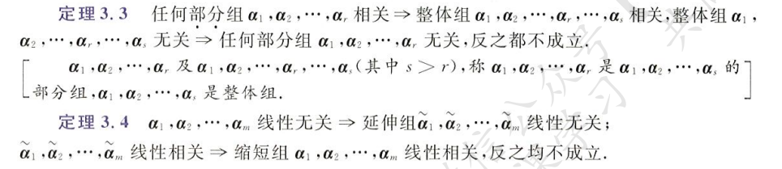

## 线性表出及线性相关

### 线性表出和相关的定义

对于向量组`α`
$$
k_1\alpha_1+k_2\alpha_2+...+k_n\alpha_n
$$
为其一个**线性组合**

若一个向量`β`能够被`α`的某个线性组合表示出，即
$$
\beta = k_1\alpha_1+k_2\alpha_2+...+k_n\alpha_n
$$
则说`β`能够被`α`**线性表出**

对于线性齐次方程组
$$
k_1\alpha_1+k_2\alpha_2+...+k_n\alpha_n = 0
$$
若这里的系数`k`可以不全为零，则说向量组`α`**线性相关**（说明某一个向量是另一个向量的整数倍）；若只有当系数`k`全为 0 时方程才成立，说明向量组`α`**线性无关**

线性相关/无关的多种表述形式

重要定理，将**非齐次方程组 - 向量乘法 - 线性表出 - 秩**相联系

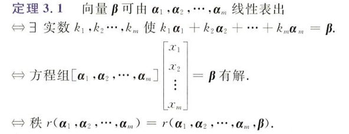

另一重要定理，将**齐次方程组和线性相关**相联系

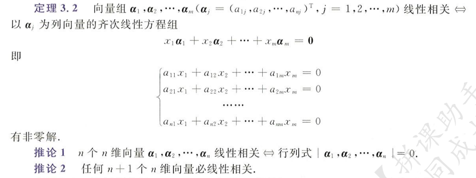

关于**整体组、部分组、延伸组、缩短组**的定理

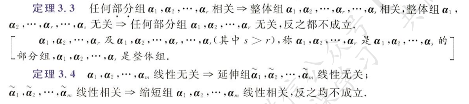

另外一些定理，太长不想看了

### 线性表出和非齐次方程组

> 判断向量是否能被某个向量组线性表出，使用方程对应的非齐次线性方程组进行判定

线性表出式子对应的非齐次线性方程组
$$
\beta = k_1\alpha_1+k_2\alpha_2+...+k_n\alpha_n
$$
对应方程组
$$
\begin{cases}
a_{11}x_1+...+a_{1n}x_n = b_1\\
a_{21}x_1+...+a_{2n}x_n = b_2\\
...\\
a_{n1}x_1+...+a_{nn}x_n = b_n\\
\end{cases}
$$
其中
$$
\alpha_1 = [a_{11},...,a_{1n}]^T\quad \beta =[b_{1},...,b_{n}]^T
$$
其他以此类推，当方程组有解，即有有意义的`x1,x2,...,xn`使方程组成立时，我们就说：向量`β`能够被向量组`α`线性表出（注意这里不能判断`α`是否线性相关，这是齐次方程组的事儿）

向量`β`能够被向量组`α`线性表出，说明对应的非齐次线性方程有解，说明对应的方程组系数矩阵`α`和矩阵`(α|β)`的秩相同

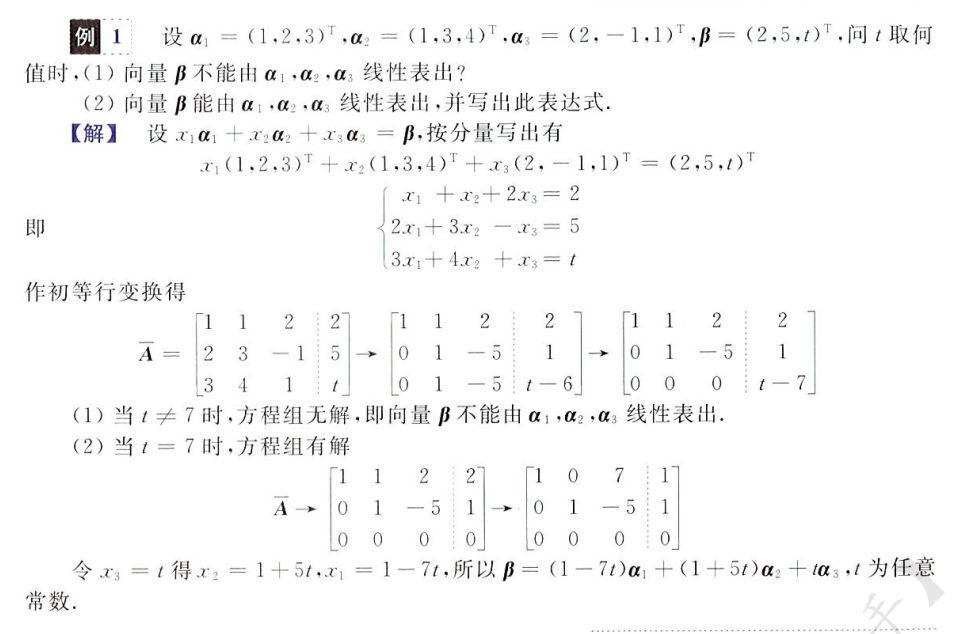

再举个栗子

线性表出实际上重点在于指出向量组前的系数是否存在，存在则能表出

### 线性相关和齐次方程组

> 判断向量组内部是否线性相关，使用向量组对应的齐次线性方程组进行判断，线性相关使向量组内部的事，线性表出是向量组这个整体的事，一定要注意区分

现有向量组`α` 
$$
\alpha = [\alpha_1,\alpha_2,...,\alpha_n]
$$
`α`向量组对应的齐次线性方程组
$$
\begin{cases}
a_{11}x_1+...+a_{1n}x_n = 0\\
a_{21}x_1+...+a_{2n}x_n = 0\\
...\\
a_{n1}x_1+...+a_{nn}x_n = 0\\
\end{cases}
$$
自然可以得到该方程组的系数矩阵，记为`A`
$$
\left |
\begin{matrix}
a_{11}&a_{12}&...&a_{1n}\\
a_{21}&a_{22}&...&a_{2n}\\
...\\
a_{n1}&a_{n2}&...&a_{nn}
\end{matrix}
\right |
$$
判断向量组`α`线性相关的方法

- 若`A`为方阵，求其对应行列式`|A|`，**若`|A| = 0`，说明行列式中必有两行为各自的倍数**，也就是说矩阵`A`线性相关（向量组`α`线性相关）；相反的，若`|A|`不为 0，说明向量组`α`线性无关
- 将`A`经过初等变换得到行阶梯矩阵`B`，可以轻易知道矩阵`B`的秩，也就是`A`的秩，**当`r(A) < n`（这里`n`为向量组中向量的个数，也是其对应方程组未知数`x`的个数），说明有全零行**，根据初等变换的性质可知，有成整数倍的两行，自然满足线性相关的定义

根据秩的大小判断向量组是否线性相关

根据向量组对应行列式是否为 0 判断向量组是否线性相关

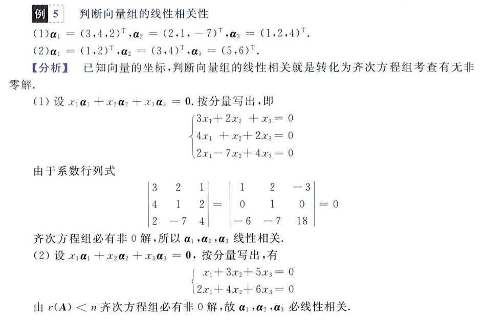

含有未知量的向量组，关于线性相关的讨论，根据秩的大小来判定，一定要注意在消去公因子时，要做是否为 0 的判断（不能除以 0）

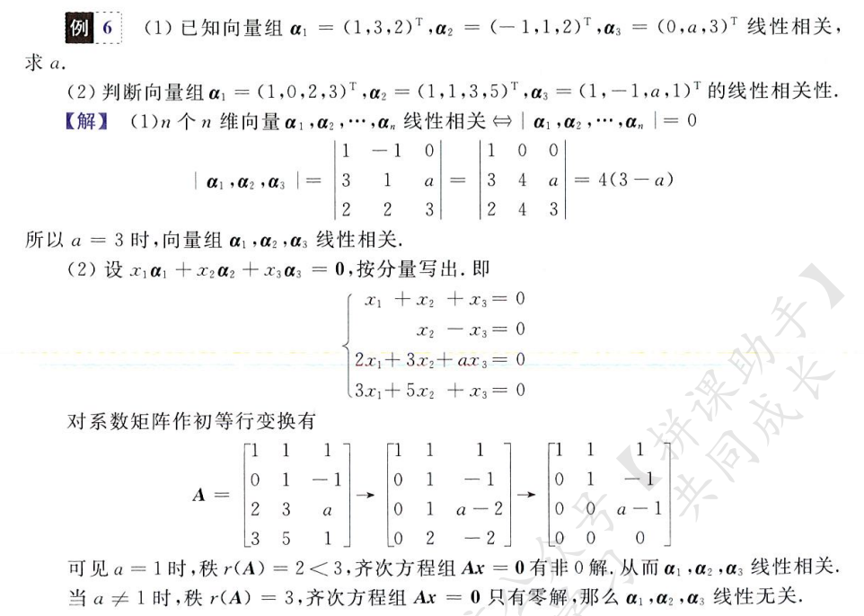

灵活结合**矩阵乘法和线性相关的性质**（行列式为 0）得出结论

以下三道证明题，死了亲妈，需要反复祭奠

关于线性相关和表示法唯一的证明

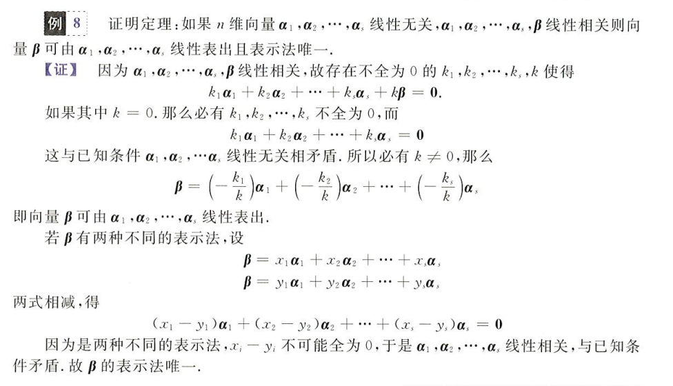

**向量组线性相关 <=> 向量组内部某一向量能被其余向量线性表出**

线性无关的延展性

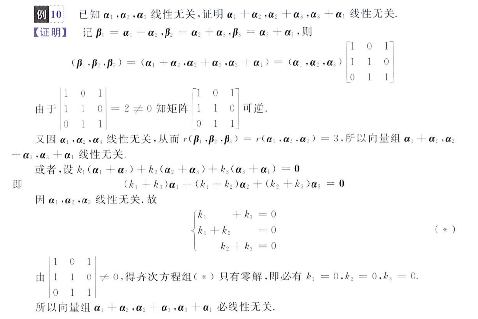

## 向量组及矩阵的秩

> 向量组和矩阵好像没有什么区别，向量组更强调列的概念，
>
> 矩阵：是描述变换的

极大无关组：再多一点看一眼，就会爆炸（相关）

秩的官方定义：极大无关组中向量的个数，即为向量组的秩

求秩的方法

- 化为行阶梯矩阵，非零行的个数即为向量组的秩
- 若向量组为方阵，当对应行列式不为 0 时，其秩等于方阵阶数 n

求极大无关组的方法：将向量组化为行阶梯矩阵，其主元所在的列标对应的初始列向量构成的向量组即为原向量组的一个极大无关组（注意很多时候极大无关组不止一个，这有可能取决于你的初等变换过程）

向量组等价：向量组 α 中每个向量均可以由 β 线性表出，相反也成立，则说 α 等价于 β

矩阵的秩：暂时我将矩阵视为向量组，向量组视为矩阵，不分家

矩阵秩的公式

转置和数乘：转置和数乘不影响矩阵的秩
$$
r(A) = r(A^T) \quad r(kA) = r(A)
$$
矩阵乘法：乘以转置不影响秩大小；乘积的秩取项中最小的秩
$$
r(A^TA)=r(A)\quad
r(AB) \leq min\{r(A),r(B)\}
$$
可逆：矩阵乘以可逆矩阵，其秩不变（矩阵可逆，其秩一定为 n）
$$
\exist A^{-1}\Rightarrow r(AB) = r(B) = r(BA)
$$
分块矩阵
$$
r\left (
\begin{matrix}
A&0\\
0&B\\
\end{matrix}
\right ) =
r(A) + r(B)
$$
矩阵的扩展
$$
max\{r(A),r(B)\} \leq r(A,B) \leq r(A)+r(B)
$$
三秩相等：**矩阵的秩**等于**矩阵的列秩**等于**矩阵的行秩**（矩阵的列秩可以视为相应向量组的秩）

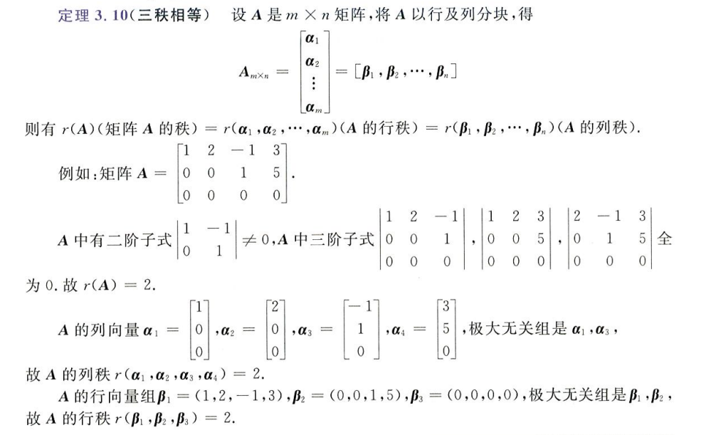

根据秩的大小求解未知数，就是把秩表示出来然后列方程计算未知数

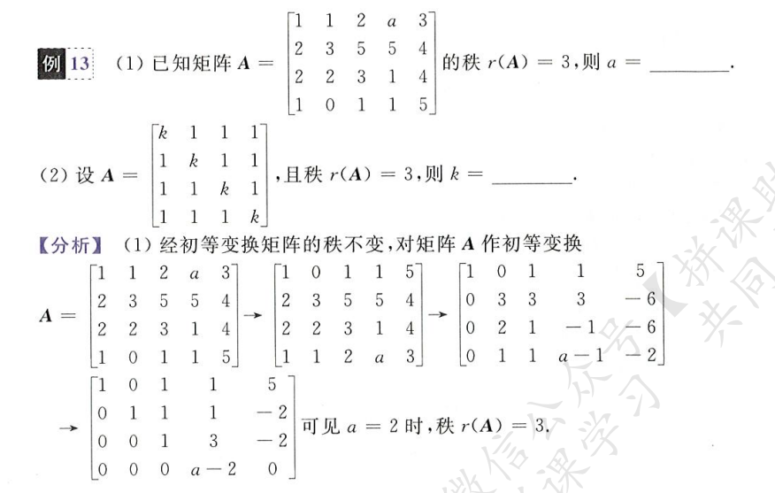

选择题答案为`B,A`

## 正交规范化及正交矩阵

### 内积、模和正交

向量的内积：对于两个 n 维向量，选择合适的乘法顺序，将得到一个一维向量，即一个数，我们将这个一维向量称作向量的内积，如
$$
([1,2,3],[4,5,6]^T) = 1\times4+2\times5+3\times6 = 32
$$
向量的模，即为自身和自身的内积的根号，如设`a = [1,2,3]`，其模记为`|a|`
$$
|a| = \sqrt{(a,a)} = \sqrt{[1,2,3][1,2,3]^T} = \sqrt{19}
$$
这里的符号区别于矩阵对应的行列式，向量是`1xn`的，行列式是`nxn`的

当`|a| = 1`时，我们称向量`a`为单位向量

定义两个向量的夹角余弦为
$$
cos<\alpha,\beta> = \frac{(\alpha, \beta)}{|\alpha|\,|\beta|}
$$
当余弦为 0 时，自然两向量垂直，即正交，此时称向量 α 和 β 正交

### 施密特正交化

### 正交矩阵

> **要记住，矩阵，是描述变换的**

当下式成立时，矩阵 A 正交
$$
AA^T = E
$$
等价于
$$
A^T = A^{-1}
$$
另外，当一个矩阵内**行/列向量两两正交**，且**都是单位向量**，我们说这个矩阵是正交矩阵

求正交向量

正交一定线性无关，按道理说正交是最线性无关

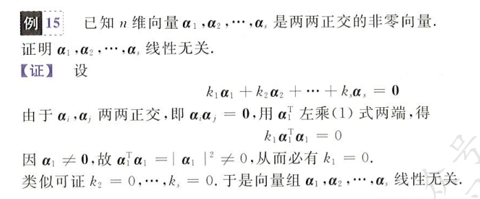

