## 随机事件和概率

### 随机事件、事件间的关系与运算

一些名词解释

- 随机试验（试验）：可重复性
- 样本点和样本空间：试验结果
- 随机事件（事件）：样本空间子集

| 随机事件的关系 |                                              |
| -------------- | -------------------------------------------- |
| 包含           | ⊂ 箭头指向谁，谓语是谁，如 A ⊂ B 则 B 包含 A |
| 相等           | 互相包含                                     |
| 互斥           | 不相容，不同时发生                           |
| 对立           | A 不发生 B 必发生                            |
| 独立           | P(AB) = P(A)P(B)                             |

| 随机事件的运算 |                           |
| -------------- | ------------------------- |
| 交（积）       | 都发生，A ∩ B，AB         |
| 并（和）       | 至少一个发生，A∪B，或 A+B |
| 差             | A - B，A 发生 B 不发生    |

独立的性质：若事件 A B 独立，则
$$
P(AB) = P(A)P(B)
$$
并的拆分
$$
P(A+B) = P(A)+P(B)-P(AB)
$$
$$
P(A+B+C) = P(A)+P(B)+P(C)-P(AB)-P(AC)-P(BC)+P(ABC)
$$

并运算的分配律
$$
P[(A+B)(A+B)] = P(A)+2P(AB)+P(B)
$$
其中
$$
P(AA) = P(A)\quad P(AB) = P(BA)
$$
总的来说求随机事件概率

- 一是画图
- 二是运算

独立和不相容的区别

- 不相容：`P(AB) = 0`
- 独立：`P(AB) = P(A)P(B)`

### 概率及概率公式

和高中内容是否有些许重合

### 古典概型与伯努利概型

伯努利方程（一种一阶微分方程），将只相差 1 的两个 y 的幂用高次的微分代替，这样方程中将只含有一个关于 y 的幂，将这个 y 的幂设为新的未知函数 z，用公式法求解一阶线性微分方程得到 z，反代回去最终得到 y

## 离散随机变量概述

一维随机变量的分布、概率密度、数学期望以及方差

### 一维离散随机分布

形如这样的分布即为一维离散随机分布

| X     | 0    | 1    |
| ----- | ---- | ---- |
| **P** | 0.5  | 0.5  |

很显然，这里的自变量只有 X 一个，即一个 X 对应一个概率，故为一维分布

### 二维离散随机分布

二位随机分布，其自变量为两个 X 和 Y，二者共同决定一个概率

其实就是这样一个二维表

| X\Y     | Y1    | Y2    | ...  | Yn    | ...  |
| ------- | ----- | ----- | ---- | ----- | ---- |
| **X1**  | `P11` | `P12` |      | `P1n` |      |
| **X2**  | `P21` | `P22` |      | `P2n` |      |
| **...** |       |       |      |       |      |
| **Xn**  | `Pn1` | `Pn2` |      | `Pnn` |      |
| **...** |       |       |      |       |      |

性质如下
$$
0 \leq P_{ij} \leq 1 \quad\quad \sum P_{ij} = 1
$$

### 联合分布列和边际分布列

联合分布列，就是联合概率分布表

边际分布列，就是单个变量的概率分布表，塌陷二维分布中其中一个变量便可以得到另一变量的边际分布

| X    | `x1`  | `x2`  | ...  | `xn`  | ...  |
| ---- | ----- | ----- | ---- | ----- | ---- |
| P    | `P1-` | `P2-` |      | `Pn-` |      |

| Y    | `y1`  | `y2`  | ...  | `yn`  | ...  |
| ---- | ----- | ----- | ---- | ----- | ---- |
| P    | `P-1` | `P-2` |      | `P-n` |      |

### 离散随机变量的独立

事件独立：有事件`a,b`，若`P(a,b) = P(a)P(b)`，则事件`a,b`相互独立

二维离散随机变量的独立：对于二维随机变量的联合分布表，每个概率`Pij`都为两个变量相应的边际分布概率相乘

如 X/Y 有边际分布

| X     | 0    | 1    |
| ----- | ---- | ---- |
| **P** | 0.4  | 0.6  |

| Y     | 0    | 1    |
| ----- | ---- | ---- |
| **P** | 0.3  | 0.7  |

其联合分布为

| X\Y   | 0    | 1    |
| ----- | ---- | ---- |
| **0** | 0.12 | 0.28 |
| **1** | 0.18 | 0.42 |

其中
$$
\begin{cases}
P_{00} = P_{x=0}\,P_{y=0} = 0.4\times0.3 = 0.12\\
P_{01} = P_{x=0}\,P_{y=1} = 0.4\times0.7 = 0.28\\
P_{10} = P_{x=1}\,P_{y=0} = 0.6\times0.3 = 0.18\\
P_{11} = P_{x=1}\,P_{y=1} = 0.6\times0.7 = 0.42
\end{cases}
$$
此时我们说二维离散随机变量 X/Y 是独立的

## 离散型随机变量函数的分布

### 随机变量函数的定义

随机变量函数：一个二元函数，自变量、因变量均为随机变量，函数映射的是他们的值，而不是概率

- 概率由自变量传递给因变量
- 相同值的概率是可以合并的

对于下列一维离散随机变量

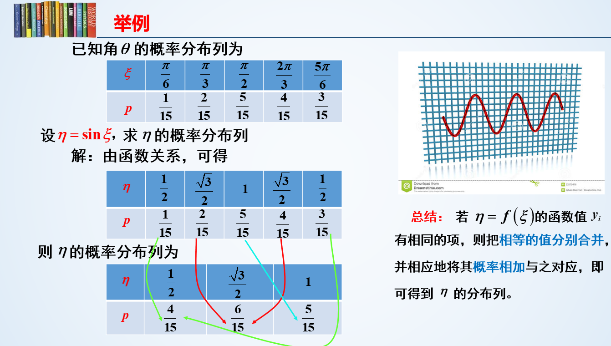

实际上就是一个正常的二元函数，只不过每个自变量取值将其原有附带的概率也传递给了因变量（随机变量函数）

### 离散随机变量函数

对于二维随机变量 X/Y 的分布表

| X\Y   | 0    | 1    |
| ----- | ---- | ---- |
| **1** | 0.2  | 0.3  |
| **2** | 0.4  | 0.1  |

现在有这样一个函数：`f = X+Y`

那么这个函数`f`实际上塌陷为一个一维随机变量，其相对应的概率分布表（一维）为

| f     | 1    | 2    | 3    |
| ----- | ---- | ---- | ---- |
| **P** | 0.2  | 0.7  | 0.1  |

- 当`f = X + Y = 1 + 0 = 1`时，概率为`0.2`
- 当`f = X + Y = 2`时，有两种可能，一为`Y = 1, X = 1`，二为`Y = 0, X = 2`，所以`P(f=2)`为二者概率相加，即`0.3+0.4=0.7`
- 当`f = X+Y = 2+1 = 3`时，概率为`0.1`

## 常见离散随机变量概率分布

### 二项分布

在n次独立重复的伯努利试验中，设每次试验中事件A发生的概率为p。用X表示n重伯努利试验中事件A发生的次数，则X的可能取值为`0，1，…，n`，且对每一个k（`0≤k≤n`）,事件`{X=k}`即为`n次试验中事件A恰好发生k次`，随机变量X的离散概率分布即为二项分布（Binomial Distribution）

举个栗子：如抛硬币`n`次，花面次数`X`的概率分布（花面概率`p`始终为0.5）

用符号`b`表示二项分布：`X ~ b(n,p)`表示进行次数为`n`，抛硬币 m 次画面次数 H 的二项分布表示为`H ~ (m,0.5)`

数学期望：每次独立事件发生概率均为`p`的二项分布`X`，其数学期望为`np`

### 0-1分布

当二项分布`X ~ b(n,p)`中`n=1`时，即只进行一次实验，事件发生次数要么1次要么0次（如抛一次硬币），即为**0-1分布**，其数学期望为`p(n=1)`

其分布列为

| X     | 1    | 0    |
| ----- | ---- | ---- |
| **P** | 0.5  | 0,5  |

### 泊松分布

泊松分布的概率函数，记为 P(λ)
$$
P(x=k)=\frac{\lambda ^k}{k!}e^{-\lambda}
$$

- `λ`为单位时间(或单位面积)内随机事件的平均发生次数，是泊松分布的唯一参数
- 泊松分布适合于描述单位时间内随机事件发生的次数

泊松分布的数学期望和方差均为`λ`

### 几何分布

几何分布（Geometric distribution）。一种定义为：在`n`次伯努利试验中，试验`k`次才得到第一次成功的机率。详细地说，是：前`k-1`次皆失败，第 k 次成功的概率

- 简单来说，就是抛硬币第`i`次首次抛到花面的概率分布

几何分布表示为：`X ~ Ge(p)`

- 其中`p`为每次独立实验事件发生的概率

其数学期望为`E(X) = 1/p`

## 连续型随机变量概述

一维、二维连续型随机变量及其函数的分布和概率密度

### 连续型随机变量定义

设有随机变量`f`，这是一个一维的实值随机变量函数，也可以是一个随机变量，定义这个随机变量的分布函数为：`F(x) = P(f < x), x∈R`

- 分布函数是一个普通的函数（不携带概率），`x`是自变量，定义域为`R`
- `F(x)`是随机变量`f`取值不大于`x`的概率，值域为`[0,1]`
- 就像一根绳子随机砍断的几何分布

通常来讲，随机变量的分布函数是分段函数，在小的区间内概率始终为0，经过一段概率逐渐上升的区间后，概率稳定为 1

### 分布函数和事件概率

对于离散型随机变量，其分布函数`F(x0)`的取值就是各个小于`x0`的概率相加，当`x和x0`取等时概率突变

于是分布函数被`x`的取值分为不同的函数段，在图像上是一个右升的阶梯型曲线，在取等时垂直跳跃，在其他阶段是平行于`x`的直线

- 离散型随机变量的概率密度始终为0

分布函数性质：

- 单调不减性：`F(x+a) >= F(x), a>0`
- `x -> -∞`时取值为0，`x -> +∞`时取值为1
- 右连续：`F(x+0) = F(x)`

注意，在取等时，分布函数的值有可能发生突变，所以在进行概率求解时，只有`x`明确的小于`a`，才可以用`F(a)`，或者是明确的`x>=a`，可以用`1-F(a)`

不同概率事件所对应的分布函数值

| 事件      | 对应分布函数  |
| --------- | ------------- |
| P(f<=a)   | F(a)          |
| P(f=a)    | F(a) - F(a-0) |
| P(f<a)    | F(a-0)        |
| P(f>=a)   | 1 - F(a-0)    |
| P(f>a)    | 1 - F(a)      |
| P(a<f<=b) | F(b) - F(a)   |

## 一维连续性随机变量性质

### 概率密度

对于随机变量`X`，其分布函数为`F`，概率密度即为`F`的导数，记为`p`或`f`

- 若能够求导，即原分布函数有导数，则 X 为连续性随机变量，`F`的导数`p`称为 X 的概率密度

性质

- `p(x) >= 0`，因为`F`单调不减
- 概率密度对整个实数区间积分，其结果必为 1

但注意，概率密度不完全等于分布函数的导数，只有在`p(x)`的连续区间内，才有`F'(x) = p(x)`，分布函数不一定在整个实数区间都可导

用概率密度表示事件发生概率
$$
P(a<X\leq b)=\int_a^bp(x)dx
$$
对于连续型随机变量，因为连续，所以有
$$
F(x_0) = F(x_0-0) = F(x_0+0)
$$
所以对于连续随机变量必有
$$
P(X=x_0) = 0
$$
注意，若`X = a`是不可能事件，必有`P(X=a) = 0`，但反之，若`P(X=a)=0`，`X = a`不一定是不可能事件（参考上述连续型随机变量某点概率去理解）

### 分布函数

和一维的分布函数有点类似，一维连续性随机变量的分布是连续的，我们经常考虑他的密度函数
$$
F(x) = \int_{-\infty}^xf(x)dx
$$
上述积分结果记为分布函数，注意当 f(x) 分段时，一定要一段一段处理

## 常见一维连续随机分布

### 均匀分布

均匀分布的概率密度是一条横线，积分回去得到的分布函数为一个单调递增的一次函数，记作`X ~ U(a,b)`

其中`a,b`为横线的左右边界，由于面积（总概率）为 1，易得
$$
\int_a^bp(x) = 1\quad p(x)=\frac{1}{b-a}
$$

均匀分布和离散型几何分布没有半毛钱关系

### 指数分布

记为 X~E(λ)，概率密度为

$$
p(x)=\begin{cases}
0&x \leq 0\\
\lambda e^{-\lambda x}&x>0
\end{cases}
$$
指数分布的分布函数
$$
F(x) = 1-e^{\lambda x}\quad x>0
$$

指数分布的重要性质：无记忆性，电路元件、动物的寿命等都服从指数分布

指数分布期望：1/λ，方差：1/λ^2

### 正态分布

又叫高斯分布，记作：`X ~ N(μ,σ), μ,σ∈R`

其概率密度为
$$
p(x)=\frac{1}{\sqrt{2\pi}σ}e^{\frac{(x-μ)^2}{2σ^2}}
$$
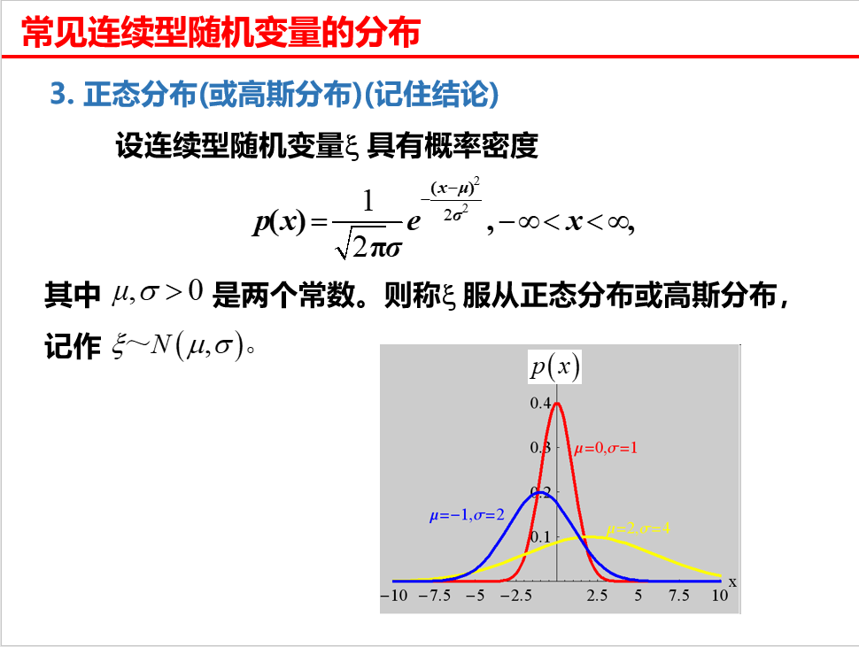

正态分布的几何特征

- 曲线关于 x = μ 对称
- 在 x = u 时，p(x) 取最大值
- 曲线在 x = u+v 和 x = u-v 处有拐点
- 曲线以 x 轴为水平渐近线
- 当固定 μ 时，改变 σ 的大小，p(x) 图形的形状不变，沿着 x 轴左右移动
- 当固定 σ 时，改变 μ 的大小，图形的对称轴不变，但形状改变

3σ 原则：对于正态分布`X ~ N(0,σ^2)`，有

- P(|X| < σ) = 0.668
- P(|X| < 2σ) = 0.955
- P(|X| < 3σ) = 0.997

上式说明`X`的取值大部分集中在`3v`内，而分布其外的很小，几乎不可能发生

### 标准正态分布

当正态分布`X ~ N(u,v)`的`u=0,v=1`时，我们称这个正态分布为标准正态分布

其概率密度为偶函数
$$
p(x) = \frac{1}{\sqrt{2\pi}}e^{-\frac{x^2}{2}}
$$
其分布函数`F(x)`的值可以查表查到，并且这个分布函数同样是一个偶函数，有以下性质

- `F(-x) = 1-F(x)`
- `F(0) = 0.5`
- `P(a<x0<=b) = F(b)-F(a)`

标准正态分布和正态分布的关系

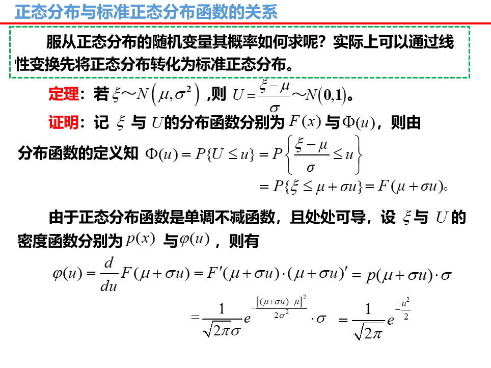

若有正态分布`x ~ N(u,v^2)`，则`(x-u)/v`满足标准正态分布

根据这一特性能够得到以下公式，设`x ~ N(u,v^2)`

$$
P(x<=c) = P(\frac{x-u}{v} <= c-\frac{u}{v}) = F(c-\frac{u}{v})
$$

- 不等式同步加减乘除不影响未知数取值
- 由于`(x-u)/v`满足标准正态分布，所以说等价于一个标准正态分布的`P(u < (c-u)/v)`，自然等于其分布函数的`F((c-u)/v)`

同理有
$$
P(a<x<=b) = F(\frac{b-u}{v}) - F(\frac{a-u}{v})
$$

## 二维连续型随机变量性质

### 联合分布函数

对于二维随机变量`(u,v)`，其分布函数：`F(x,y) = P(u<=x,v<=y)`，称为`u,v`的联合分布函数

性质

- 单调不减
- `F(-∞,y) = 0, F(x,-∞) = 0, F(+∞,+∞) = 1`
- `F(x,y)`对`x,y`均右连续

$$
P(x_1<u<x_2,\,y_1<v<y_2) =F(x_2,y_2)+F(x_1,y_1)-F(x_2,y_1)-F(x_1,y_2)
$$

其中`x1 < x2, y1 < y2`

### 联合概率密度

若二维随机变量`(u,v)`的分布函数`F(x,y)`能够求一次全导，那么我们称他是连续型二维随机变量，他的一次全导`p(x,y)`为他的概率密度，也称联合概率密度

联合概率密度性质

- `p(x,y) >= 0`
- `p(x,y)`从`-∞`到`+∞`对`x,y`的积分结果为1
- 对任意二维区域`G`，点`(u,v)`落在`G`中的概率`P{(u,v)∈G} = ∬p(x,y)dxdy`
- 若`p(x,y)`在点`(x,y)`连续，则`p(x,y)`等于`F(x,y)`的全导

平行或垂直二重积分

垂直积分：给出`x`的取值范围`(a,b)`，给出`y`关于`x`的函数`y = g(x)`，`p(x,y)`先对`y`进行积分，上下限为`(g(a), g(b))`，再对`x`进行积分，上下限为`(a,b)`

- 从图像来看，是先从下到上积分（垂直），再从左往右积分，点-线-面的积分过程

平行积分：给出`y`的取值范围`(c,d)`，给出`x`关于`y`的函数`x = h(y)`，`p(x,y)`先对`x`进行积分，上下限为`(h(c), h(d))`，再对`y`进行积分，上下限`(c,d)`

- 先从左往右积分，再从下往上积分

举个栗子

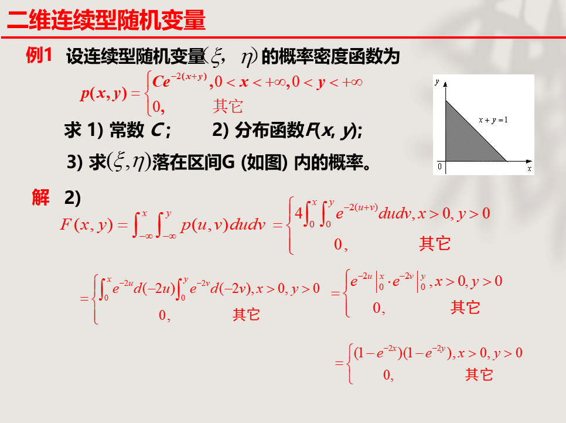

### 边际分布函数

若二维随机变量`(u,v)`联合分布函数`F(x,y)`已知，则

- 关于`x`的边际分布函数为：`Fu(x) = F(x,+∞)`
- 关于`y`的边际分布函数为：`Fv(y) = F(+∞,y)`

若已知联合密度函数`p(x,y)`，则
$$
F_u(x) = ∫_{-∞}^x (∫_{-∞}^{+∞}p(u,y)dy)du
$$

$$
F_v(y) = ∫_{-∞}^y (∫_{-∞}^{+∞}p(x,v)dx)dv
$$

### 边际概率密度

举个栗子

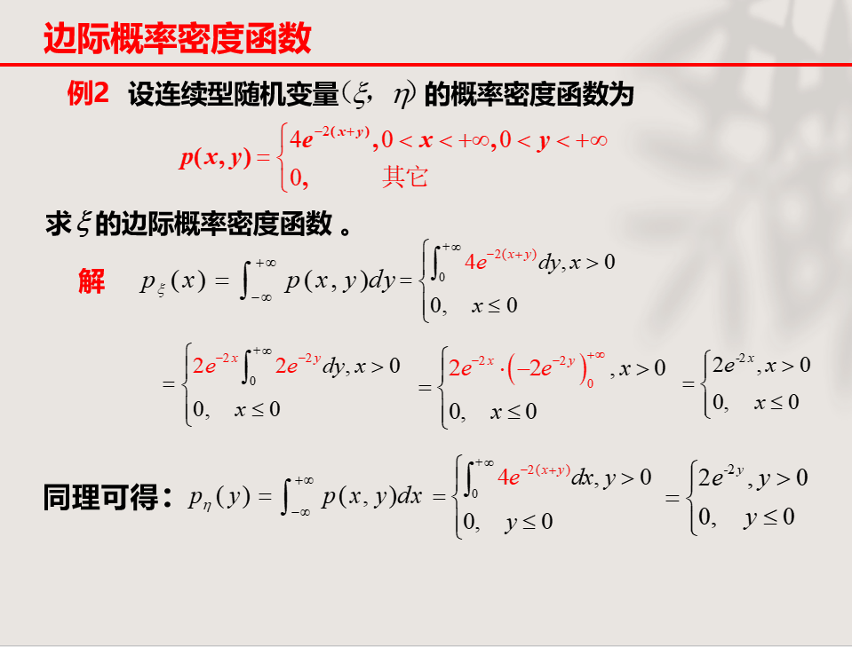

总结下来就是

| 原函数       | 动作                       | 目的函数     |
| ------------ | -------------------------- | ------------ |
| 联合分布函数 | 求全导                     | 联合密度函数 |
| 联合密度函数 | 对`(-∞,x),(-∞,y)`积分      | 联合分布函数 |
| 联合分布函数 | 固定某一变量为`+∞`         | 边际分布函数 |
| 联合密度函数 | 对某一变量从`(-∞，+∞)`积分 | 边际密度函数 |
| 边际密度函数 | 对自变量`z`从`(-∞,z)`积分  | 边际分布函数 |
| 边际分布函数 | 求导                       | 边际密度函数 |

没有边际到联合的转换，联合到边际的过程是不可逆的，只能从联合到边际，联合到联合，边际到边际

### 二维连续随机变量的独立

现有二维随机变量`(u,v)`，若其联合分布函数处处等于其边际分布函数的乘积

$$
F_{u,v}(x,y) = F_u(x)F_v(y)
$$
随机变量`u,v`相互独立

若其联合密度函数`p(x,y)`处处连续，若其联合密度函数处处等于其边际密度函数的乘积

$$
p(x,y) = p_u(x)p_v(y)
$$
`u,v`相互独立

## 常见二维连续随机分布

### 二维均匀分布

二维随机变量`(u,v)`的联合概率密度函数`p(x,y)`为一个常数

$$
\iint_G f(x,y)\,dxdy = 1
$$
在一个有限的平面`G`中，设`G`的面积为`A`，概率密度即为`1/A`

### 二维正态分布

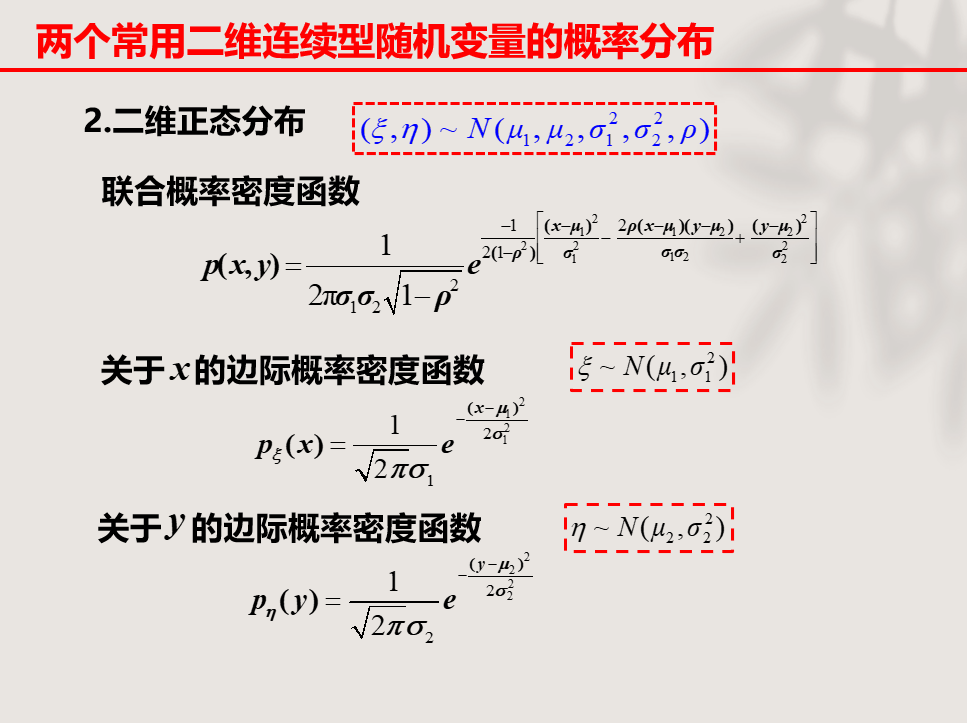

二维正态分布的边际分布均为一维的正态分布，这里边际分布同样推不出对应的联合分布，因为存在参数`p`

## 连续型随机变量函数及其分布

好难捏

### 分布函数法及公式法

> 一个一维变量经过变换 f 得到一个新的一维随机变量

这里考虑主要问题是，已知`X`的概率密度和转换函数`f`，求`Y`的概率密度

#### 分布函数法

对于连续型随机变量的函数 η = f(ξ)，其分布函数 F 根据定义有
$$
F_η(y) = P(\,η < y\,) = P[\,f(\xi)<y\,] = P[\,\xi\leq h(y)\,] = F_\xi[\,h(y)\,]
$$
其中`x = h(y)`是`y = f(x)`的反函数，成功的将关于 η 的分布函数转化为一个关于 ξ 的分布函数（通过反函数反求）

反函数如
$$
y = sinx\quad arcsiny = x
$$
$$
y=x+1\quad\quad x=y-1
$$

再对这个关于 ξ 的分布函数求导（链式求导）即可求得连续性变量函数的密度（二者等价嘛）
$$
\rho_g = F'_\eta(y) = F'_\xi[\,h(y)\,] = F'_z(y)\times h'(y)
$$
举个栗子

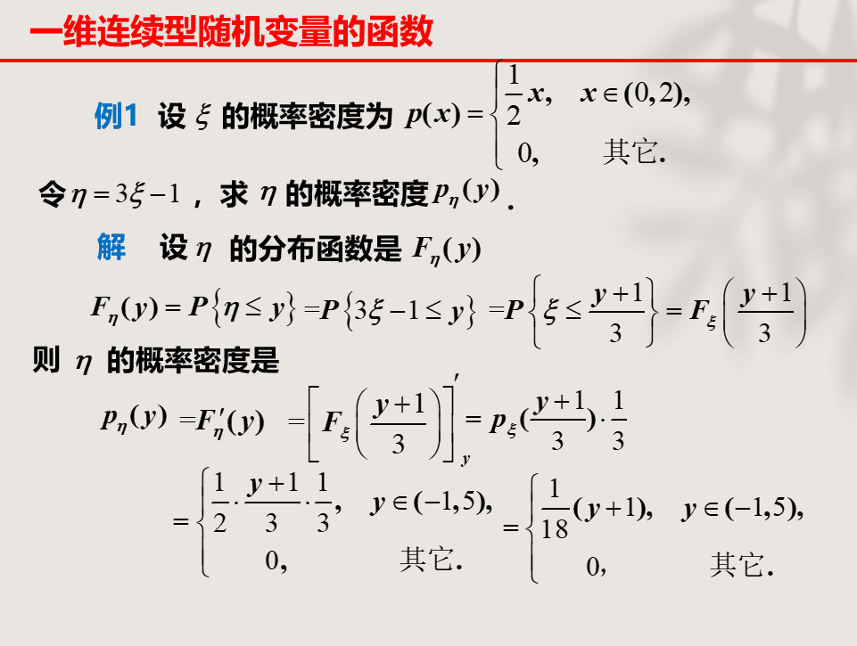

需要注意的是，用反函数对原自变量进行替换时，其取值范围也要相应变换

#### 公式法

当函数`f(x) = y`严格单调且具有连续可导的反函数`h(y) = x`，那么这个函数可以作用于任意连续型随机变量并生成一个连续型随机变量

若已知原随机变量的概率密度函数，那么我们就可以直接使用公式法求得函数的概率密度

$$
ρ(y) = ρ[h(y)] \times h'(y)
$$
这个所谓公式和上面那个其实是一样的

举个栗子

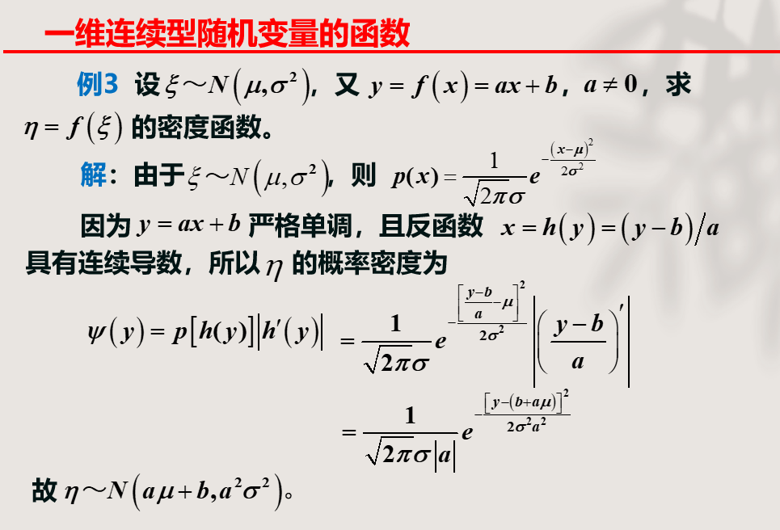

这个例题也得到一个关于正态分布的结论：当一维正态分布随机变量
$$
X\sim N(u,v^2)
$$
经由一个线性函数`y=f(x)=ax+b`作用后，将得到一个二维正态分布随机变量
$$
Y\sim N(a,u+b,a^2,v^2)
$$

### 和的分布、卷积公式

> 两个一维变量组合变换为新的随机变量，显然这个新的随机变量有两个自变量（两个随机变量参与），自然是一个二维随机变量

在这里只考虑这样的连续型随机变量函数：`ζ  = ξ + η`，其中 ξ 和 η 是两个二维连续型随机变量

卷积公式这一方法只针对**相互独立**的一组一维连续型随机变量`(ξ, η)`且**已知这两个随机变量的概率密度函数**的情况，可用于求解随机变量函数的密度函数

卷积公式内容：对于 ζ  = ξ + η，其关于 z 的密度函数为
$$
\rho_\zeta(z) = ∫_{-∞}^{+∞} \rho_\xi(x)\,\rho_\eta(z-x)dx
$$
自然，其分布函数为
$$
F_\zeta(z) = \int_{-\infty}^zdz∫_{-∞}^{+∞} \rho_\xi(x)\,\rho_\eta(z-x)dx
$$
推导过程如下

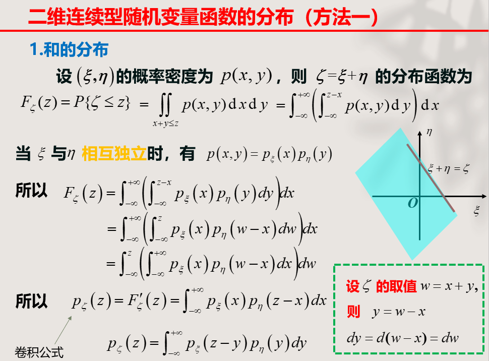

即：把其中一个概率密度函数的自变量由`y`换成`z-x`，消除`y`，再对`p(x,y)=p(x)p(y)`对`x`在`(-∞,+∞)`上一重积分，消除`x`，从而得到关于自变量`z`的分布函数`ρ`

举个栗子

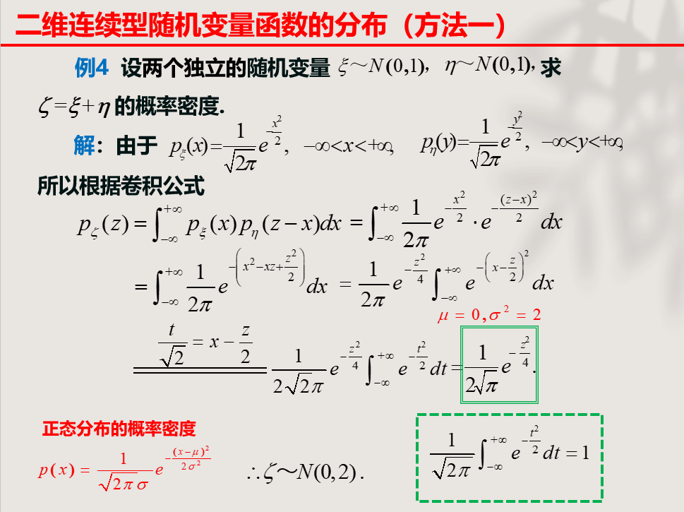

上述栗子也证明了正态分布的可加性：即正态分布相加，仍为一个正态分布，新的正态分布的参数为原正态分布参数之和

- `u = u1+u2, v^2 = v1^2+v2^2`
- 并且这种可加是一直持续的，即可以无限加

### 变量变换定理

> 处理二维连续型随机变量函数的分布

难死爹了

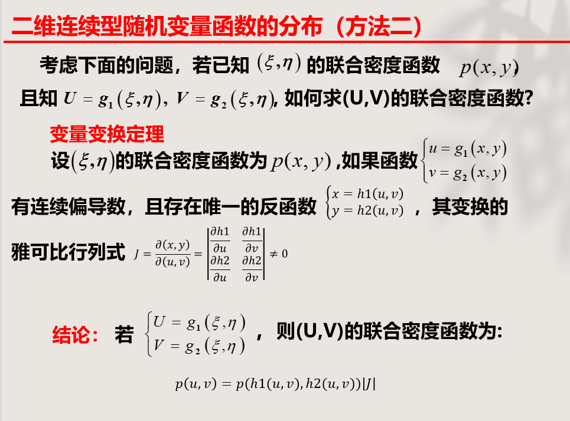

求解两个二维函数（其自变量为同一组二维连续型随机变量）的联合密度函数

雅可比行列式：偏导数`11+22-12-21`
