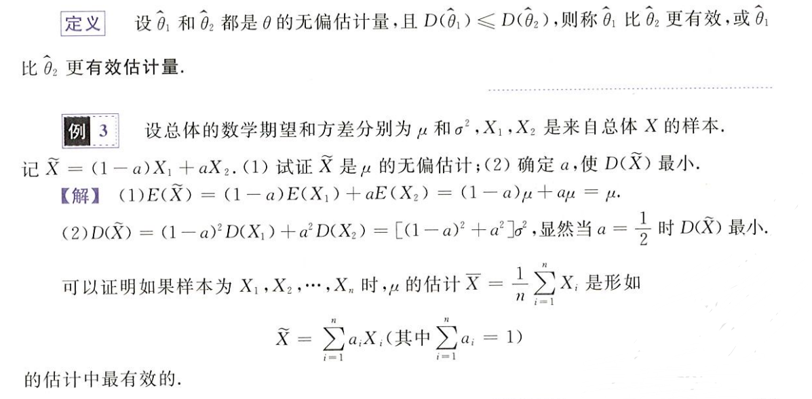
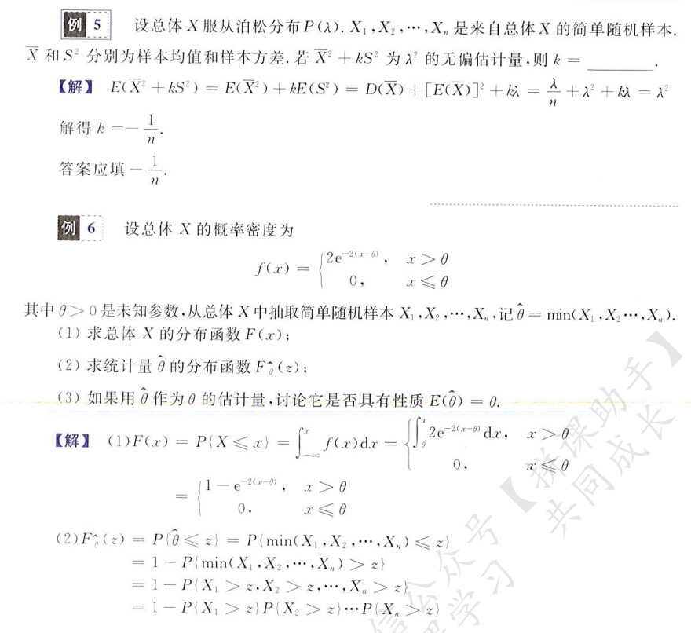
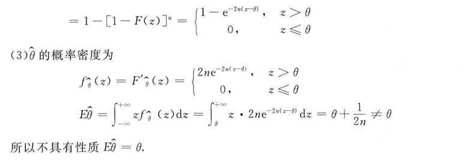
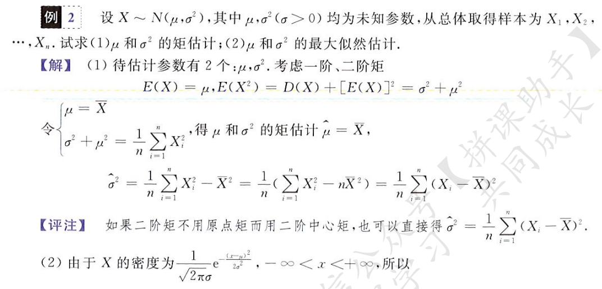
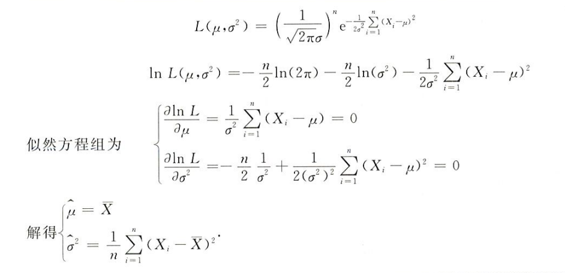
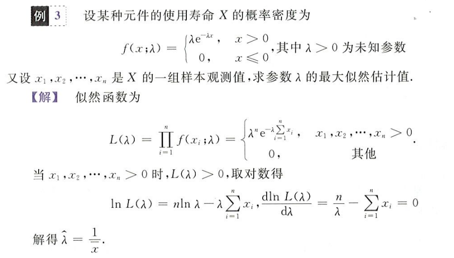

在实际应用中，很多情况事先并不知道随机变量的分布函数是什么，有的时候即便知道服从什么样的分布类型，但是却不清楚具体的参数是什么，这就需要借助于统计的知识加以明确

统计学：以偏概全

## 总体、样本和统计量和样本数字特征

### 总体和样本的定义

基本概念

- 总体：研究对象的某项数量指标 X 的全体
- 个体：研究对象中某一个对象的指标叫做个体
- 样本：如果`(X1,X2,...,Xn)`相互独立且与总体 X 同分布，则`(X1,X2,...,Xn)`为来自 X 的简单随机样本，简称样本，`n`为样本容量
- 样本观察值：简单随机样本`Xi`具体取值的集合`(x1,x2,...,xn)`称作样本观察值

总体和样本的关系

取样有点像一个独立重复实验？或者说其实就是，其概率和分布自然通过相乘来合并

举两个栗子

### 常见统计量

统计量：`(X1,X2,...,Xn)`为来自于总体 X 的样本，`(X1,X2,...,Xn)`的不含未知参数的表达式为 X 的统计量，如
$$
\frac{X_1+X_2+X_3}{3},\quad\quad X_1^2+X_2^2+X_3^2,\quad\quad aX_1+2X_2-X_3
$$

其中第一、二是统计量，第三不是统计量。统计量是无穷无尽的，但有价值的统计量并不多：如特朗普和我，我没有统计价值，而特朗普有

样本均值（期望）
$$
\overline{X}=\frac{1}{n}\sum_{i=1}^{n}X_i
$$
样本方差和标准差
$$
S^2=\frac{1}{n-1}\sum_{i=1}^{n}(X_i-\overline{X})\quad S=\sqrt{\frac{1}{n-1}\sum_{i=1}^{n}(X_i-\overline{X})}
$$
样本的 k 阶原点距
$$
A_k=\frac{1}{n}\sum_{i=1}^{n}X_i^k
$$
样本的 k 阶中心距
$$
B_k = \frac{1}{n}\sum_{i=1}^n(X_i-\overline{X})^k\quad B_2 = \frac{n-1}{n}S_2\neq S_2
$$
1 阶原点距即为样本均值，2 阶原点距为
$$
A_2=\frac{1}{n}(x_1^2+x_2^2+...+x_k^2)
$$
一个常用推论
$$
\sum_{i=1}^n(X_i-\overline{X})^2 = \sum_{i=1}^nX_i^2-n\overline{X}^2
$$

这里的求和可以在 i 前任意调换位置，就像**幂级数**的变换，将原式换算为已知值，如样本均值、方差，以此来推进运算

对于总体为 0/1 分布的 X，其样本独立重复实验，就相当于一个伯努利实验，其样本之和（概率直接相乘）满足二项分布

## 常见统计抽样分布

就是一些常见的样本统计量，针对为正态分布的总体

回顾一下正态分布（接下来介绍的三个抽样分布都基于服从标准正态分布的总体）

若总体`X～N(0,1)`，即服从标准正态分布

则其样本`(X1,X2,...,Xn)`

- 各随机变量相互独立
- 均服从标准正态分布

对于总体`X～N(2,8)`，现有样本`X1,X2`遵循总体分布，则
$$
aX_1+bX_2\sim N(2a+2b,8a^2+8b^2)\rightarrow
\frac{(aX_1+bX_2)-(2a+2b)}{2\sqrt{2a^2+2b^2}}\sim N(0,1)
$$

### 卡方分布

#### 卡方分布定义

> 标准正态分布的平方和

`(X1,X2,...,Xn)`均相互独立且服从标准正态分布，则
$$
X_1^2+X_2^2+...+X_n^2 \sim\chi^2
$$

- 随机变量的平方仍为随机变量
- 随机变量的和仍为随机变量

定义若干标准正态分布的平方和构成的随机变量服从卡方分布

#### 卡方分布的性质

维数为1的卡方分布就是标准正态分布的平方
$$
X\sim N(0,1)\rightarrow X^2\sim\chi^2(1)
$$

两个独立的塌方分布相加，其结果的随机变量为他们维数之和的卡方分布
$$
X\sim X^2(m),Y\sim\ X^2(n),X\perp Y\rightarrow X+Y\sim X^2(m+n)
$$

卡方分布的期望为其维数`n`，方差为维数的两倍，即`2n`
$$
X\sim X^2(n)\rightarrow E(X)=n,D(X)=2n
$$

右范围点和左范围点，对于卡方分布的密度函数，对于其面积为`a/2`的点，从右向左的横坐标记为右范围点，从左向右的横坐标记为左范围点
$$
X^2_{1-\frac{\alpha}{2}}\quad\quad X^2_{\frac{\alpha}{2}}
$$

对于非标准正态分布的总体`X ~ N(u,a^2)`

其样本`(X1,X2,...,Xn)`同样服从`N(u,a^2)`

根据标准化：
$$
\frac{X_i-u}{\sigma}\sim N(0,1)
$$
则
$$
(\frac{X_1-u}{\sigma})^2+(\frac{X_2-u}{\sigma})^2+...+(\frac{X_n-u}{\sigma})^2\sim X^2(n)
$$
即
$$
\frac{1}{\sigma^2}\sum_{i=1}^n(X_i-u)^2\sim X^2(n)
$$

### t 分布

#### t 分布定义

t 分布是**标准正态分布和卡方分布的商**

前提条件
$$
X\sim N(0,1),Y\sim X^2(n),X\perp Y
$$
将上述标准正态分布和卡方分布做如下除法得
$$
\frac{X}{\sqrt{\frac{Y}{n}}}=\tau\sim t(n)
$$
例题：设有总体`X~N(0,4)`，现有样本`X1,X2,X3,X4`，问
$$
A=\frac{X_1-X_2}{\sqrt{X_3^2+X_4^2}}\sim\quad?
$$
上述随机变量`A`属于什么分布？

考虑分子
$$
X_1-X_2\sim N(0,8)\rightarrow\frac{X_1-X_2}{2\sqrt{2}}\sim N(0,1)
$$
考虑分母
$$
X_3\sim N(0,4)\rightarrow \frac{X_3}{2}\sim N(0,1)\rightarrow\frac{X_3^2+X_4^2}{4}\sim X^2(2)
$$
用一个正态分布除以卡方分布开根，得t分布
$$
U=\frac{\frac{X_1-X_2}{2\sqrt{2}}}{\sqrt{\frac{X_3^2+X_4^2}{4}\times\frac{1}{2}}}=\frac{X_1-X_2}{\sqrt{X_3^2+X_4^2}}\sim X^2(2)
$$
完全符合，其中`1/2`就是那个常数`1/n`，`X`是一个标准正态分布，`Y`是一个`n`维的卡方分布
$$
\frac{X}{\sqrt{\frac{Y}{n}}}=\tau\sim t(n)
$$

#### t 分布的性质

对于一个 t 分布，有

- 期望为0
- 当维数够大时，近似服从标准正态分布

t 分布的密度关于 y 轴对称，即为偶函数，和卡方分布一样有左右范围点，并且满足
$$
t_{1-\frac{\alpha}{2}}^n=-t_{\frac{\alpha}{2}}^n
$$

### F 分布

#### F 分布定义

F 分布为两个卡方分布的商

前提条件
$$
X\sim X^2(m),Y\sim X^2(n),X\perp Y
$$
将两个卡方分布做如下除法得
$$
\frac{X/m}{Y/n}\sim F(m,n)
$$

其中`m,n`称为自由度

例题
$$
U\sim t(3)\quad U^2\sim\,\,?
$$
t分布是标准正态分布和卡方分布的商
$$
U=\frac{X}{\sqrt{Y/3}}\quad X\sim N(0,1),Y\sim X^2(3)
$$
则有
$$
U^2=\frac{X^2/1}{Y/3}
$$
又因为
$$
X^2\sim X^2(1),Y\sim X^2(3)
$$
所以
$$
U^2\sim F(1,3)
$$
#### F 分布的性质

F 分布的倒数同样为 F 分布，一二维度交换位置
$$
X\sim F(m,n)\rightarrow \frac{1}{X}\sim F(n,m)
$$
F分布的密度函数，分为左右范围点
$$
F_{1-\frac{\alpha}{2}}(m,n)\quad F_{\frac{\alpha}{2}}(m,n)
$$

当`0 < α < 1`，对于两个F分布的范围点有如下关系
$$
F_{1-\alpha}(m,n)=\frac{1}{F_{\alpha}(m,n)}
$$

## 正态总体的抽样分布

> 好难，这个地方化来化去

设`X~N(u,a^2)`，取出样本`(X1,X2,...,Xn)`，各个体相互独立并且和总体分布相同

样本均值为
$$
\overline{X}=\frac{1}{n}X_1+\frac{1}{n}X_2+...+\frac{1}{n}X_n
$$
易知这个均值同样是一个正态分布

根距正态分布相加的规则
$$
aX_1+bX_2\sim N(au+bu,a^2\sigma^2+b^2\sigma^2)
$$
可得
$$
\overline{X}\sim N(u,\frac{\sigma^2}{n})
$$
则均值的期望和方差分别为：正态分布期望为`u`，方差为`v^2`
$$
E(\overline{X})=u\quad D(\overline{X})=\frac{\sigma^2}{n}
$$

将均值标准化可得
$$
\frac{\overline{X}-u}{\frac{\sigma}{\sqrt{n}}}\sim N(0,1)
\tag1
$$

其中`σ`是总体的均方差（方差开根），将这个`sigma`换成样本的均方差`S`，可得
$$
\frac{\overline{X}-u}{\frac{S}{\sqrt{n}}}\sim t(n-1)
\tag2
$$
之前已经推过，对于一个不标准的正态分布序列`(X1,X2,...,Xn), Xi ~ N(u,a^2)`，有平方和服从卡方分布的特点
$$
\frac{1}{\sigma^2}\sum_{i=1}^n(X_i-u)^2=\frac{(X_1-u)^2}{\sigma^2}+...+\frac{(X_n-u)^2}{\sigma^2}\sim X^2(n)
\tag3
$$
上式中，`u`是总体期望（均值），将这个`u`换成样本均值，可得
$$
\frac{1}{\sigma^2}\sum_{i=1}^n(X_i-\overline{X})^2\sim X^2(n-1)
$$
乘除变换得
$$
\frac{n-1}{\sigma^2}\frac{1}{n-1}\sum_{i=1}^n(X_i-\overline{X})^2\sim X^2(n-1)
$$
将项中右侧替换为样本方差`S^2`，得
$$
\frac{n-1}{\sigma^2}S^2\sim X^2(n-1)
\tag4
$$
即样本方差乘以`总体方差分之样本数-1`服从样本数减一的卡方分布

易知样本方差为
$$
S^2=\frac{1}{n-1}\sum_{i=1}^n(X_i-\overline{X})^2
$$

注意这里的 S^2 仍为一个随机变量，因为没有代入具体的值
$$
E(S^2)=\sigma^2
\tag5
$$

即样本方差的期望为总体方差，这很合理

最后一个结论，样本均值和样本方差相互独立
$$
\overline{X}\perp S^2
\tag6
$$
上述`(1)(2)(3)(4)(5)(6)`式为常考的六个结论

## 点估计

如果说数理统计是用一个统一分布的总体去判断，考察样本的分布特征，那么参数估计就是通过样本来考察总体的分布特征，考的比较少

复习一下统计量的概念，对于总体 X 的一堆样本`X1, X2,..., Xn`，有一个不含位置参数的作用函数 f，则`f(X1, X2,..., Xn)`是样本 Xi 的一个统计量

### 无偏估计量

当这个作用函数 f 存在未知数 θ 时，则`f(X1, X2,..., Xn; θ)`即为所谓**估计量**，并且，当估计量的期望等于这某个未知数时
$$
E(f(X_1,X_2,...,X_n)) = \theta
$$
我们称 f 为 θ 的无偏估计量

如，对于总体 X 为正态分布的样本 Xi
$$
X\sim N(\mu,\sigma^2)
$$
其样本方差有
$$
S^2 = \frac{1}{n-1}\sum_{i=1}^n(X_i-\overline X)^2
$$
这个统计量（样本方差）中含有未知数 θ = σ^2

又根据数理统计，卡方分布，易知
$$
\frac{(n-1)S^2}{\sigma^2}\sim \chi^2(n-1)
$$
故有
$$
E\{\frac{(n-1)S^2}{\sigma^2}\} = n-1\rightarrow E(S^2) = \sigma^2 = \theta
$$
故在这里样本方差为其总体方差的一个无偏估计值

### 更有效的估计

对于无偏估计量 Z，若其方差，即 D(Z) 越小，我们称这个估计量越有效

几个栗题：一定要深谙总体和样本的关系，什么时候用总体期望，什么时候求解样本均值期望，求和符号也要灵活放在合适的位置便于计算

不管是离散型还是连续型随机变量，按照定义来求总是没错

有一个问题：样本方差总是等于总体方差吗？在例五中，对于泊松分布的总体 X，他直接做了如下处理
$$
kE(S^2) = kD(X) = k\lambda
$$

## 估计量求解和区间估计

### 矩估计法

> 点估计法：不管随机变量类型，关注未知参数个数
>

就是令期望、方差或一些统计量（如 E(X^2)）等于样本的中心距或原点矩，建立方程，求解未知数的过程

复习一下样本的中心距和原点矩

原点矩：矩估计法常用原点矩等价于期望来建立方程
$$
A_k = \frac{1}{n}\sum_{i=1}^nX_i^k\quad A_1 = \overline X\quad A_2≈E(X^2)
$$
中心距
$$
B_k = \frac{1}{n}\sum_{i=1}^n(X_i-\overline X)^k\quad B_2 = \frac{n-1}{n}S^2
$$
有时我们令总体方差 D(X) 等于二阶中心距来建立方程求解未知数
$$
D(X) = B_2 = \frac{1}{n}\sum_{i=1}^n(X_i-\overline X)^2
$$
注意这里对于离散型和连续性随机变量的处理原理是一模一样的，请抓**住令样本原点矩或中心距等于期望或方差建立方差求解**

### 最大似然估计法

> 也属于点估计，不管参数个数，关注随机变量类型
>

似然方程
$$
L = \Pi\,f_{X_i}(x)
$$
如对于连续型随机变量
$$
f(x;\lambda) = \begin{cases}
\lambda e^{-\lambda x}&x>0\\
0&x\leq0
\end{cases}
$$
对于一组样本观测值`(x1,x2,...,xn)`，其对应的似然方程为

又如，对于离散型随机变量

| X    | -1   | 0    | 1    |
| ---- | ---- | ---- | ---- |
| P    | 2θ   | θ    | 1-3θ |

其似然函数为
$$
L = \Pi\,P(X=X_i) = 2\theta^2(1-3\theta)
$$
最大似然估计法：即求出令似然函数取最大值时，未知数 λ 的取值

- 这对于 λ 一个变量来说，L 是一个一元函数，可以通过求导求驻点取极值的方式求得令 L 最大时的 λ 取值

我们认为这个令 L 最大的 λ 约等于实际的未知数值（此时 λ 的在已知样本中偏差最小），即
$$
\frac{dlnL}{d\lambda} = 0 \Rightarrow \lambda = \lambda_0
$$
举几个矩估计和最大似然估计的栗子

对于离散型随机变量的矩估计和最大似然估计

### 区间估计

> 考的很少且非重点，略

对于变量 θ，若其取值在某一区间内的概率等于 1-α，则该区间称为 θ 的 1-α 置信区间，而 1-α 为该区间的置信度，如
$$
P(a<\theta<b) = 1-\alpha
$$
区间 (a, b) 即为 θ 的 1-α 的置信区间

和正态分布息息相关，写不了一点

## 假设检验

> 仅数一要求

### 假设分类

简单假设，如假设随机变量 X 符合标准正态分布，参数确定（只假设了分布）
$$
X \sim N(0,1)
$$
复合假设，如假设 X 符合正态分布且参数不确定（此时既假设了分布，也假设了参数）
$$
X \sim(\mu,\sigma^2)
$$
非参数假设，参数确定，只假设分布
$$
X\sim N(0,1)\quad X\sim N(\mu_0,\sigma^2_0)
$$
参数假设，假设分布和参数
$$
X\sim N(\mu,1)
$$

### 错误概率

假设中，会出现两种错误

- 第一种错误：拒绝正确的假设
- 第二种错误：接收错误的假设

而犯上述两种错误的概率分别记为 α 和 β，前者（即 α）也被称为显著水平或检验水平，这里要和区间估计中的置信度做一个区分

### 显著性检验

拒绝域：x 不能取值的区间，若 x 取值在这个区间，发生第一类错误的概率将大于设置的 α，判定为检验失败

α 表示对 H0 弃真程度的控制，α 越小，表示出错概率越低，H0 的选择范围应该更大，拒绝域应该更小

t 检验，使用统计量 T 进行检验
$$
T = \frac{\overline X-E(X)}{S/\sqrt{n}}
$$

注意，检验水平 α 表示出现第一种错误的概率，自然 α 越小，**出错概率越小，检验将越宽松**，H0 的取值范围将越大（死记硬背吧，理解不了一点）

