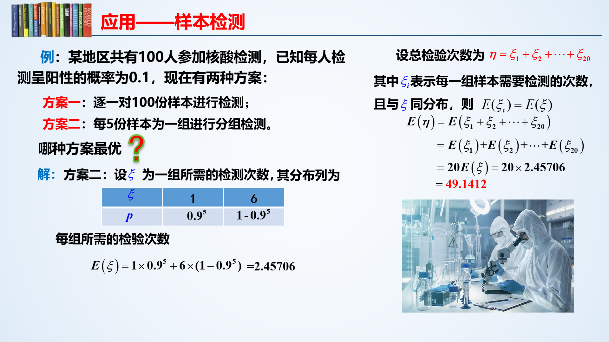
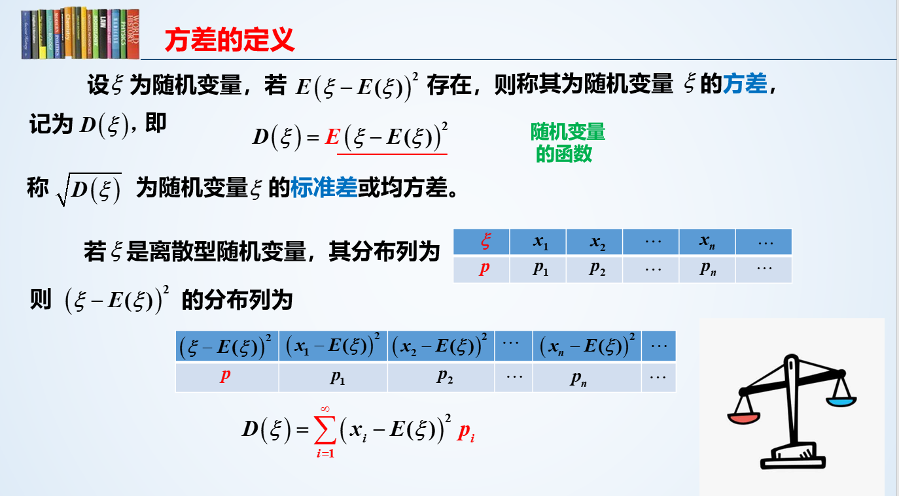
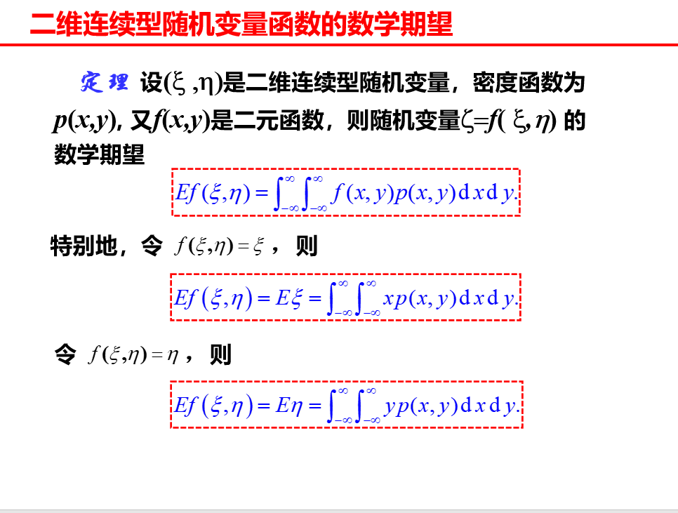

## 离散随机变量数学特征

### 数学期望

一维离散随机变量得数学期望定义：数学期望即所有值乘以其发生概率之和
$$
E=\sum_{i=0}^n P(i)Value(i)
$$

其中`P(i)`为概率；`Value(i)`为值

统计意义：反映了随机变量所有取值的中心位置

性质

- 对于常数 c，E(c) = c，因为默认常数概率为 1，故 E(c) = 1xc = c
- 对于随机变量 X，E(cX) = cE(X)，其中 C 为常数

对于随机变量函数`f`，在得到概率分布表后按照同一步骤（即值、概率相乘求和）求出数学期望

举个栗子

抓住代价：在这里是检测数量，方案一固定为100次，方案二不固定，五人一检，阳性则每人依次检测，阴性则略过

明确取值：在方案二中，每组检测次数取值可能为1或6，根据题目已给条件求出各自概率，再按比例扩大范围

这里有一个分组的问题，一开始没想到

### 方差和标准差

方差：差距的平方的期望

- 方差开根即为标准差

- 先求出一维概率分布的数学期望，用`(xi-期望)的平方`作为新的值，`xi`的概率作为这个值的概率，组成一个新的一维概率分布

  这个新概率分布的数学期望即为原概率的方差，记为`D(X)`

方差体现了随机变量围绕期望的偏离程度，方差越小，说明分布越集中，越大说明分布越分散（常用于判断产品优劣）

性质

- 常数的方差为0，即`D(c) = 0`，毫不偏差（常数拥有概率为1，偏差为0的特点）
- `D(cX) = c²D(X)`，常数开出来要平方
- `D(X+Y) = D(X)+D(Y)`，和变量的方差等于变量的方差和，前提是变量`X,Y`相互独立

常见概率分布的方差

| 分布     | 参数          | 数学期望 | 方差       |
| -------- | ------------- | -------- | ---------- |
| 两点分布 | `0<p<1`       | `p`      | `p(1-p)`   |
| 二项分布 | `n>=1, 0<p<1` | `np`     | `np(1-p)`  |
| 泊松分布 | `λ>0`         | `λ`      | `λ`        |
| 几何分布 | `0<p<1`       | `1/p`    | `(1-p)/p²` |

### 随机变量函数的数学期望

对于一维随机变量 X，已知

| X     | -2   | 0    | 1    | 3    |
| ----- | ---- | ---- | ---- | ---- |
| **P** | 1/3  | 1/2  | 1/12 | 1/12 |

$$
\begin{aligned}
E(2X^2+5)&=((-2)^2\times2+5)\times\frac{1}{3}+(0+5)\times\frac{1}{2}+(1\times2+5)\times\frac{1}{12}+(3^2\times2+5)\times\frac{1}{12}\\\\
&=\frac{13}{3}+\frac{5}{2}+\frac{7}{12}+\frac{23}{12}=\frac{28}{3}
\end{aligned}
$$

对于二维随机变量 X/Y，已知

| X/Y   | 0       | 1      |
| ----- | ------- | ------ |
| **0** | (1-p)^2 | p(1-p) |
| **1** | p(1-p)  | p^2    |

求得`E(X+Y)`，将`f(X+Y)`的概率分布表列出，用一维的办法解即可

| f     | 0       | 1       | 2    |
| ----- | ------- | ------- | ---- |
| **P** | (1-p)^2 | 2p(1-p) | p^2  |

## 连续随机变量数字特征

### 数学期望

回忆以下离散型随机变量的数学期望：概率和值的乘积的和

连续型随机变量的数学期望
$$
\int_{-∞}^{+∞} xp(x)dx
$$

即对`xp(x)`在实数范围内积分，这很合理，就是`值*概率`的和，若该积分不为正无穷，则称离散型随机变量数学期望存在，为这个积分结果

常见连续型随机变量的数学期望：

1、均匀分布`X~U(a,b)`的数学期望为`(a+b)/2`（区间中间）

2、指数分布
$$
p(x)=\lambda e^{-\lambda x}, x>0 \rightarrow E(X) = \frac{1}{\lambda}
$$
3、正态分布`X~N(u,v^2)`
$$
p(x)=\frac{1}{\sqrt{2\pi}v}e^{-\frac{(x-u)^2}{2v^2}} \rightarrow E(X) = u
$$
连续型随机变量函数的数学期望：

对于普通函数`f(x)`，将其自变量换为一个连续型随机变量`Z`，那么`f(Z)`的数学期望为：`∫(-∞,+∞) f(x)p(x)dx`

- 只改变值，概率不变，所以只将积分项中`x`换为`f(x)`

二维连续型随机变量函数的数学期望：

性质：基本与离散型随机变量期望性质一致

- 当随机变量取值有限，必有期望，且期望大于下限小于上线
- 常数的期望为常数自身
- `E(k1X+k2Y) = k1*E(X)+k2*E(Y)`，其中`k1,k1`为实数，`X,Y`为连续型随机变量
- 若连续型随机变量`X,Y`相互独立，则`E(XY) = E(X)E(Y)`

### 方差

计算：`D(X)=E((X-EX)^2)`

在这里构造一个函数：
$$
f(x)=[x-E(X)]^2
$$

用求**连续型随机变量函数**的方法求方差

即
$$
D(x) = \int_{-∞}^{+∞} (x-E(X))^2\times p(x)dx
$$
化简可得
$$
D(x) = E(X^2)-E(X)^2 = ∫_{-∞}^{+∞} x^2p(x)dx - [∫_{-∞}^{+∞} xp(x)dx]^2
$$
常见连续型随机变量的方差

| 分布     | 参数         | 期望      | 方差         |
| -------- | ------------ | --------- | ------------ |
| 两点分布 | `0<p<1`      | `p`       | `p(1-p)`     |
| 二项分布 | `n>=1,0<p<1` | `np`      | `np(1-p)`    |
| 泊松分布 | `λ>0`        | `λ`       | `λ`          |
| 几何分布 | `0<p<1`      | `1/p`     | `(1-p)/p^2`  |
| 均匀分布 | `a<b`        | `(a+b)/2` | `(b-a)^2/12` |
| 指数分布 | `λ>0`        | `1/λ`     | `1/λ^2`      |
| 正态分布 | `u,v>0`      | `u`       | `v^2`        |

性质

- 常数的方差为0
- `D(cX) = c^2 D(X)`
- 对于相互独立的随机变量`X,Y`，`D(X+Y) = D(X)+D(Y)`

## 切比雪夫不等式

之前也提到过，方差越大，一般来说数据离期望会较远，方差越小则反之

切比雪夫不等式使用严格的数学公式规范这种直觉，设随机变量`X`期望为`E(X)=u`，方差`D(X)`存在，则
$$
P(|X-u|\geq ε)\leq \frac{D(X)}{ε^2}\quad\quad P(|X-u|<ε)\geq 1-\frac{D(X)}{ε^2}
$$

其中`ε`为任意正数

## 协方差与相关系数

对于二维随机变量`(u,v)`，协方差反应`u,v`之间的联系

定义协方差为
$$
Cov(u,v) = E[(u-Eu)(v-Ev)]
$$
展开计算可得
$$
Cov(u,v) = E(uv)-E(u)E(v)
$$
性质

- 交换律：`Cov(u,v) = Cov(v,u)`

- 数乘：`Cov(au,bv) = abCov(u,v)`

- 分配律：`Cov(u1+u2,v) = Cov(u1,v)+Cov(u2,v)`

- 和方差的关系：`D(u+v) = D(u)+2Cov(u,v)+D(v)`，当`u,v`独立时，`Cov(u,v)=0`，自然`D(u+v)=D(u)+D(v)`

相关系数
$$
\rho = \frac{Cov(u,v)}{\sqrt{(Du)(Dv)}}
$$

- 相关系数是随机变量间线性关系强弱的一个量度，当`|p|`越大，两随机变量**线性关系**较密切，`|p|`越小，线性相关程度较差，当`p=0`，二者线性无关
- 值域为`[-1,1]`
- 当`p=1`，两个随机变量正**线性**相关，当`p=-1`，二者负线性相关

协方差也可以表示为
$$
Cov(u,v) = \rho\,\sqrt{D(u)D(v)}
$$
变量和的方差可以表示为
$$
D(u+v) = D(u) + 2\rho\,\sqrt{D(u)D(v)} + D(v)
$$
当线性无关，即
$$
p=0 \rightarrow Cov(u,v)=0, D(u+v)=D(u)+D(v)
$$
注意，独立一定线性无关，但线性无关不一定相互独立，二者是两个不同的概念

