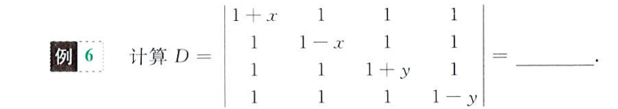
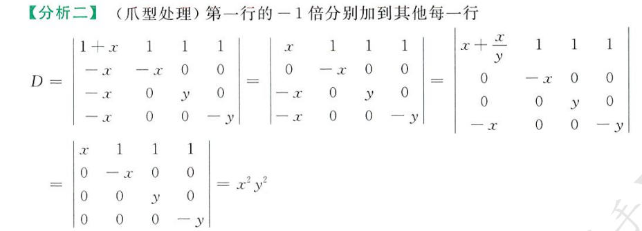
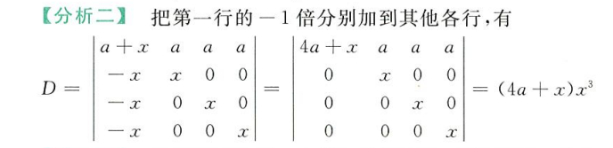
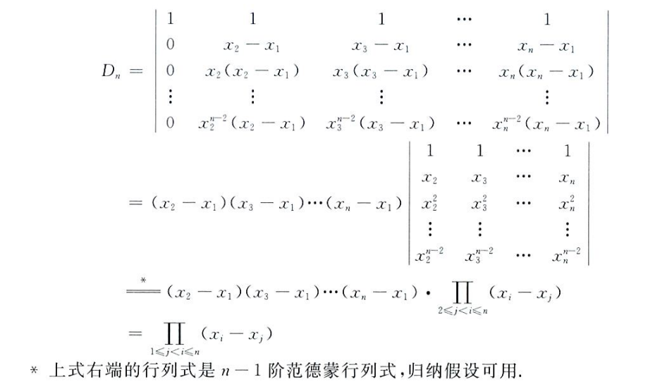

## 行列式概念及性质

### 行列式定义

行列式是**一个数**，他是不同行不同列元素乘积的代数和

如三阶行列式的对角线法计算法

逆序和逆序数

对于`4321`，其每位上的逆序分别为`3,2,1`，因为`4>3>2>1`，所以对于 4 来说，后三位均是逆序，其逆序自然为 3，同理，在这个序列中，3 的逆序为 2，2 的逆序为 1

逆序数指的是序列所有元素逆序之和，如上述序列逆序数为`3+2+1 = 6`，为偶数

- 逆序数为偶数，序列为**偶排列**
- 否则为奇排列

展开公式法计算行列式

$$
|A| = \sum_{j_1j_2...j_n}(-1)^{\tau(j_1j_2...j_n)}a_{1j_1}a_{2j_2}...a_{nj_n}
$$

其中

$$
\tau(j_1j_2...j_n)
$$

为序列`j1 j2 ... jn`的逆序数，就是说，若序列为偶排列，则为正，否则为负

注意对角线法可以列出所有的行列式序列，每个序列的符号通过逆序数来确定

### 行列式性质

所有行都可以等价于列，因为行列置换后行列式等价，行等于列

$$
|A| = |A^T|
$$

两行互换位置，行列式值变号

$$
\left | \begin{matrix}
a_{11}&a_{12}\\
a_{21}&a_{22}
\end{matrix}
\right | =
-\left |
\begin{matrix}
a_{12}&a_{11}\\
a_{22}&a_{21}
\end{matrix}
\right |
$$

某整行的公因子可以提出

$$
\left |
\begin{matrix}
ka_{11}&a_{12}\\
ka_{21}&a_{22}
\end{matrix}
\right | =
k\left |
\begin{matrix}
a_{11}&a_{12}\\
a_{21}&a_{22}
\end{matrix}
\right |
$$

存在某行全为 0 的行列式值为 0

$$
\left |
\begin{matrix}
a_{11}&a_{12}&0\\
a_{21}&a_{22}&0\\
a_{31}&a_{32}&0
\end{matrix}
\right |
= 0
$$

存在某两行线性相关，行列式值为 0

$$
\left |
\begin{matrix}
a_{11}&a_{12}&ka_{12}\\
a_{21}&a_{22}&ka_{22}\\
a_{31}&a_{32}&ka_{32}
\end{matrix}
\right |
= 0
$$

其中第二列和第三列线性相关，`A2 = kA3`

行列式的线性加法不改变值，什么是线性加法？就是某一行的整数倍加到另一行上，如

$$
\left |
\begin{matrix}
a_{11}&a_{12}&a_{13}\\
a_{21}&a_{22}&a_{23}\\
a_{31}&a_{32}&a_{33}
\end{matrix}
\right | =
\left |
\begin{matrix}
a_{11}&a_{12}&a_{13}+ka_{12}\\
a_{21}&a_{22}&a_{23}+ka_{22}\\
a_{31}&a_{32}&a_{33}+ka_{32}
\end{matrix}
\right |
$$

这也侧面印证了，若两行线性相关，则行列式值为 0 的结论，因为线性相关的行一定能通过线性加法得到全为 0 的行，从而行列式值一定为 0

行列式的拆分

$$
\left |
\begin{matrix}
a_{11}&a_{12}&b_{1}+c_{1}\\
a_{21}&a_{22}&b_{2}+c_{2}\\
a_{31}&a_{32}&b_{3}+c_{3}
\end{matrix}
\right | =
\left |
\begin{matrix}
a_{11}&a_{12}&b_{1}\\
a_{21}&a_{22}&b_{2}\\
a_{31}&a_{32}&b_{3}
\end{matrix}
\right |
+
\left |
\begin{matrix}
a_{11}&a_{12}&c_{1}\\
a_{21}&a_{22}&c_{2}\\
a_{31}&a_{32}&c_{3}
\end{matrix}
\right |
$$

## 行列式计算

### 行列式按行展开

余子式

$$
|M_{ij}| = |A|去掉第i行第j列所对应行列式
$$

代数余子式

$$
(-1)^{i+j}|M_{ij}|
$$

行列式按第 i 行展开，m 为行列式 A 的列数

$$
|A| = \sum_{j=1}^{m}a_{ij}(-1)^{i+j}|M_{ij}|
$$

行展开，就是行列式一整行的元素乘上**其对应的**代数余子式的总和，等于原行列式的值（列同理）

注意一整行的元素乘上**另一行的**代数余子式的总和恒为零

栗子一

可以通过倍加凑出只有一个非零元素的行，然后按行展开简化计算

栗子二

通过行列式方程按行展开解未知数

### 拆分法

通过拆开矩阵元素，删去含全零行的行列式，计算保留项，以此简化计算（行列式来自于栗子一）

栗子二的拆分法

### 爪形处理

就是通过倍加凑出上下三角行列式或斜对角线行列式，以简化计算

#### 上三角

上/下三角行列式（对角线行列式）
$$
\left |
\begin{matrix}
a_{11}&a_{12}&a_{13}\\
0&a_{22}&a_{23}\\
0&0&a_{33}
\end{matrix}
\right | =
a_{11}a_{22}a_{33}
$$
所谓的爪形处理，就是凑上三角行列式以简化计算，行列式来自栗子一

栗子二的爪形处理

#### 副对角线

副对角线行列式
$$
\left |
\begin{matrix}
0&0&a_{13}\\
0&a_{22}&a_{23}\\
a_{31}&a_{32}&a_{33}
\end{matrix}
\right | =
(-1)^{\frac{n(n-1)}{2}}a_{13}a_{22}a_{31}
$$
#### 拉普拉斯

> 上三角行列式和副对角线行列式的**分块矩阵形式**

拉普拉斯行列式
$$
\left |
\begin{matrix}
A&0\\
0&B
\end{matrix}
\right | = |A|\,|B|
\\-------\\
\left |
\begin{matrix}
0&A\\
B&0
\end{matrix}
\right | = (-1)^{mn}|A|\,|B|
$$
其中`m`和`n`分别为行列式`A`和`B`的阶数

### 范德蒙行列式

范德蒙行列式
$$
\left |
\begin{matrix}
1&1&1\\
x_{1}&x_{2}&x_{3}\\
x_{1}^2&x_{2}^2&x_{3}^2
\end{matrix}
\right | =
(x_3-x_2)\times(x_3-x_1)\times(x_2-x_1)
$$
推广到 n 阶，即为
$$
\prod_{1\leq j<i\leq n}(x_i-x_j)
$$
 通过数学归纳法可以证明

范德蒙行列式计算
$$
\begin{aligned}
|A| &= \left |
\begin{matrix}
1&1&1\\
2&-1&-3\\
4&1&9
\end{matrix}
\right | \Rightarrow x_1 = 2,x_2=-1,x_3=-3\\
&=(x_3-x_1)(x_3-x_2)(x_2-x_1)\\
&=(-5)(-2)(-3)\\
&=-30
\end{aligned}
$$
我发现行列式等式证明的题，是不是喜欢用数学归纳法，确实比较适配

**总结来说**

行列式计算

- 化简展开：按照行列式的性质，一般使用线性加法得到足够多的 0，然后按行展开，降阶行列式，然后使用对角线法直接计算
- 凑特殊行列式求解：拉普拉斯行列式，上三角行列式，范德蒙行列式

解方程

- 首先一定涉及行列式的计算，这是前提，将行列式化简和凑特殊行列式计算出来，然后视作一个一元多次方程求解未知数`λ`

证明题：通常来说，是证明一个等式行列式为 n 阶时始终成立，可以考虑用数学归纳法，请参考范德蒙行列式的证明，从`n-1`阶推导`n`阶成立得证

## 行列式解非齐次方程组

> 克拉默法则

对于非齐次线性方程

$$
\begin{cases}
a_{11}x_1+...+a_{1n}x_n = b1\\
a_{21}x_1+...+a_{2n}x_n = b2\\
...\\
a_{n1}x_1+...+a_{nn}x_n = bn\\
\end{cases}
$$

克拉默法则：针对线性方程组的系数矩阵，若其系数矩阵对应行列式值不为 0（行列式不存在线性相关的行），说明方程组只有一个唯一解，且解为

$$
x_i = \frac{|A_i|}{|A|}
$$

其中`Ai`为第`i`列替换为`B`的行列式，如`A1`为

$$
\left |
\begin{matrix}
b_{1}&a_{12}&...&a_{1n}\\
b_{2}&a_{22}&...&a_{2n}\\
...\\
b_{n}&a_{n2}&...&a_{nn}
\end{matrix}
\right |
$$

应用到齐次方程组上（即`b1=b2=..=bn=0`），若其系数行列式值不为 0，则说明其只有一个解，一定是`x1=x2=...=xn=0`，即只存在全 0 解

相应的，只有当系数行列式值等于 0 时，说明系数行列式存在线性相关的行（行列式性质），齐次方程组才存在非 0 解，也就是说存在线性相关的项

这里的逻辑有点乱，但是是正确的，就是说，行列式为 0，通过行列式性质可知，行列式存在线性相关的行（即`ai = kaj`），所对应的齐次方程组的解`xi`和`xj`就可以不为 0，如
$$
a_i = ka_j\,,\,\,x_j = -kx_i \Rightarrow a_ix_i + a_jx_j = 0
$$
这样就有了不全为 0 的解

求解非齐次方程组特解：`xi = |Ai| / |A|`

