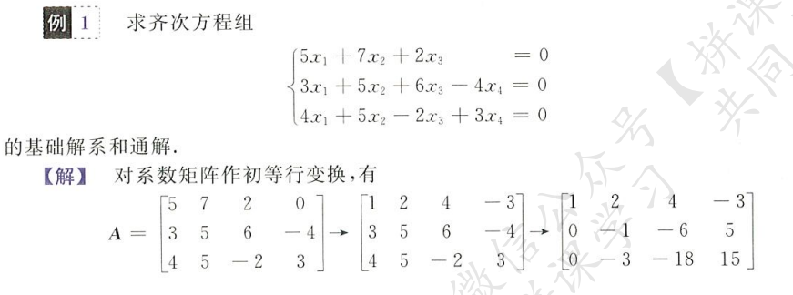
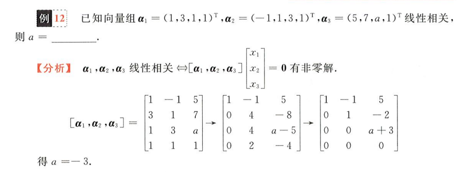

## 线性方程组及相关概念

### 基本概念

线性方程组，就是多元一次方程组，如下列方程组
$$
\begin{cases}
a_{11}x_1+...+a_{1n}x_n = b1\\
a_{21}x_1+...+a_{2n}x_n = b2\\
...\\
a_{n1}x_1+...+a_{nn}x_n = bn\\
\end{cases}
$$
化为向量（矩阵）乘法的形式
$$
Ax = b
$$
当`b`为零向量时，为齐次线性方程组，否则为非齐次线性方程组

对于任意一个非齐次方程组，令其`b`向量为零向量，得到其对应的齐次方程组，也称作非齐次方程组的导出组

系数矩阵`A`的秩，其实就是方程组中**有效方程**的个数，如同我熟知的，一个两元一次方程组，两个不同的方程可以解出确定解，这里也一样，当`r(A) = n`，**方程组的解将被唯一确定**

- 若为齐次方程组，则说明该方程只有唯一的一个全零解
- 若为非齐次方程组，说明该方程通解只由唯一一个特解构成

### 解方程组的步骤

化简矩阵：初等行变换

- 系数矩阵
- 增广矩阵

判定解的形式：根据矩阵秩的大小和未知数的数量判断解的情况

- 齐次满秩：唯一零解
- 齐次非满秩：基础解系存在`n-r`个向量
- 非齐次满秩：唯一特解
- 非齐次非满秩：存在一个特解和对应齐次方程组`n-r`个向量构成的通解，二者共同构成非齐次的通解

解方程：通常通过正交的方式确定自由项，确定`n-r`个自由项的值，解出方程，得到通解

## 齐次线性方程组

### 基础解系和通解

对于齐次线性方程组，当`r(A) < n`时，此时方程组的解将有无穷个（因为一定存在`n-r(A)`个不被确定约束的变量，我称之为自由项），**通过自定义线性无关的自由项，可以解出`n-r(A)`个不同的解向量**，这些解向量共同构成原方程的**基础解系**，而齐次线性方程组的通解，即为**基础解系的任一线性表出**

简单说，秩表示有效方程的数量，r 个有效方程约束了 r 个变量，剩下的 n-r 个变量自由发挥，通过线性无关排列，可以表示出任一符合该方程组的向量组合

### 求解齐次线性方程组

解齐次方程组

- 首先，化行最简系数矩阵
- 第二，确定自由项
- 第三，解方程，得到基础解系
- 最后，添上常数系数`k`，得到通解

举两个栗子

可以发现，其实解齐次线性方程组的步骤非常固定

关于解的构成，牢记`n-r(A)`为自由项的个数，即为基础解系向量的个数

## 非齐次线性方程组

### 增广矩阵和导出组

对于非齐次方程组
$$
Ax = b
$$
其对应的**增广矩阵**如下
$$
\overline{A} = (A|b)
$$
只有当
$$
r(A) = r(\overline{A})
$$
时，非齐次方程组才存在有效解

上述非齐次方程组对应**导出组**（齐次线性方程组）
$$
Ax = 0
$$
当系数矩阵秩等于增广矩阵秩时，确定非齐次方程组有解，根据`r(A)`和未知数数量`n`的比较，可以得知通解的构成

- 当`r(A) = n`时，原方程组存在唯一特解
- 当`r(A) < n`时，原方程组通解由`非齐次特解 + 对应齐次通解`构成

### 求解非齐次线性方程组

求解大体分为两步，每一大步都要经过化简矩阵、判定解形式和解方程的步骤

- 求解特解
- 求解导出组通解

举两个梨子

仍可以发现，解非齐次方程组的方法也很固定，化简增广矩阵，判断秩的大小确定自由项个数，确定一个特解，解对应齐次方程组通解，糅合一下得到原方程组通解

要注意的是这里的化简方法，涉及到之前的初等行变换，灵活一点，通常通解不唯一

解的个数和增广矩阵秩的关系

非齐次线性方程组的通解和其对应导出组通解的关系

## 方程组的应用

### 可交换矩阵

可交换的概念，对于矩阵乘法，有
$$
AB = BA
$$
则说矩阵`A`和`B`可交换

通过线性方程组求解可交换矩阵

就是矩阵各个位置元素乘出来，列等式，联立方程组，通过解方程组求得各个位置元素的具体值（通解）

### 求解矩阵方程

通过线性方程组求解矩阵方程

这里不能用传统的求逆的方式求解矩阵乘法方程（很显然这里的矩阵都不可逆），只能用解线性方程组通解的形式求解每个位置的元素值

### 线性相关和线性表出

线性相关及线性表出和线性方程组通解的关系

线性相关和解情况的联系

将线性表出的系数视作未知数，联立线性方程组，求解线性表出的系数，表示出确定的线性表出

### 已知解系求方程组

逆天

