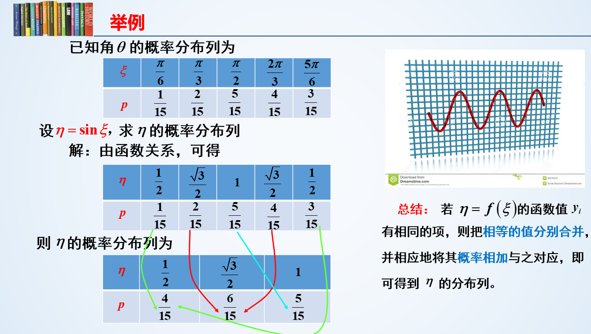

## 随机事件和概率

### 随机事件、事件间的关系与运算

一些名词解释

- 随机试验（试验）：可重复性
- 样本点和样本空间：试验结果
- 随机事件（事件）：样本空间子集

| 随机事件的关系 |                                              |
| -------------- | -------------------------------------------- |
| 包含           | ⊂ 箭头指向谁，谓语是谁，如 A ⊂ B 则 B 包含 A |
| 相等           | 互相包含                                     |
| 互斥           | 不相容，不同时发生                           |
| 对立           | A 不发生 B 必发生                            |
| 独立           | P(AB) = P(A)P(B)                             |

| 随机事件的运算 |                           |
| -------------- | ------------------------- |
| 交（积）       | 都发生，A ∩ B，AB         |
| 并（和）       | 至少一个发生，A∪B，或 A+B |
| 差             | A - B，A 发生 B 不发生    |

独立的性质：若事件 A B 独立，则
$$
P(AB) = P(A)P(B)
$$
并的拆分
$$
P(A+B) = P(A)+P(B)-P(AB)
$$
$$
P(A+B+C) = P(A)+P(B)+P(C)-P(AB)-P(AC)-P(BC)+P(ABC)
$$

并运算的分配律
$$
P[(A+B)(A+B)] = P(A)+2P(AB)+P(B)
$$
其中
$$
P(AA) = P(A)\quad P(AB) = P(BA)
$$
总的来说求随机事件概率

- 一是画图
- 二是运算

独立和不相容的区别

- 不相容：`P(AB) = 0`
- 独立：`P(AB) = P(A)P(B)`

### 概率及概率公式

和高中内容是否有些许重合

### 古典概型与伯努利概型

伯努利方程（一种一阶微分方程），将只相差 1 的两个 y 的幂用高次的微分代替，这样方程中将只含有一个关于 y 的幂，将这个 y 的幂设为新的未知函数 z，用公式法求解一阶线性微分方程得到 z，反代回去最终得到 y

## 离散随机变量概述

一维随机变量的分布、概率密度、数学期望以及方差

### 一维离散随机分布

形如这样的分布即为一维离散随机分布

| X     | 0    | 1    |
| ----- | ---- | ---- |
| **P** | 0.5  | 0.5  |

很显然，这里的自变量只有 X 一个，即一个 X 对应一个概率，故为一维分布

### 二维离散随机分布

二位随机分布，其自变量为两个 X 和 Y，二者共同决定一个概率

其实就是这样一个二维表

| X\Y     | Y1    | Y2    | ...  | Yn    | ...  |
| ------- | ----- | ----- | ---- | ----- | ---- |
| **X1**  | `P11` | `P12` |      | `P1n` |      |
| **X2**  | `P21` | `P22` |      | `P2n` |      |
| **...** |       |       |      |       |      |
| **Xn**  | `Pn1` | `Pn2` |      | `Pnn` |      |
| **...** |       |       |      |       |      |

性质如下
$$
0 \leq P_{ij} \leq 1 \quad\quad \sum P_{ij} = 1
$$

### 联合分布列和边际分布列

联合分布列，就是联合概率分布表

边际分布列，就是单个变量的概率分布表，塌陷二维分布中其中一个变量便可以得到另一变量的边际分布

| X    | `x1`  | `x2`  | ...  | `xn`  | ...  |
| ---- | ----- | ----- | ---- | ----- | ---- |
| P    | `P1-` | `P2-` |      | `Pn-` |      |

| Y    | `y1`  | `y2`  | ...  | `yn`  | ...  |
| ---- | ----- | ----- | ---- | ----- | ---- |
| P    | `P-1` | `P-2` |      | `P-n` |      |

### 离散随机变量的独立

事件独立：有事件`a,b`，若`P(a,b) = P(a)P(b)`，则事件`a,b`相互独立

二维离散随机变量的独立：对于二维随机变量的联合分布表，每个概率`Pij`都为两个变量相应的边际分布概率相乘

如 X/Y 有边际分布

| X     | 0    | 1    |
| ----- | ---- | ---- |
| **P** | 0.4  | 0.6  |

| Y     | 0    | 1    |
| ----- | ---- | ---- |
| **P** | 0.3  | 0.7  |

其联合分布为

| X\Y   | 0    | 1    |
| ----- | ---- | ---- |
| **0** | 0.12 | 0.28 |
| **1** | 0.18 | 0.42 |

其中
$$
P_{00} = P_{x=0}\,P_{y=0} = 0.4\times0.3 = 0.12\\
P_{01} = P_{x=0}\,P_{y=1} = 0.4\times0.7 = 0.28\\
P_{10} = P_{x=1}\,P_{y=0} = 0.6\times0.3 = 0.18\\
P_{11} = P_{x=1}\,P_{y=1} = 0.6\times0.7 = 0.42
$$
此时我们说二维离散随机变量 X/Y 是独立的

## 离散型随机变量函数的分布

### 随机变量函数的定义

随机变量函数：一个二元函数，自变量、因变量均为随机变量，函数映射的是他们的值，而不是概率

- 概率由自变量传递给因变量
- 相同值的概率是可以合并的

对于下列一维离散随机变量

实际上就是一个正常的二元函数，只不过每个自变量取值将其原有附带的概率也传递给了因变量（随机变量函数）

### 离散随机变量函数

对于二维随机变量 X/Y 的分布表

| X\Y   | 0    | 1    |
| ----- | ---- | ---- |
| **1** | 0.2  | 0.3  |
| **2** | 0.4  | 0.1  |

现在有这样一个函数：`f = X+Y`

那么这个函数`f`实际上塌陷为一个一维随机变量，其相对应的概率分布表（一维）为

| f     | 1    | 2    | 3    |
| ----- | ---- | ---- | ---- |
| **P** | 0.2  | 0.7  | 0.1  |

当`f = X + Y = 1 + 0 = 1`时，概率为`0.2`

当`f = X + Y = 2`时，有两种可能，一为`Y = 1, X = 1`，二为`Y = 0, X = 2`，所以`P(f=2)`为二者概率相加，即`0.3+0.4=0.7`

当`f = X+Y = 2+1 = 3`时，概率为`0.1`

## 常见离散随机变量概率分布

### 二项分布

在n次独立重复的伯努利试验中，设每次试验中事件A发生的概率为p。用X表示n重伯努利试验中事件A发生的次数，则X的可能取值为`0，1，…，n`，且对每一个k（`0≤k≤n`）,事件`{X=k}`即为`n次试验中事件A恰好发生k次`，随机变量X的离散概率分布即为二项分布（Binomial Distribution）

举个栗子：如抛硬币`n`次，花面次数`X`的概率分布（花面概率`p`始终为0.5）

用符号`b`表示二项分布：`X ~ b(n,p)`表示进行次数为`n`，抛硬币 m 次画面次数 H 的二项分布表示为`H ~ (m,0.5)`

数学期望：每次独立事件发生概率均为`p`的二项分布`X`，其数学期望为`np`

### 0-1分布

当二项分布`X ~ b(n,p)`中`n=1`时，即只进行一次实验，事件发生次数要么1次要么0次（如抛一次硬币），即为**0-1分布**，其数学期望为`p(n=1)`

其分布列为

| X     | 1    | 0    |
| ----- | ---- | ---- |
| **P** | 0.5  | 0,5  |

### 泊松分布

泊松分布的概率函数，记为 P(λ)
$$
P(x=k)=\frac{\lambda ^k}{k!}e^{-\lambda}
$$

- `λ`为单位时间(或单位面积)内随机事件的平均发生次数，是泊松分布的唯一参数
- 泊松分布适合于描述单位时间内随机事件发生的次数

泊松分布的数学期望和方差均为`λ`

### 几何分布

几何分布（Geometric distribution）。一种定义为：在`n`次伯努利试验中，试验`k`次才得到第一次成功的机率。详细地说，是：前`k-1`次皆失败，第 k 次成功的概率

- 简单来说，就是抛硬币第`i`次首次抛到花面的概率分布

几何分布表示为：`X ~ Ge(p)`

- 其中`p`为每次独立实验事件发生的概率

其数学期望为`E(X) = 1/p`

