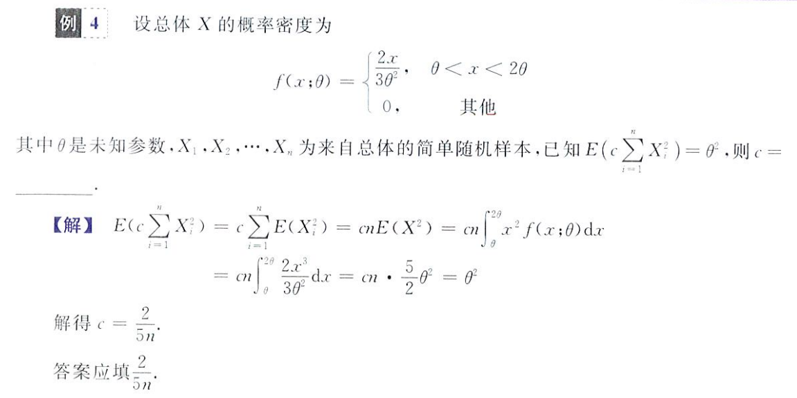
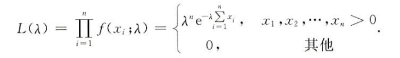
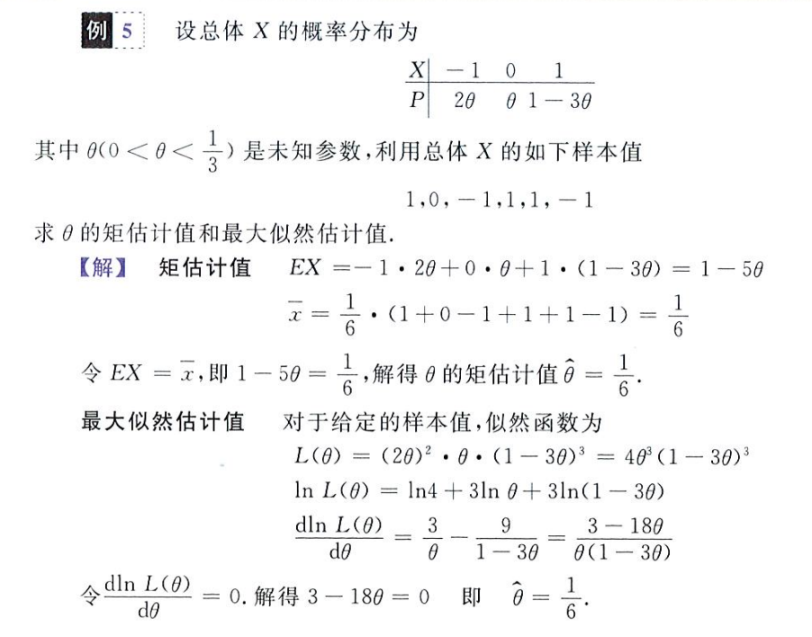
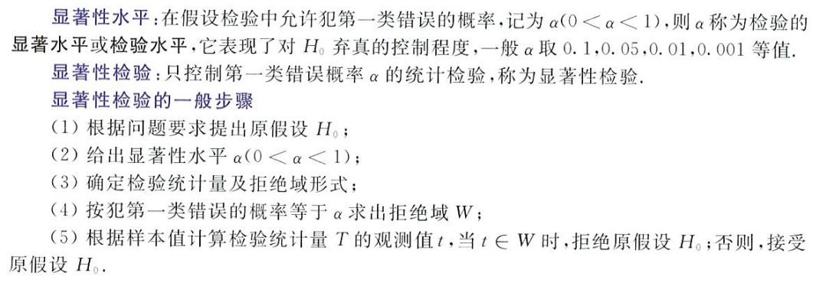
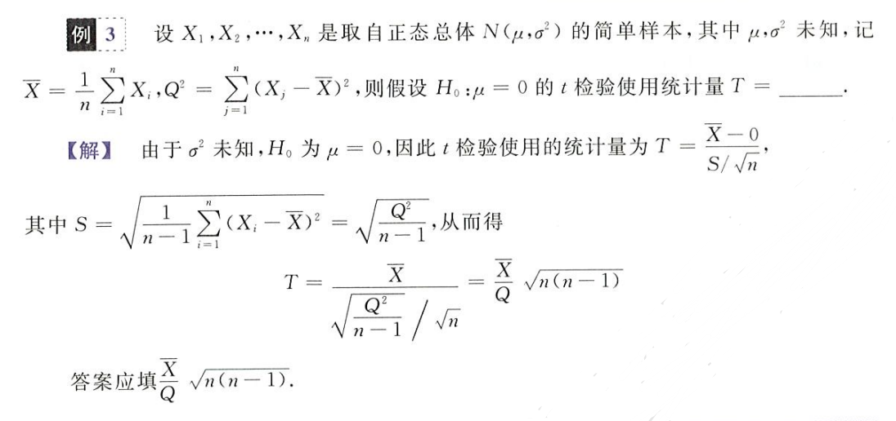
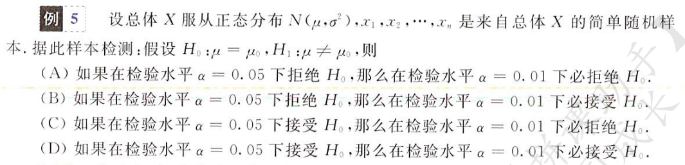

如果说数理统计是用一个统一分布的总体去判断，考察样本的分布特征，那么参数估计就是通过样本来考察总体的分布特征，考的比较少

## 点估计

复习一下统计量的概念，对于总体 X 的一堆样本`X1, X2,..., Xn`，有一个不含位置参数的作用函数 f，则`f(X1, X2,..., Xn)`是样本 Xi 的一个统计量

### 无偏估计量

当这个作用函数 f 存在未知数 θ 时，则`f(X1, X2,..., Xn; θ)`即为所谓**估计量**，并且，当估计量的期望等于这某个未知数时
$$
E(f(X_1,X_2,...,X_n)) = \theta
$$
我们称 f 为 θ 的无偏估计量

如，对于总体 X 为正态分布的样本 Xi
$$
X\sim N(\mu,\sigma^2)
$$
其样本方差有
$$
S^2 = \frac{1}{n-1}\sum_{i=1}^n(X_i-\overline X)^2
$$
这个统计量（样本方差）中含有未知数 θ = σ^2

又根据数理统计，卡方分布，易知
$$
\frac{(n-1)S^2}{\sigma^2}\sim \chi^2(n-1)
$$
故有
$$
E\{\frac{(n-1)S^2}{\sigma^2}\} = n-1\rightarrow E(S^2) = \sigma^2 = \theta
$$
故在这里样本方差为其总体方差的一个无偏估计值

### 更有效的估计

对于无偏估计量 Z，若其方差，即 D(Z) 越小，我们称这个估计量越有效

几个栗题：一定要深谙总体和样本的关系，什么时候用总体期望，什么时候求解样本均值期望，求和符号也要灵活放在合适的位置便于计算

不管是离散型还是连续型随机变量，按照定义来求总是没错

有一个问题：样本方差总是等于总体方差吗？在例五中，对于泊松分布的总体 X，他直接做了如下处理
$$
kE(S^2) = kD(X) = k\lambda
$$

## 估计量求解和区间估计

### 矩估计法

> 点估计法：不管随机变量类型，关注未知参数个数
>

就是令期望、方差或一些统计量（如 E(X^2)）等于样本的中心距或原点矩，建立方程，求解未知数的过程

复习一下样本的中心距和原点矩

原点矩：矩估计法常用原点矩等价于期望来建立方程
$$
A_k = \frac{1}{n}\sum_{i=1}^nX_i^k\quad A_1 = \overline X\quad A_2≈E(X^2)
$$
中心距
$$
B_k = \frac{1}{n}\sum_{i=1}^n(X_i-\overline X)^k\quad B_2 = \frac{n-1}{n}S^2
$$
有时我们令总体方差 D(X) 等于二阶中心距来建立方程求解未知数
$$
D(X) = B_2 = \frac{1}{n}\sum_{i=1}^n(X_i-\overline X)^2
$$
注意这里对于离散型和连续性随机变量的处理原理是一模一样的，请抓**住令样本原点矩或中心距等于期望或方差建立方差求解**

### 最大似然估计法

> 也属于点估计，不管参数个数，关注随机变量类型
>

似然方程
$$
L = \Pi\,f_{X_i}(x)
$$
如对于连续型随机变量
$$
f(x;\lambda) = \begin{cases}
\lambda e^{-\lambda x}&x>0\\
0&x\leq0
\end{cases}
$$
对于一组样本观测值`(x1,x2,...,xn)`，其对应的似然方程为

又如，对于离散型随机变量

| X    | -1   | 0    | 1    |
| ---- | ---- | ---- | ---- |
| P    | 2θ   | θ    | 1-3θ |

其似然函数为
$$
L = \Pi\,P(X=X_i) = 2\theta^2(1-3\theta)
$$
最大似然估计法：即求出令似然函数取最大值时，未知数 λ 的取值

- 这对于 λ 一个变量来说，L 是一个一元函数，可以通过求导求驻点取极值的方式求得令 L 最大时的 λ 取值

我们认为这个令 L 最大的 λ 约等于实际的未知数值（此时 λ 的在已知样本中偏差最小），即
$$
\frac{dlnL}{d\lambda} = 0 \Rightarrow \lambda = \lambda_0
$$
举几个矩估计和最大似然估计的栗子

对于离散型随机变量的矩估计和最大似然估计

### 区间估计

> 考的很少且非重点，略

对于变量 θ，若其取值在某一区间内的概率等于 1-α，则该区间称为 θ 的 1-α 置信区间，而 1-α 为该区间的置信度，如
$$
P(a<\theta<b) = 1-\alpha
$$
区间 (a, b) 即为 θ 的 1-α 的置信区间

和正态分布息息相关，写不了一点

## 假设检验

> 仅数一要求

### 假设分类

简单假设，如假设随机变量 X 符合标准正态分布，参数确定（只假设了分布）
$$
X \sim N(0,1)
$$
复合假设，如假设 X 符合正态分布且参数不确定（此时既假设了分布，也假设了参数）
$$
X \sim(\mu,\sigma^2)
$$
非参数假设，参数确定，只假设分布
$$
X\sim N(0,1)\quad X\sim N(\mu_0,\sigma^2_0)
$$
参数假设，假设分布和参数
$$
X\sim N(\mu,1)
$$

### 错误概率

假设中，会出现两种错误

- 第一种错误：拒绝正确的假设
- 第二种错误：接收错误的假设

而犯上述两种错误的概率分别记为 α 和 β，前者（即 α）也被称为显著水平或检验水平，这里要和区间估计中的置信度做一个区分

### 显著性检验

拒绝域：x 不能取值的区间，若 x 取值在这个区间，发生第一类错误的概率将大于设置的 α，判定为检验失败

α 表示对 H0 弃真程度的控制，α 越小，表示出错概率越低，H0 的选择范围应该更大，拒绝域应该更小

t 检验，使用统计量 T 进行检验
$$
T = \frac{\overline X-E(X)}{S/\sqrt{n}}
$$

注意，检验水平 α 表示出现第一种错误的概率，自然 α 越小，**出错概率越小，检验将越宽松**，H0 的取值范围将越大（死记硬背吧，理解不了一点）

