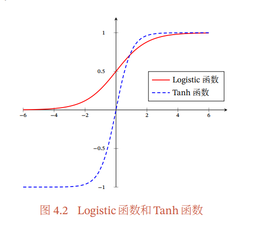
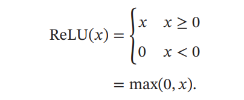
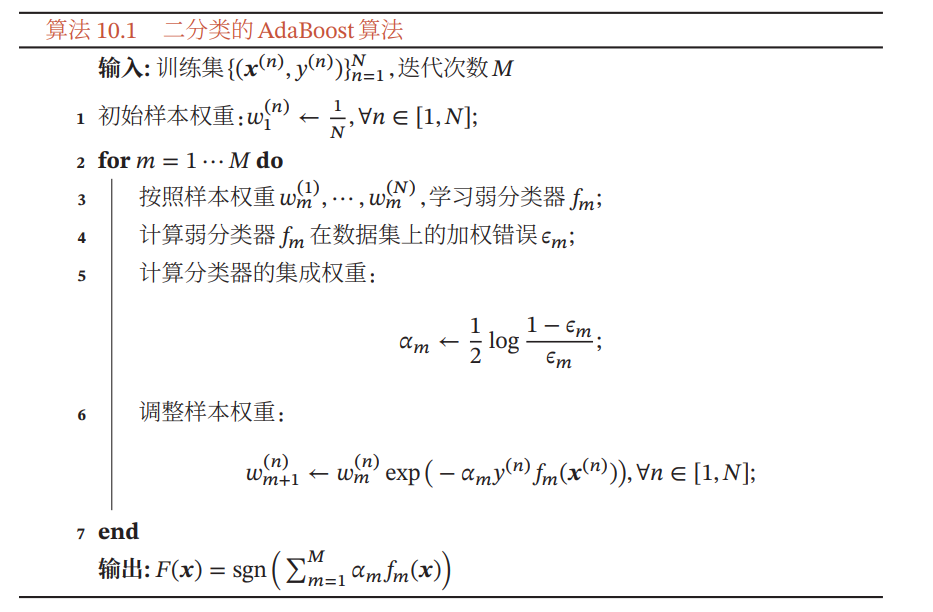

## 概述

### 机器学习

机器学习步骤：数据预处理，特征提取，特征转换，预测

其中中间两步又可被视作特征工程

机器学习的三个基本要素

- 模型：具有内部参数权重 w 和偏置 b
- 学习准则：损失函数和风险最小化准则
- 优化算法：最小二乘法，梯度下降法

损失函数：在确定模型参数 w 和 b 时，力求使损失函数最小化

- 0/1 损失函数（预测和 y 不同即为 0，否则为 1）

- 平方损失函数
  $$
  L(y,f(x,\theta)) = \frac{1}{2}(y - f(x,\theta))^2
  $$

- 交叉熵损失函数
  $$
  L(y,f(x,\theta)) = -y^Tlogf(\theta, x) = -\sum_{c=1}^Cy_clogf_c(x,\theta)
  $$

期望风险、经验风险和结构风险：又叫期望错误，就是应用在机器学习上模型上的某种损失函数，在学习过程要求通过找到合适的参数将这种风险（错误）实现最小化，也就是所谓的风险最小化准则

梯度下降法：其中 α 为学习率
$$
\theta_{t+1} = \theta_t-\alpha \frac{L(y,x,\theta)}{∂\theta}
$$

提前停止：为了防止过拟合，提前停止梯度下降，当然，也可以加入正则项使其转化为结构风险最小化问题防止过拟合

机器学习算法的类型

- 监督学习（输入有标签）：算法如线性模型，神经网络
- 无监督学习（输入无标签）：算法如主成分分析，自编码器
- 强化学习（通过交互学习）

介于监督学习和无监督学习之间，还有半监督学习，或弱监督学习，其采用一部分有标签的训练集训练出一个基础的模型，再通过这个基础的模型预测无标签数据得到有标签的训练集，选取可靠的部分再作为训练集训练自身（这种方式也叫自训练）

理论和定理

- PAC 学习理论：可能近似正确，在误差足够小时认为正确
- 没有免费午餐定理：没有一种模型能高效解决所有问题
- 奥卡姆剃刀原理：追求简单的模型
- 丑小鸭定理：模型的差异不可简单量化

参数和超参数：模型的参数指其内部参数，如权重 w 和偏置 b，影响模型效率的参数；模型的超参数指描述模型结构的参数，如神经网络的层数，不可通过优化算法优化，需要强经验调整

### 表示学习

表示学习用以**特征提取**，将输入变为更有效的特征，主要需要解决**语义鸿沟**问题

一个好的表示

- 强的表达能力
- 简化后续任务
- 独立性和迁移性

表示学习可以分为

- 局部表示（one-hot 表示）：离散的表示
- 分布式表示（如 RGB 颜色，即为三位稠密分布式表示）：多维低维稠密向量

表示学习的目的：构建多层次的特征表示（高维到低维的映射）

### 深度学习

从数据中自动学习到有效的特征表示，主要需要解决各层之间贡献度分配问题，多采用多层神经网络的反向传播算法

从表示学习中，我们可以构建一个多层次的特征表示，深度学习通过多个特征表示，自动学习到有效的特征表示，即为能解决实际问题的模型（预测函数）

端到端学习：和模块化对立，只关注最开始的输入和最后的输出，中间的过程不加以区分

## 线性模型

### 线性回归

属于二分类问题，分为简单回归（输出为 0/1）和多元回归（分为多类）

参数学习：学习合适的权重 w 和偏移 b

- 经验风险最小化：最小二乘法，梯度下降法
- 结构风险最小化：正则化，梯度下降法
- 最大似然估计
- 最大后验估计：贝叶斯估计

### 感知器

是一种线性分类器，只有一个神经元，输出是与不是（1/0），感知器学习算法其实是一个经典的线性参数学习算法（使用梯度下降法求解）

参数学习的梯度下降递归公式
$$
w_{k+1} = w_k + x^{(n)}y^{(n)}
$$
其中每一次迭代的梯度为 -xy，学习率 α 为 1

感知器的收敛性，求得最大的特征向量的模 R 和最小的函数值
$$
R = max|x_n|\quad\xi = min(w^*x^{(n)}y^{(n)})
$$
则感知器一定会在
$$
\frac{R^2}{\xi^2}
$$
次迭代中收敛（即完成参数学习），若这么多次都未收敛，则可以判定其线性不可分

参数平均的感知器：用以解决参数学习中，输入样例顺序造成的强干扰，简单来说，就是令后学习的样例的学习率降低，能够有效提高感知器的泛化能力

改进的平均感知器参数学习算法
$$
w = w+y^{(n)}x^{(n)}\\
u = u+ty^{(n)}x^{(n)}
$$
其中 u 即为平均感知器，t 为当前的迭代次数

### 支持向量机

解决二分类问题（线性模型）的经典算法，就是寻找一个使输入 x 间隔最大的超平面（间隔越大，二分划分就越稳定，这很显然）

需要注意的是，这个间隔最大的超平面具有唯一性，间隔公式为
$$
\xi^{(n)} = min\frac{y^{(n)}(w^Tx^{(n)+b})}{||w||}
$$
位于超平面上的样本，称之为**支持向量**

支持向量机的优化（参数学习）是一个凸优化问题

- 参数学习：对模型做出强烈假设，固定参数个数
- 非参数学习：没有固定参数，在学习过程中动态加入参数

支持向量机的决策函数只取决于**支持向量的数量**，也就是说支持向量机的收敛效率只取决于支持向量

## 神经网络

非线性的模型，凹优化问题，没有足够的数学理论支撑

### 前馈神经网络

> 前馈神经网络分为：全连接神经网络；卷积神经网络

就是一个多层感知器（感知器：线性分类器，只有一个神经元）

- 净输入
- 活性值
- 激活函数

为什么是前馈，上一层感知器的活性值为下一层感知器的输入，经过当前层的加权变换后为净活性值，再经过当前层的激活函数作为新的活性值输入至下一层感知器

激活函数

Sigmoid 函数：分为 Logistic 和 Tanh 函数，前者非零中心化，后者为零中心化

ReLU 函数：一个分段函数，会发生 ReLU 死亡现象（就是在迭代过程中 x 一直小于 0，ReLU 始终为 0，不被触发，就像不存在一样），和梯度消失有点像

反向传播算法：通过激活函数的偏导数，将当前层的活性值反向输入给上一层，这自然有可能造成梯度消失问题

所谓梯度消失，就是当输出乘以导数（很小的值），导致结果越来越小，直到梯度近似为 0，就像消失了一样，这将对神经网络造成严重的计算负担

如何解决梯度消失问题：采用导数较大的激活函数，如 ReLU

自动梯度计算

- 数值微分：根据导函数定义，手动设置 ▲x 为一个很小的值，直接求▲y
- 符号微分：保留符号（未知数）进行微分，微分对象为含未知数的多项式
- 自动微分：处理一个函数或一段程序

### 卷积

前馈神经网络的一种，全连接神经网络中，每一层感知器都有其权重和偏移，当层数增加时这样的系数将呈指数增加，大大降低了计算效率

于是就有了卷积神经网络，其特征为**权值共享、局部连接、汇聚**，其结构由卷积层、汇聚层、全连接层构成

信号序列 x 和滤波器 w 的乘积之和即为**卷积**
$$
y_t = \sum_{k=1}^Kw_kx_{t-k+1}
$$
卷积常作为特征提取的方法，其结果为特征映射（这里涉及到机器学习的中间两个步骤）

卷积良好的数学性质：交换性和导数

### 循环神经网络

不同于前馈神经网络的单向传播（从上一层传向下一层直到全连接层），循环神经网络通过随时间反向传播算法可以将错误反向传播给前驱，使神经网络具有短期记忆能力

## 网络优化和正则化

常见的优化方向

- 梯度下降批量选择：常采用小批量梯度下降法
- 学习率调整：学习率衰减，学习率预热，学习率周期调整（加大）
- 梯度估计修正

### RMSprop 算法

用于学习率调整

先计算参数梯度的累计值，其中 gt 为本次迭代的梯度，β 为衰减率（常为 0.9）
$$
\begin{aligned}
G_t &= \beta G_{t-1}+(1-\beta)g_t\odot g_t\\
&=(1-\beta)\sum_{k=1}^t\beta^{t-k}g_k\odot g_k
\end{aligned}
$$
通过累计值（作为系数）调整本次梯度
$$
▲\theta_t = -\frac{\alpha}{\sqrt{G_t+\xi}}\odot g_t
$$
下一轮的学习率即为
$$
\theta_{t+1} \leftarrow \theta_t + ▲\theta_t
$$
在学习率调整中，这个 θ 即为学习率 α，代入即可

AdaGrad 算法：和 RMSprop 的区别就是 Gt 的求法不一样，其 Gt 简单的为每个参数梯度平方的累计值
$$
G_t = \sum_{k=1}^tg_k\odot g_k
$$

### 动量法

用于**梯度估计修正**，在梯度下降的时候，常采用随机梯度下降，为了避免梯度不合理，采用平均值来处理当前梯度（防止梯度消失或爆炸）

原梯度为偏导数，通过加权移动平均更新为
$$
▲\theta_t = ρ▲\theta_{t-1}-\alpha g_t = -\alpha\sum_{k=1}^tρ^{t-k}g_k
$$
其中 ρ 为动量因子，常为 0.9，α 为模型当前的学习率

自然，θ 作用于参数学习的话，如权重 w，下一个值即为
$$
w_t = w_{t-1} + ▲w
$$

### 逐层归一化

> 再参数化的一种

归一化：即将模型的输入经过多一层处理，使之规范且合理

批归一化（批量归一化）：针对神经网络中某一层中的单个神经元，对其输入进行归一化处理

层归一化：对神经网络的某一层的所有神经元进行归一化处理

### 网络正则化

## 记忆与注意力机制

All You Need Is Attention

### 注意力机制

全连接前馈神经网络的输入和参数太过庞大，每一层每一维都需要不同的参数参与，于是采用卷积前馈神经网络对参数的数量进行简化（权重共享、局部连接、汇聚），但这似乎还是不够

于是对于输入向量 X，我们采用注意力机制，即规定一个任务向量，规定需要直接作用于当前任务的维度，使神经网络重点处理和当前任务强相关的维度数据，这就是所谓注意力机制

## 无监督学习

### 自编码器

自编码器：是通过无监督的方式来学习一组数据的有效编码（或表示）

就是一个编码和解码的过程，其要学习的风险函数为编码再解码的差错率，设函数 f 为编码函数，g 为解码函数，则期望风险为
$$
y^{(n)}-f[g(x^{(n)})]
$$
通过风险最小化准则，将编码和解码函数拟合为理想值，实现无监督的机器学习

## 集成学习

### 集成学习概述

就是集合多个独立模型，取其“均值”作为最终的模型输出
$$
f(x) = \frac{1}{N}\sum_{n=1}^Na_nf_n(x)
$$
其中 an 为各个独立模型参与集成的权重

### AdaBoost 算法

求解各个模型的权值，并进一步通过权值和各个弱分类器（基分类器）构造一个强分类的算法
$$
F(x) = \sum_{m=1}^Ma_mf_m(x)
$$
其中 F 即为所要求的强分类器（其实就是一个集成学习模型）

算法的基本思路是，在经过一次基本权重分配，更加注意分配错误率更高的弱分类器，适时的提高出错的弱分类器对应的权重，以此增加每个弱分类器的差距

第一步：初始化各弱分类器权重，均分为 1/N

第二步：选取弱分类器 fm，并计算其加权错误 ε，通过公式为 fm 计算新的权重 αm（这取决于错误的大小，错误越大，集成权重越大）
$$
\alpha_m = \frac{1}{2}log\frac{1-ε_m}{ε_m}
$$
第三步：调整弱分类器 fm 的内部参数 w 的样本权重
$$
w_m \leftarrow w_me^{-\alpha_my^{(n)f_m(x^{(n)})}}
$$
第四步：遍历所有弱分类器 f，循环第二步和第三步，更新所有弱分类器的集成权重 α 和内部权重 w

在二分类模型中，最后的输出为 1/0，即判断是否是这一类，所以最后的强分类器 F 要加上一个 sgn 函数，表示其正负（大于 0 则输出 1，否则输出 0）

## 深度生成模型

### 生成模型概述

深度生成模型是一种特殊的模型，其目的在于随机生成可观测的数据（一个数据生成器）

### 变分自编码器

> 放了要不

再参数化（其实归一化属于再参数化的一种），就是将自变量用另一个函数的因变量表示，如对于函数 f(θ)，其接收的输入为初始的 θ，现在我们对 x 进行这样的处理
$$
θ = g(x) \rightarrow f[g(x)]
$$
现在函数 f 接收的参数为函数 g 的输出，这样有利于将原始自变量简化、规范化，从而减少参数量，便于计算

