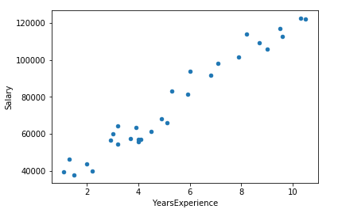
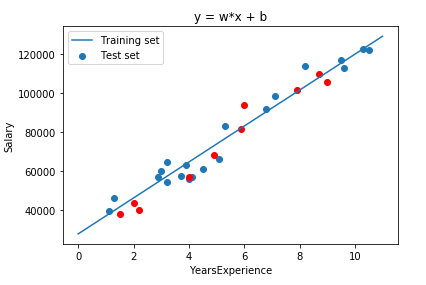
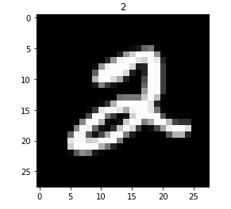
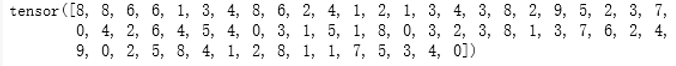
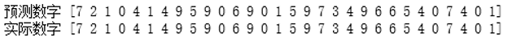
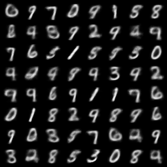
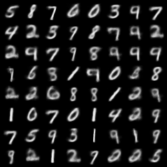
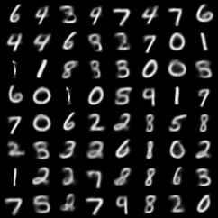

[pytorch.org](https://pytorch.org/get-started/locally/)

[60分钟快速入门 PyTorch - 知乎 (zhihu.com)](https://zhuanlan.zhihu.com/p/66543791)

## 验证线性回归

### 实验目的和要求

实验目的

- 掌握机器学习的一般实验过程
- 理解并实现线性回归模型

实验要求：学会安装和设置机器学习开发环境；熟悉机器学习任务的编码和调试

### 实验实现

linear_regression.py

```python
# 导包
import numpy as np
import pandas as pd
import matplotlib.pyplot as plt

#导入数据并可视化
data_set = pd.read_csv('Salary_Data.csv')
data_set = data_set.take(np.random.permutation(30))#随机排列
data_set

data_set.plot.scatter(x='YearsExperience',y='Salary')
plt.show()

data_set = np.array(data_set)
data_set

# 分割数据集为训练集和测试集
data_train,data_test = np.split(data_set,[20],)#水平切割
n_train = np.shape(data_train)[0] #训练集的个数
n_test = np.shape(data_test)[0]

x_train = data_train[:,:1]
y_train = data_train[:,1:2]

x_test = data_test[:,:1]
y_test = data_test[:,1:2]


# 列出模型 y = wx + b
#对参数进行初始化
w = np.ones(n_train).reshape(n_train,1) #20列1行的矩阵
b = 1.0

lr = 0.00001 #学习率

num_iter = 100000 #迭代次数


# 使用梯度下降求解参数
for i in range(num_iter):
    y_hat = w*x_train + b       #y_hat是预测值
    sum_w = np.sum((y_train-y_hat)*(-x_train))    
    sum_b = np.sum((y_train-y_hat)*(-1))
    det_w = 2 *sum_w       
    det_b = 2 *sum_b
    w = w - lr * det_w
    b = b - lr * det_b
print(w)
print(b)


# 可视化
fig,ax = plt.subplots()
ax.scatter(x_train,y_train)
ax.scatter(x_test,y_test,c = 'r')
ax.plot([i for i in range(0,12)],[w[0,0]*i+b for i in range(0,12)])
ax.set_xlabel('YearsExperience')
ax.set_ylabel('Salary')
plt.title('y = w*x + b')
plt.legend(('Training set','Test set'),loc = 'upper left')
plt.show()
```

### 结果及性能分析

导入数据并可视化



数据可视化



本次实验的内容为使用梯度下降法求解线性回归，梯度下降法识一种基于搜素的最优化方法，可以用于求解最小二乘问题。通过本次实验，我认识到了机器学习的一般实验过程，同时也对线性回归模型有了更深刻的认识，也让我理解了梯度下降法的相关知识。由于本次实验前需要进行环境配置，将源配置为国内的，也让我了解了机器学习开发环境的配置和安装，并学会了如何使用Anaconda

参考资料

1. [阿里云开发者社区 - Anaconda配置](https://developer.aliyun.com/article/848988)

## 手写数字识别

### 实验目的及要求

实验目的

- 会根据任务设计合适的神经网络
- 熟悉超参数调整的一般规则

实验要求：熟悉常见的神经网络设计，从MLP、CNN、RNN中选择一种模型加以实现，掌握基本的超参数调整原则和方法

### 实验实现

number_recognition.py

```python
import torch
import torchvision
from torch.utils.data import DataLoader
import torch.nn as nn
import torch.nn.functional as F
import torch.optim as optim
import matplotlib.pyplot as plt
 
n_epochs = 3
batch_size_train = 64
batch_size_test = 1000
learning_rate = 0.01
momentum = 0.5
log_interval = 10
random_seed = 1
torch.manual_seed(random_seed)
 
train_loader = torch.utils.data.DataLoader(
    torchvision.datasets.MNIST('./data/', train=True, download=True,
                               transform=torchvision.transforms.Compose([
                                   torchvision.transforms.ToTensor(),
                                   torchvision.transforms.Normalize(
                                       (0.1307,), (0.3081,))
                               ])),
    batch_size=batch_size_train, shuffle=True)
test_loader = torch.utils.data.DataLoader(
    torchvision.datasets.MNIST('./data/', train=False, download=True,
                               transform=torchvision.transforms.Compose([
                                   torchvision.transforms.ToTensor(),
                                   torchvision.transforms.Normalize(
                                       (0.1307,), (0.3081,))
                               ])),
    batch_size=batch_size_test, shuffle=True)
 
examples = enumerate(test_loader)
batch_idx, (example_data, example_targets) = next(examples)
# print(example_targets)
# print(example_data.shape)
 
fig = plt.figure()
for i in range(6):
    plt.subplot(2, 3, i + 1)
    plt.tight_layout()
    plt.imshow(example_data[i][0], cmap='gray', interpolation='none')
    plt.title("Ground Truth: {}".format(example_targets[i]))
    plt.xticks([])
    plt.yticks([])
plt.show()
 
 
class Net(nn.Module):
    def __init__(self):
        super(Net, self).__init__()
        self.conv1 = nn.Conv2d(1, 10, kernel_size=5)
        self.conv2 = nn.Conv2d(10, 20, kernel_size=5)
        self.conv2_drop = nn.Dropout2d()
        self.fc1 = nn.Linear(320, 50)
        self.fc2 = nn.Linear(50, 10)
 
    def forward(self, x):
        x = F.relu(F.max_pool2d(self.conv1(x), 2))
        x = F.relu(F.max_pool2d(self.conv2_drop(self.conv2(x)), 2))
        x = x.view(-1, 320)
        x = F.relu(self.fc1(x))
        x = F.dropout(x, training=self.training)
        x = self.fc2(x)
        return F.log_softmax(x, dim=1)
 
network = Net()
optimizer = optim.SGD(network.parameters(), lr=learning_rate, momentum=momentum)
 
train_losses = []
train_counter = []
test_losses = []
test_counter = [i * len(train_loader.dataset) for i in range(n_epochs + 1)]
 
 
def train(epoch):
    network.train()
    for batch_idx, (data, target) in enumerate(train_loader):
        optimizer.zero_grad()
        output = network(data)
        loss = F.nll_loss(output, target)
        loss.backward()
        optimizer.step()
        if batch_idx % log_interval == 0:
            print('Train Epoch: {} [{}/{} ({:.0f}%)]\tLoss: {:.6f}'.format(epoch, batch_idx * len(data),
                                                                           len(train_loader.dataset),
                                                                           100. * batch_idx / len(train_loader),
                                                                           loss.item()))
            train_losses.append(loss.item())
            train_counter.append((batch_idx * 64) + ((epoch - 1) * len(train_loader.dataset)))
            torch.save(network.state_dict(), './model.pth')
            torch.save(optimizer.state_dict(), './optimizer.pth')
 
def test():
    network.eval()
    test_loss = 0
    correct = 0
    with torch.no_grad():
        for data, target in test_loader:
            output = network(data)
            test_loss += F.nll_loss(output, target, reduction='sum').item()
            pred = output.data.max(1, keepdim=True)[1]
            correct += pred.eq(target.data.view_as(pred)).sum()
    test_loss /= len(test_loader.dataset)
    test_losses.append(test_loss)
    print('\nTest set: Avg. loss: {:.4f}, Accuracy: {}/{} ({:.0f}%)\n'.format(
        test_loss, correct, len(test_loader.dataset),
        100. * correct / len(test_loader.dataset)))
 
 
train(1)
 
for epoch in range(1, n_epochs + 1):
    train(epoch)
    test()
 
 
fig = plt.figure()
plt.plot(train_counter, train_losses, color='blue')
plt.scatter(test_counter, test_losses, color='red')
plt.legend(['Train Loss', 'Test Loss'], loc='upper right')
plt.xlabel('number of training examples seen')
plt.ylabel('negative log likelihood loss')
 
 
examples = enumerate(test_loader)
batch_idx, (example_data, example_targets) = next(examples)
with torch.no_grad():
    output = network(example_data)
fig = plt.figure()
for i in range(6):
    plt.subplot(2, 3, i + 1)
    plt.tight_layout()
    plt.imshow(example_data[i][0], cmap='gray', interpolation='none')
    plt.title("Prediction: {}".format(output.data.max(1, keepdim=True)[1][i].item()))
    plt.xticks([])
    plt.yticks([])
plt.show()
 


continued_network = Net()
continued_optimizer = optim.SGD(network.parameters(), lr=learning_rate, momentum=momentum)
 
network_state_dict = torch.load('model.pth')
continued_network.load_state_dict(network_state_dict)
optimizer_state_dict = torch.load('optimizer.pth')
continued_optimizer.load_state_dict(optimizer_state_dict)
 
for i in range(4, 9):
    test_counter.append(i*len(train_loader.dataset))
    train(i)
    test()
 
fig = plt.figure()
plt.plot(train_counter, train_losses, color='blue')
plt.scatter(test_counter, test_losses, color='red')
plt.legend(['Train Loss', 'Test Loss'], loc='upper right')
plt.xlabel('number of training examples seen')
plt.ylabel('negative log likelihood loss')
plt.show()
```

### 结果及性能分析

图片数据可视化



数据分配



模型验证



本次实验的内容为在 PyTorch 中创建一个简单的CNN，并使用 MNIST 数据集训练它识别手写数字。MNIST 是计算机视觉领域中最为基础的一个数据集，其中包含 70000 张手写数字图像，其中 60000 张用于培训，10000 张用于测试。通过本次实验，我学会了根据任务设计合适的神经网络，同时熟悉了超参数调整的一般规则，对机器学习的知识有了更深刻的理解

参考资料

1. [CSDN - Pytorch入门 - MNIST数字识别](https://blog.csdn.net/NikkiElwin/article/details/112980305)

## 基于 VAE 的手写数字生成

### 实验目的和要求

实验目的

- 会根据任务设计合适的神经网络
- 熟悉超参数调整的一般原则
- 通过编写代码，进一步理解和掌握变分自编码器（VAE）

实验要求

- 利用MNIST数据集，训练VAE生成手写体数字；
- 结合代码，介绍相关的VAE模块；
- 可视化
  - 随机选择20个数字作为VAE的输入，分别输出在第5轮、10轮、20轮，以及训练结束后的轮次生成的输出图像
  - 将最后一轮得到的每个输入数字的隐状态映射为一个点，通过不同颜色加以区分，并用散点图输出。
- 实验结果及分析

### 实验实现

vae_number_recognition.py

```python
# prerequisites
import torch
import torch.nn as nn
import torch.nn.functional as F
import torch.optim as optim
from torchvision import datasets, transforms
from torch.autograd import Variable
from torchvision.utils import save_image

bs = 100
# MNIST Dataset
train_dataset = datasets.MNIST(root='./mnist_data/', train=True, transform=transforms.ToTensor(), download=True)
test_dataset = datasets.MNIST(root='./mnist_data/', train=False, transform=transforms.ToTensor(), download=False)

# Data Loader (Input Pipeline)
train_loader = torch.utils.data.DataLoader(dataset=train_dataset, batch_size=bs, shuffle=True)
test_loader = torch.utils.data.DataLoader(dataset=test_dataset, batch_size=bs, shuffle=False)


class VAE(nn.Module):
    def __init__(self, x_dim, h_dim1, h_dim2, z_dim):
        super(VAE, self).__init__()

        # encoder part
        self.fc1 = nn.Linear(x_dim, h_dim1)
        self.fc2 = nn.Linear(h_dim1, h_dim2)
        self.fc31 = nn.Linear(h_dim2, z_dim)
        self.fc32 = nn.Linear(h_dim2, z_dim)
        # decoder part
        self.fc4 = nn.Linear(z_dim, h_dim2)
        self.fc5 = nn.Linear(h_dim2, h_dim1)
        self.fc6 = nn.Linear(h_dim1, x_dim)

    def encoder(self, x):
        h = F.relu(self.fc1(x))
        h = F.relu(self.fc2(h))
        return self.fc31(h), self.fc32(h)  # mu, log_var

    def sampling(self, mu, log_var):
        std = torch.exp(0.5 * log_var)
        eps = torch.randn_like(std)
        return eps.mul(std).add_(mu)  # return z sample

    def decoder(self, z):
        h = F.relu(self.fc4(z))
        h = F.relu(self.fc5(h))
        return F.sigmoid(self.fc6(h))

    def forward(self, x):
        mu, log_var = self.encoder(x.view(-1, 784))
        z = self.sampling(mu, log_var)
        return self.decoder(z), mu, log_var


# build model
vae = VAE(x_dim=784, h_dim1=512, h_dim2=256, z_dim=2)
if torch.cuda.is_available():
    vae.cuda()

print(vae)

optimizer = optim.Adam(vae.parameters())
# return reconstruction error + KL divergence losses
def loss_function(recon_x, x, mu, log_var):
    BCE = F.binary_cross_entropy(recon_x, x.view(-1, 784), reduction='sum')
    KLD = -0.5 * torch.sum(1 + log_var - mu.pow(2) - log_var.exp())
    return BCE + KLD


def train(epoch):
    vae.train()
    train_loss = 0
    for batch_idx, (data, _) in enumerate(train_loader):
        # 取消cuda
        # data = data.cuda()
        data = data.cpu()
        optimizer.zero_grad()

        recon_batch, mu, log_var = vae(data)
        loss = loss_function(recon_batch, data, mu, log_var)

        loss.backward()
        train_loss += loss.item()
        optimizer.step()

        if batch_idx % 100 == 0:
            print('Train Epoch: {} [{}/{} ({:.0f}%)]\tLoss: {:.6f}'.format(
                epoch, batch_idx * len(data), len(train_loader.dataset),
                       100. * batch_idx / len(train_loader), loss.item() / len(data)))
    print('====> Epoch: {} Average loss: {:.4f}'.format(epoch, train_loss / len(train_loader.dataset)))


def test():
    vae.eval()
    test_loss = 0
    with torch.no_grad():
        for data, _ in test_loader:
            # 取消cuda
            # data = data.cuda()
            data = data.cpu()
            recon, mu, log_var = vae(data)

            # sum up batch loss
            test_loss += loss_function(recon, data, mu, log_var).item()

    test_loss /= len(test_loader.dataset)
    print('====> Test set loss: {:.4f}'.format(test_loss))

for epoch in range(1, 51):
    train(epoch)
    test()

with torch.no_grad():
    # cuda改为cpu
    z = torch.randn(64, 2).cuda()
    sample = vae.decoder(z).cuda()

    save_image(sample.view(64, 1, 28, 28), './samples/sample_' + '.png')
```

### 结果及性能分析

五轮训练结果



十轮训练结果



二十轮训练结果



通过这次实验，我深入了解了基于 VAE 的手写数字生成的原理和方法，并在实践中获得了对模型参数、损失函数和训练优化的实际经验。这个实验不仅提升了我的编程和深度学习技能，还加深了我对生成模型和图像处理的理解。我期待在未来的研究和实践中能够继续探索和应用 VAE 及其他生成模型的相关技术

参考资料

1. [GitHub - lyeoni/pytorch-mnist-VAE](https://github.com/lyeoni/pytorch-mnist-VAE)
2. [知乎 - VAE算法](https://zhuanlan.zhihu.com/p/348603688)
