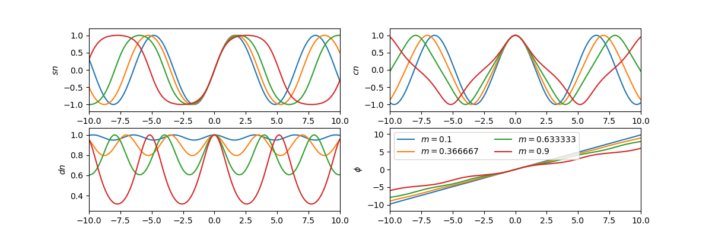
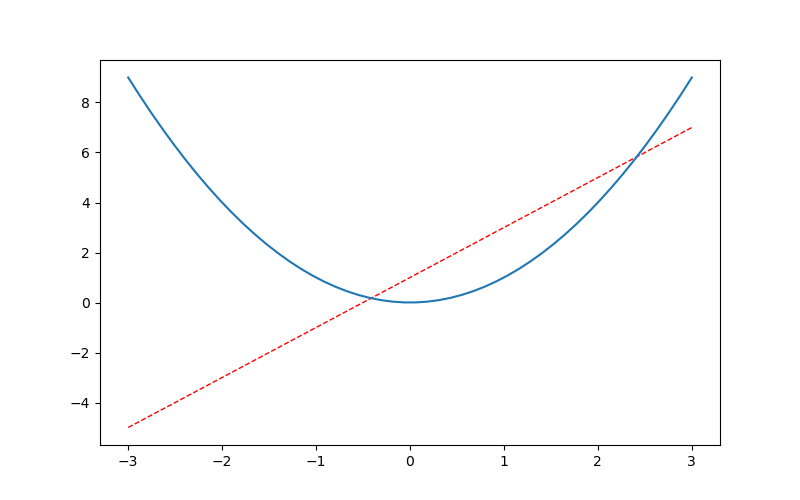
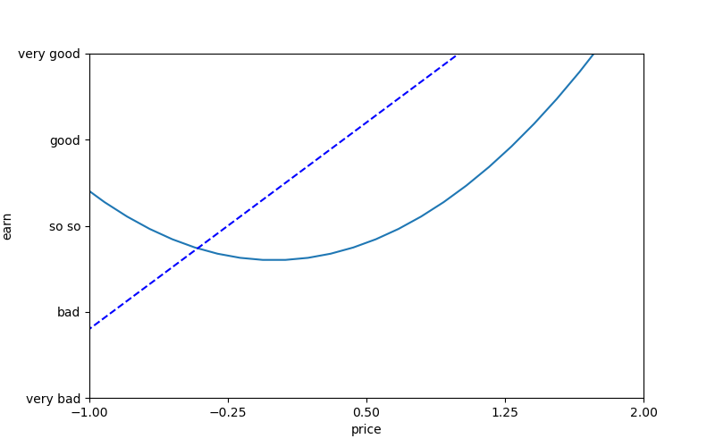
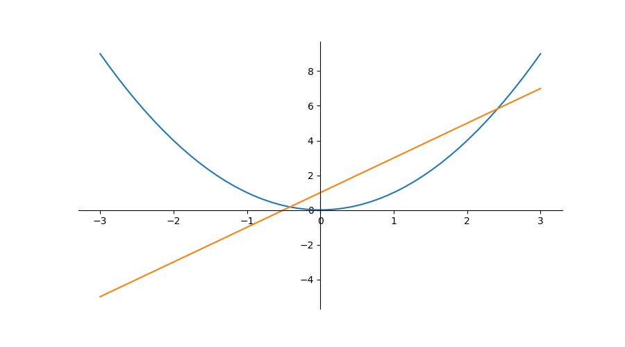
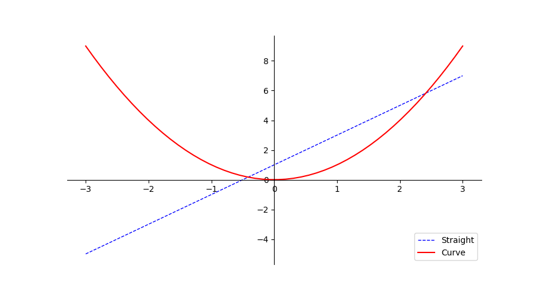
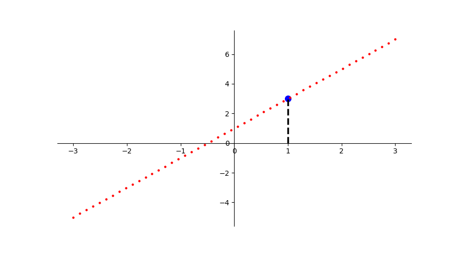
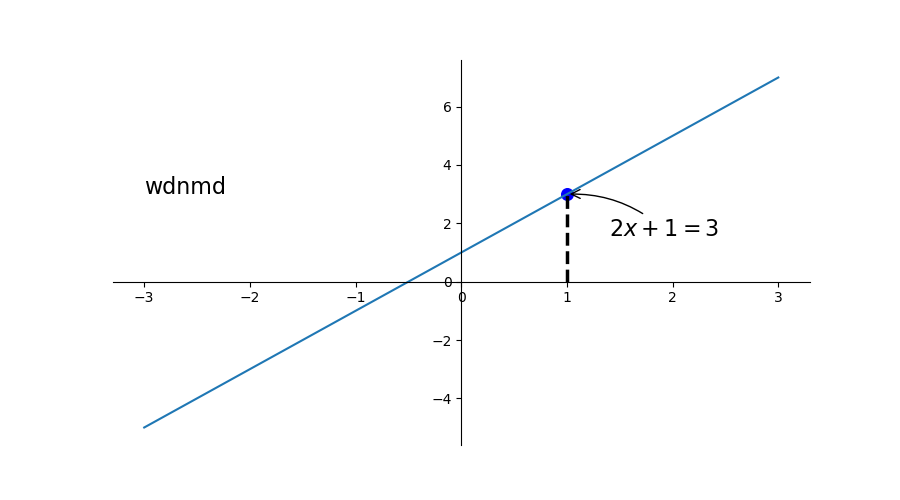
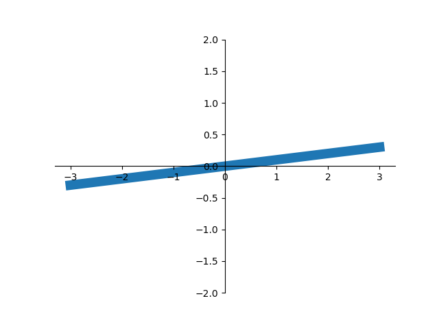
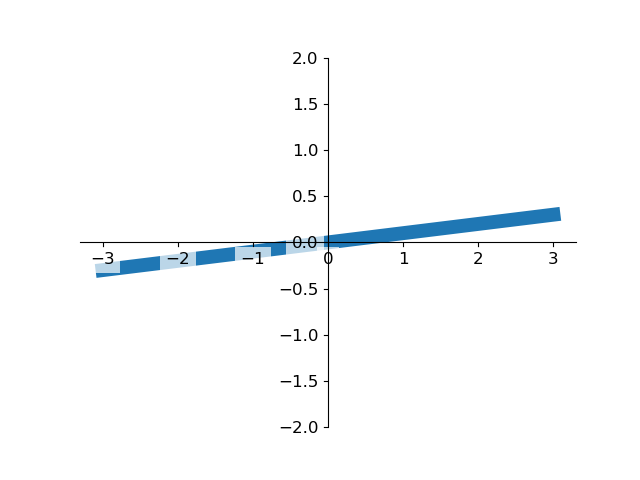

Scipy 是一个用于数学、科学、工程领域的常用软件包，是一个数值计算库，可以处理插值、积分、优化、图像处理、常微分方程数值解的求解、信号处理等问题

它能够有效计算 Numpy 矩阵，使 Numpy 和 Scipy 协同工作，高效处理数据

## Scipy 概述

导入

~~~python
import numpy as np
import scipy
import matplotlib.pyplot as plt

print(scipy.__version__)
~~~

`pyplot`是绘图库`matplotlib`下的一个模块

- `pyplot`和`matlab`高度相似
- 还有另一个模块叫做`pylab`，`pylab = pyplot + 部分numpy`，更加冗余
- 引入`pylab`不用加`maplotlib`，即直接`import pylab`

常数和特殊函数

~~~python
from scipy import constants as C

# 真空光速
print(C.c)
# 普朗克常数
print(C.h)
# pyysical_constants是一个常量字典，物理常量名为键，对应一个三元组，分别为常数值、单位和误差
print(C.physical_constants["electron mass"])

# 1英里等于多少米, 1英寸等于多少米, 1克等于多少千克, 1磅等于多少千克
print(C.mile)
print(C.inch)
print(C.gram)
print(C.pound)
~~~

科学计算

~~~python
import scipy.special as S

print (1 + 1e-20)
print (np.log(1+1e-20))
print (S.log1p(1e-20))
~~~

线代计算

~~~python
m = np.linspace(0.1, 0.9, 4)
u = np.linspace(-10, 10, 200)
results = S.ellipj(u[:, None], m[None, :])

print([y.shape for y in results])
~~~

绘图

~~~python
m = np.linspace(0.1, 0.9, 4)
u = np.linspace(-10, 10, 200)
results = S.ellipj(u[:, None], m[None, :])
#%figonly=使用广播计算得到的`ellipj()`返回值
fig, axes = plt.subplots(2, 2, figsize=(12, 4))
labels = ["$sn$", "$cn$", "$dn$", "$\phi$"]
for ax, y, label in zip(axes.ravel(), results, labels):
    ax.plot(u, y)
    ax.set_ylabel(label)
    ax.margins(0, 0.1)
    
axes[1, 1].legend(["$m={:g}$".format(m_) for m_ in m], loc="best", ncol=2);
plt.show()
~~~

## 拟合与优化

Optimize

~~~python
import matplotlib.pyplot as plt
import numpy as np
~~~

### 非线性方程组求解

从`math`库中引入`sin,cos`函数，引入`scipy`的`potimize`模块

~~~python
from math import sin,cos
from scipy import optimize

def f(x):
    x0,x1,x2 = x.tolist()
    return [5*x1+3, 4*x0**2-2*sin(x1*x2), x1*x2-1.5]

result = optimize.fsolve(f, [1,1,1])
print(result)
print(f(result))
~~~

- `fsolve`的第一个参数为方程组，第二个参数为未知数初始值

- 方程组的形式由一个数组返回，`=0`省略，如上述代码表示方程组
  $$
  \begin{cases}
  5\times x_1+3=0\\
  4\times x_0^2-2\sin{(x_1\times x_2)}=0\\
  x_1\times x_2-1.5=0
  \end{cases}
  $$

- 该函数使用最速梯度下降法求解局部最优解，故要设置未知数的初始值

最速（梯度）下降法，先求原函数在原点的梯度，再设步长并求出使函数值最小的步长，原点减去步长乘以梯度得次点，令次点为原点，重复以上操作

- 梯度：偏导的集合

- 对于上述方程组，其对应函数为
  $$
  f(x_0,x_1,x_2)=4x_0^2+5x_1-2\sin{(x_1x_2)}+x_1x_2+1.5
  $$

- 其偏导即为
  $$
  f'(x)=[f_{x_0}'(x_0), f_{x_1}'(x_1), f_{x_2}'(x_2)]
  $$

- 代入`[1,1,1]`即为原点的梯度

- 令`f(1,1,1)-af'(1,1,1)`取最小值，求得步长`a`

- 次点即为`[1,1,1]-af'(1,1,1)`

~~~python
def g(x):
    return [[0, 5, 0],
           [8*x[0], -2*cos(x[1]*x[2]), -2*x[1]*cos(x[1]*x[2])],
           [0, x[2], x[1]]]
result1 = optimize.fsolve(f, [1,1,1], fprime=g)
print(result1) 
~~~

- `fprime`： 可调用 `f(x, *args)` ，可选

  用于计算 func 的雅可比行列式的函数，该函数具有跨行的导数。默认情况下，将估计雅可比行列式

### 最小二乘拟合

> 最小二乘法（又称最小平方法）是一种数学优化技术。它通过最小化误差的平方和寻找数据的最佳函数匹配。利用最小二乘法可以简便地求得未知的数据，并使得这些求得的数据与实际数据之间误差的平方和为最小
>
> 最小二乘法还可用于曲线拟合，其他一些优化问题也可通过最小化能量或最大化熵用最小二乘法来表达 

简单来说，就是通过构造函数，使计算结果和已知数据的平方差最小

使用`optimize.leastsq`拟合一次函数

~~~python
X = np.array([ 8.19,  2.72,  6.39,  8.71,  4.7 ,  2.66,  3.78])
Y = np.array([ 7.01,  2.78,  6.47,  6.71,  4.1 ,  4.23,  4.05])

def residuals(p):
    "计算以p为参数的直线和原始数据之间的误差"
    k, b = p
    return Y - (k*X + b)

# leastsq使得residuals()的输出数组的平方和最小，参数的初始值为[1,0]
r = optimize.leastsq(residuals, [1, 0])
k, b = r[0]
print ("k =",k, "b =",b)
~~~

- 拟合的结果`r[0]`为一个向量，按函数`residuals`入参`p`的顺序存放着未知参数的估计值

更多

- 计算局域最小值
- 计算全域最小值

## Spatial

空间算法库

### 最近旁点

对于一维序列，寻找最近旁点

~~~python
import numpy as np
from scipy import spatial

x = np.sort(np.random.rand(100))
# print(x)

idx = np.searchsorted(x,0.5)
print(x[idx], x[idx-1])
~~~

- `np.random.rand`将随机生成`[0,1)`的浮点数，接收参数整型为生成浮点数个数
- 用`np.searchsorted(迭代器, 数)`寻找最近旁点的下标（取上限），即最近的大于该数的数组元素的下标（自然最近旁点有可能是`x[idx-1]`，即最近的小于该数的元素下标）

对于二维的点阵，寻找最近旁点：用`cKDTree`寻找

`query`

~~~python
np.random.seed(42)
N = 100
# 生成(-1,1)的随机数共一百行，每行两列
points = np.random.uniform(-1,1,(N,2))
kd = spatial.cKDTree(points)
# 要寻找旁点的点
targets = np.array([[0, 0], [0.5, 0.5],
                    [-0.5, 0.5], [0.5, -0.5],
                    [-0.5, -0.5]])
print(targets)
dist, idx = kd.query(targets, 3)
print(dist)
print(idx)
print(points[83])
~~~

- `np.random.seed(42)`对随机数做种，使每次生成的随机数一样，`seed()`无参实际上就是随便调了一个整型做种生成随机数
- `kd = spatial.cKDTree(points)`对已知所有点构造`cKDTree`
- 用`np.array()`构造目标点
- 用`query(targets, 3)`搜索最近旁点，`3`表示搜索最近的三个旁点，因为一共五个目标点，所以结果是一个`5x3`的矩阵，每行表示一个目标点的`3`旁点
- `query`返回的两个值分别为
  - `dist`：旁点距目标点距离
  - `idx`：旁点在`points`的下标

`query_ball_point`

~~~python
r = 0.2
idx2 = kd.query_ball_point(targets, r)
print(idx2)
~~~

- `targets`同上，为目标点矩阵
- `r`为旁点距目标点最大距离，意思是将返回距目标点`距离<r`的点的坐标
- 返回的是一个`list`数组，每个`list`储存一个目标点的旁点下标

`query_pairs`

~~~python
idx3 = kd.query_pairs(0.1)-kd.query_pairs(0.08)
print(idx3)
~~~

- `query_pairs(r)`返回的是一个`set`集合，集合中存的数据是一对对下标，如`(11,97)`，意思是`points[11]`和`points[97]`之间的距离小于`r`
- 用`set`集合减去`set`，即去掉前者中和后者共有的元素，如上述代码表示距离小于`0.1`但大于`0.08`的点对

## Matplotlib

数据可视化

### Figure 画布

~~~python
import matplotlib.pyplot as plt
import numpy as np

x = np.linspace(-3,3,50)
y1 = 2*x+1
y2 = x**2
# 设置图片名称figure3，大小为(8,5)
# 要先设置画布，才能plot(布局)
plt.figure(num=4, figsize=(8, 5))
# 设置曲线颜色、宽度、线段类型（虚线，默认实线）
plt.plot(x, y1, color='red', linewidth=1.0, linestyle='--')
plt.plot(x, y2)
# 展示图片
plt.show()
~~~

- `np.linspace`从`start`和`end`之间均分为`n`个元素组成一个向量
- 先设置画布`figure`，再布局`plot`，最后展示`show`

### Spines 坐标轴

~~~python
plt.figure(num=6, figsize=(8,5))
plt.plot(x, y2)
plt.plot(x, y1, color='blue', linewidth=1.5, linestyle='--')

plt.xlim(-1,2)
plt.ylim(-2,3)

plt.xlabel('price')
plt.ylabel('earn')

x_ticks = np.linspace(-1,2,5)
print(x_ticks)
plt.yticks(np.linspace(-2,3,5),
           ['very bad','bad','so so','good','very good'])
plt.xticks(x_ticks)
plt.show()
~~~

- `xlim/ylim`限制坐标范围
- `xlabel/ylabel`定义坐标意义
- `xticks/yticks`定义坐标轴刻度，两种重载，可以给某个坐标定义特殊含义，传入两个向量，第一个向量为坐标，第二个为其含义，一一对应

如上图，整个图的框架是四条线段，若想呈现以下效果，则只保留`x/y`轴，并设置原点

首先去掉`右,上`两条框架，即设置其颜色为`none`

~~~python
plt.figure(num=7, figsize=(9,5))
plt.plot(x, y2)
plt.plot(x, y1)

ax = plt.gca()
ax.spines['top'].set_color('none')
ax.spines['right'].set_color('none')
~~~

- `gca`即`get current axis`，获取当前轴
- 改变轴信息修改`ax`属性即可
- `spines`即为包含四条骨架的数组

设置`x/y`轴

~~~python
ax.xaxis.set_ticks_position('bottom')
ax.yaxis.set_ticks_position('left')
~~~

- 即将`下`骨架作为`x`轴，`左`骨架作为`y`轴

设置原点并展示

~~~python
ax.spines['bottom'].set_position(('data',0))
ax.spines['left'].set_position(('data',0))
plt.show()
~~~

- 这里的`data`是固定的，即表示数据值为`0`的点作为`bottom(x轴)`零点

### Legend 图例

通过`legend`函数给曲线添加图例，用`l1 ,= plt.plot()`的方式获取曲线编号

~~~python
plt.figure(num=7, figsize=(9,5))
ax = plt.gca()
ax.spines['top'].set_color('none')
ax.spines['right'].set_color('none')
ax.xaxis.set_ticks_position('bottom')
ax.yaxis.set_ticks_position('left')
ax.spines['bottom'].set_position(('data',0))
ax.spines['left'].set_position(('data',0))

# ,=表示取出可迭代对象中的唯一元素（即作用于只含有一个元素的迭代器）
l1 ,= plt.plot(x, y1, color='blue', linestyle='--', linewidth=1.0)
l2 ,= plt.plot(x, y2, color='red')
plt.legend(handles=[l1, l2], loc='lower right', labels=['Straight', 'Curve'])

plt.show()
~~~

- `handles=[]`用以绑定曲线编号，编号由`plt.plot()`函数返回，用`,=`的形式进行取值（取出迭代器中的唯一元素）

- `loc=''`设置图例位置，有以下位置选择

  ~~~bash
  best
  upper right
  upper left
  lower left
  lower right
  right
  center left
  center right
  lower center
  upper center
  center
  ~~~

- `labels=[]`用以绑定`handles`向量中的值，按顺序赋值

- 右下角即为图例

### Annoloctation 标注

~~~python
# 设置画布和坐标轴
plt.figure(num=8, figsize=(9,5))
ax = plt.gca()
ax.spines['top'].set_color('none')
ax.spines['right'].set_color('none')
ax.xaxis.set_ticks_position('bottom')
ax.yaxis.set_ticks_position('left')
ax.spines['bottom'].set_position(('data',0))
ax.spines['left'].set_position(('data',0))

# 直线
x = np.linspace(-3,3,50)
y1 = 2*x+1
y2 = x**2
# 点
x0 = 1
y0 = 2*x0+1
# 绘制散点图，若为单个点，即为描点
plt.scatter(x0,y0,s=40,color='b')
plt.scatter(x, y1, s=5, color='r')
# 绘制虚线，连接两点(x0,0)和(x0,y0)，一条垂直于x轴的线段
plt.plot([x0,x0],[0,y0], ls='--',lw=2.5, c='r')
plt.show()
~~~

- `s`设置点的大小
- `lw`即为`linewidth`
- `c`即为`color`，`b`为`blue`简写，`r`为`red`简写

添加注释和文字

~~~python
x = np.linspace(-3,3,50)
y1 = 2*x+1
x0 = 1
y0 = 2*x0+1
# 描点
plt.scatter(x0,y0, s=70, color='b')
# 画线
plt.plot(x, y1)
# 画虚线，标注点
plt.plot([x0,x0],[0,y0], ls='--',lw=2.5, c='black')
# 对点(x0,y0)添加注释
plt.annotate(r'$2x+1=%s$'%y0,xy=(x0,y0),xycoords='data',xytext=(+30,-30),textcoords='offset points',fontsize=16,arrowprops=dict(arrowstyle='->',connectionstyle='arc3,rad=.2'))
# 在`data`值为(-3,3)处添加文字
plt.text(-3,3,'wdnmd',fontdict={'size':'16', 'color':'black'})
plt.show()
~~~

- `annotate`第一个参数为注释内容（字符串）；`xy=()`为标注点的坐标；`xycoords`设置坐标的含义，如此处为数据值`data`的坐标；`fontsize`设置字体大小，接收浮点型数据 ；`arrowprops`接收一个字典，设置箭头的样式，连接方式
- `text`函数添加文字，第一、二个参数为文字坐标（左下角坐标）；第三个参数为文字内容（字符串）；`fontdict`接收一个字典，用于设置字的样式、大小等

### Tick 能见度

调整被曲线遮挡的坐标`lebal`的可见度和颜色

~~~python
x = np.linspace(-3,3,50)
y = 0.1*x

# 设置画布、坐标、绘图
plt.figure()
# 设置y轴上下限
plt.ylim(-2,2)
ax = plt.gca() # 获取骨架
# 删去上、右骨架
ax.spines['right'].set_color('none')
ax.spines['top'].set_color('none')
# 设置坐标轴
ax.xaxis.set_ticks_position('bottom')
ax.yaxis.set_ticks_position('left')
# 设置原点
ax.spines['bottom'].set_position(('data',0))
ax.spines['left'].set_position(('data',0))

plt.plot(x, y, lw=10, zorder=1)

# 对被遮挡的图像调节相关透明度，本例中设置 x轴 和 y轴 的刻度数字进行透明度设置
for label in ax.get_xticklabels()+ax.get_yticklabels():
    label.set_fontsize(12)
    '''
    其中label.set_fontsize(12)重新调节字体大小，bbox设置目的内容的透明度相关参，
    facecolor调节 box 前景色，edgecolor 设置边框， 本处设置边框为无，alpha设置透明度.
    '''
    # 其中label.set_fontsize(12)重新调节字体大小，bbox设置目的内容的透明度相关参，
#     facecolor调节 box 前景色，edgecolor 设置边框， 本处设置边框为无，alpha设置透明度.
    label.set_bbox(dict(facecolor='white',edgecolor='none',alpha=0.7))

plt.show()
~~~

调整前

调整后

## Seaborn

对 matplotlib 的进一步封装

