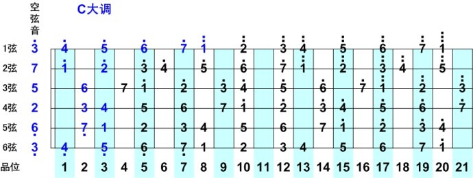

## 音调与音程

音调（Key）通常指的是调性，也就是某个音乐片段或整首乐曲围绕的主音（Tonic），调性决定了音乐的色彩和情绪，例如

- C 大调（C Major）以 C 音为中心，使用 C 大调音阶的音符
- A 小调（A Minor）以 A 音为中心，使用 A 小调音阶的音符

音阶与音调的关系

1. 音阶是音调的基础：一个音调（调性）通常由一个特定的音阶构成，例如 C 大调使用 C 大调音阶，A 小调使用 A 小调音阶
2. 音调决定了音乐的重心：虽然不同的音阶可以用于不同的调性，但每个调性都会有一个核心的主音，使音乐有归属感
3. 音阶可以用于不同的音调：比如 C 大调音阶不仅可以用于 C 大调，还可以作为 G 大调等调式中的一部分（很大一部分原因是二者均为大调，情绪都是欢快的）

简单来说，**音阶是音符的排列方式，而音调是音乐的基调或中心音**

### 音调

在 Gt 里，可以先简单分为 7 个调，即`C D E F G A B`调，上过一点音乐课我们都知道一个基本的 C 大调音阶`do re mi fa sol la si do`，他以`do`为起始音，上行七个音，其实就是由`C D E F G A B`这七个音组成

- 音阶是一组按照特定音程关系排列的音符，这个特定音程关系其实就是由音调决定的

按照这种逻辑进行推理，D 大调即是以 D 开始上行的七个音，即`G - A - B - C - D - E - F# - G`，同理，E 大调则为`E - F# - G# - A - B - C# - D# - E`

- 自然大调的特点是：音程关系是“全全半全全全半”，可以从 12 个半音之间任意选一个为主音开始构建音阶

以下是 12 个自然大调，大调是指，第一个音（主音）和第三个音之间相差四个半音（三大度）

| 大调名称 | 音阶（主音到主音）                    |
| :------- | :------------------------------------ |
| C 大调   | C - D - E - F - G - A - B - C         |
| G 大调   | G - A - B - C - D - E - F# - G        |
| D 大调   | D - E - F# - G - A - B - C# - D       |
| A 大调   | A - B - C# - D - E - F# - G# - A      |
| E 大调   | E - F# - G# - A - B - C# - D# - E     |
| B 大调   | B - C# - D# - E - F# - G# - A# - B    |
| F# 大调  | F# - G# - A# - B - C# - D# - E# - F#  |
| C# 大调  | C# - D# - E# - F# - G# - A# - B# - C# |
| F 大调   | F - G - A - B♭ - C - D - E - F        |
| B♭ 大调  | B♭ - C - D - E♭ - F - G - A - B♭      |
| E♭ 大调  | E♭ - F - G - A♭ - B♭ - C - D - E♭     |
| A♭ 大调  | A♭ - B♭ - C - D♭ - E♭ - F - G - A♭    |
| D♭ 大调  | D♭ - E♭ - F - G♭ - A♭ - B♭ - C - D♭   |
| G♭ 大调  | G♭ - A♭ - B♭ - C♭ - D♭ - E♭ - F - G♭  |
| C♭ 大调  | C♭ - D♭ - E♭ - F♭ - G♭ - A♭ - B♭ - C♭ |

有大调就有小调，自然可以以 12 个半音为主音构建 12 个自然小调，与自然大调不同，其音程特征为“全半全全半全全”，可以发现主音和第三个音之间相隔为三个半音（小三度）

| 小调名称 | 音阶（主音到主音）                    |
| :------- | :------------------------------------ |
| A 小调   | A - B - C - D - E - F - G - A         |
| E 小调   | E - F# - G - A - B - C - D - E        |
| B 小调   | B - C# - D - E - F# - G - A - B       |
| F# 小调  | F# - G# - A - B - C# - D - E - F#     |
| C# 小调  | C# - D# - E - F# - G# - A - B - C#    |
| G# 小调  | G# - A# - B - C# - D# - E - F# - G#   |
| D# 小调  | D# - E# - F# - G# - A# - B - C# - D#  |
| A# 小调  | A# - B# - C# - D# - E# - F# - G# - A# |
| D 小调   | D - E - F - G - A - B♭ - C - D        |
| G 小调   | G - A - B♭ - C - D - E♭ - F - G       |
| C 小调   | C - D - E♭ - F - G - A♭ - B♭ - C      |
| F 小调   | F - G - A♭ - B♭ - C - D♭ - E♭ - F     |
| B♭ 小调  | B♭ - C - D♭ - E♭ - F - G♭ - A♭ - B♭   |
| E♭ 小调  | E♭ - F - G♭ - A♭ - B♭ - C♭ - D♭ - E♭  |
| A♭ 小调  | A♭ - B♭ - C♭ - D♭ - E♭ - F♭ - G♭ - A♭ |

### 音程

在自然大调音阶（Ionian）中，音与音之间的音程关系是固定的

- E-F and B-C：半音
- else：全音

这种“全全半全全全半”的音程关系是 C 自然大调音阶的特征，因为 C 大调以 C 为起点，如果是 G 大调，那么音程特征就会是“全全半全全半全”（因为是以 G 为起点嘛）

我们很多时候会看到`#`符加在某个音之后，例如`C→C#、F→F#`，这是一个**升号**，将原本音符提高半个音；同样还有`♭`符号，表示降半音

- 半音的存在，在同一音程规则下也可排列组合出超多音符组合，故有上面的 12 中大调/小调

在吉他中，音程和品弦是息息相关的，首先我们明确小三度、大三度和纯四度（以半音为计量单位）

- 小三度：三个半音
- 大三度：四个半音 / 两个全音
- 纯四度：五个半音

OK，然后我们具体到琴上

- 横轴：在同一根弦上，一品为一个半音，两品为一个全音
- 纵轴：在不同弦之间，除开三弦到二弦是**大三度**（四个半音）以外，其余均是**纯四度**（五个半音）

这意味着，当我们确定一个 C 的位置后（比如五弦三品），那么我们就可以推知所有的音所在的品弦

于是就在吉他上构成了一整个 C 大调音阶

我们常说的 C D E F G A B 调，其实指的都是自然大调，对应到指板上，实际上就是在某一处确定 1，而后按照大调音程“全全半全全全半”去推知之后的七个 2、3、4、5、6、7、1

- 常说的高八度的度指的实际上就是 12 个半音（从 1 到 1 的一个循环）→ **十二平均律**

## 音阶与和弦

### 音阶

音阶练习，以 C 大调音阶为例

我们一般把挨着的 3-4 品分为一个把位，以某一个音为主音向上/下扩展 7 个音，每个把位对应着一些固定的指法（因为音程固定，一定有一些固定规律）

第一把位

第二把位

第三把位

第四把位

第五把位

第六把位

第七把位

第八把位

### 七级和弦

x 级和弦实际上是一个固定几个音的组合，比如Ⅰ级和弦就是`1,3,5`三个音的组合，我们知道，不同的自然大调，其 1 的起始点不同，比如 C 大调的 1 在五弦三品，D 大调的 1 在四弦空

故而在不同的大调中，同一组音（`1,3,5`）对应的指法不同，但表达相似

不同级和弦的作用

| 和弦级数 | 作用                                                         |
| -------- | ------------------------------------------------------------ |
| 一级和弦 | 主和弦，用于确定调性，一般用于歌曲开头结尾                   |
| 二级和弦 | 色彩柔和多用在属和弦（五级和弦）之前                         |
| 三级和弦 | 比较悲伤，与属和弦功能相近，一样可以配 5、7 这两个音         |
| 四级和弦 | 下属和弦，主和弦的下行五度，色彩明亮雄壮                     |
| 五级和弦 | 属和弦，主和弦的上行五度，强烈倾向于主和弦，一般歌曲以 5→1 级终止 |
| 六级和弦 | 六级是小调的主和弦，在大调中经常代替一级、四级找到忧伤的感觉 |
| 七级和弦 | 减三和弦，两个小三度加上一起，名称是大写字母加上 dim，听起来很奇怪用的也比较少 |

在伴奏编配中，有一些很常用的和弦走向，比如风吹麦浪的 1→6→2→5

- 一级和弦为主和弦
- 六级和弦代替四级和弦作为主和弦的下行五度
- 二级和弦用在五级和弦之前
- 五级和弦作为终止，为主和弦的上行五度，强烈倾向于主和弦，开启下一轮循环

对应在 C 大调中，其和弦走向即为：C→Am→Dm→G

若在 D 大调，则为：D→Bm→Em→A

### 五种和弦

刚刚也说到，和弦实际上是固定的多个音的组合，严格来说，其实是：三个或三个以上不同音构成的叫和弦，以任何一个音作为根音，往上三度叠加构成的

- 什么叫往上三度？

先回顾一下音程，在七个音`C-D-E-F-G-A-B`中，其音程满足 E→F 和 B→C 为一个半音，其余均为一个全音

而后，有大三度和小三度之分

- 小三度：三个半音
- 大三度：四个半音 （两个全音）

那么，就是说 1→3→5，可以构成一个和弦，为什么呢，因为以 1 为根音，上行两次三度，得到 3 和 5，于是得到一个三和弦

和弦按照构成音的数量，可以分为以下五种

- 三和弦：由三个音组成，最低音为根音，距离根音三度的音称为三音，距离根音五度的音称为五音
- 七和弦：由四个音组成，根音到冠音为七度（冠音指最高音）
- 九和弦：由五个音组成，根音到冠音为九度
- 十一和弦：由六个音组成，根音到冠音为十一度
- 十三和弦：由七个音组成，根音到冠音为十三度

注意，在每种和弦中，始终满足相邻的两个音相隔 3 度（可能是大三度，也可能是小三度）

### 常用和弦图

自然大调下的各级常用和弦

## 基本技巧

腱鞘在啸叫

- 击弦
- 勾弦
- 滑音
- 轮指：《故乡》
- 拍弦：《黑洞里》，如何拍弦时同时扫响琴弦
- 大横按：《画》，靠近品柱，侧向发力，不追求全部按实，根据需求来
- 琶音
- 泛音：《标准结局 To Be Continued》
- 切音：节奏上的变化
- 闷音：《逆战》 ，音色上的变化
- 制音：一般是封闭和弦的左手技巧，实按 → 虚按 → 实按
- 揉弦
- 推弦

特殊调弦

- 降半调调弦：将变调夹夹 1 品，调音成 EADGBE（即正常调弦）
- Open D
- Open E
