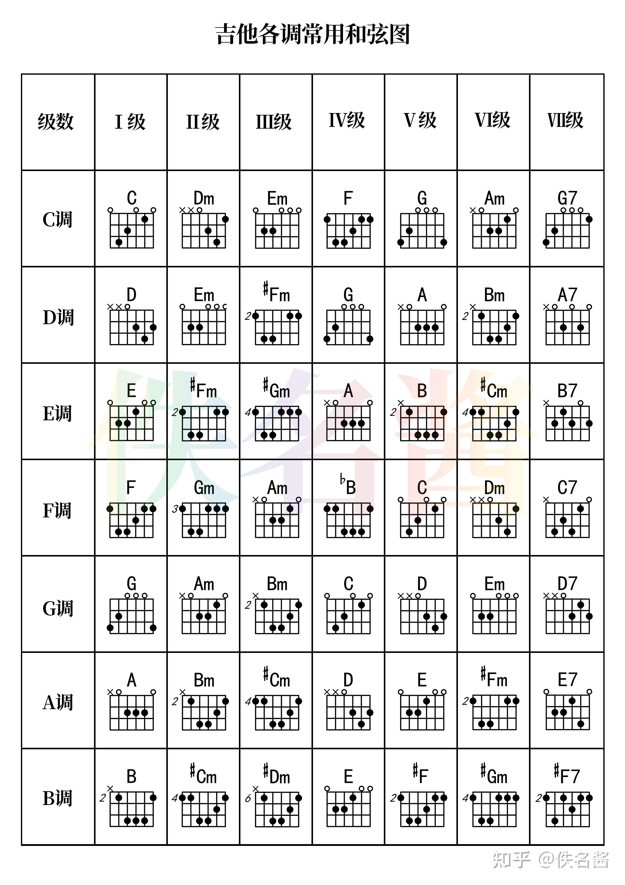

## 谱

[四和弦-吉他谱-吉他教程-求谱-Chord4](https://chord4.com/)

### 和弦图



### 黑洞里

C 调，降半调调弦

```
 Dm7           Dm7
你的太阳系 活在阳光里
 CM7              CM7
为何总是跟著不变的旧轨迹
Dm7           Dm7
我的一片地 藏在黑洞里
CM7              CM7
仿佛都是超乎意料的好东西
 Fm7            Fm7      Em7     Asus4
怎样叫你相信 怎样叫你也发现神秘的生命
         Dm7          Em7
也许太多猜疑 也许不够好奇
           FM7    G
也许是你的世界太真实
C            Em7  #Dm7  Dm7       CM7
闭上眼睛 我好想带你到我的星星 看我看的风景
      C        Em7 Am7
树上长爱情 河水洗回忆
 Dm7         /G
什么都可以 只要你愿意
C            Em7  #Dm7  Dm7       Em7 A
屏住呼吸 我好想带你离开这里 你不用飞机
Em7 Am7    Dm7  /G   C
只要放肆 万里以外更美丽

我越想靠近 你越想逃避
难道外星人是可怕的大骗子
那是织女星 那是牵牛星
只怪地球人有无聊的老传奇

怎样叫你相信 怎样叫你想跨过陌生的距离
也许太多猜疑 也许不够好奇
也许是你的世界太真实

闭上眼睛 我好想带你到我的星星 看我看的风景
树上长爱情 河水洗回忆
什么都可以 只要你愿意
屏住呼吸 我好想带你离开这里 你不用飞机
Em7 Am7    Dm7  /G   A
只要放肆 万里以外更加爱你

A^Bm7^#Cm7  F  /G   C        F  /G   C
放  开 你  双手的武器  抛弃你背后的历史
             GM7        #Fm7
因为在我住的黑洞里 从来没有引力
    F            E
从来不懂什么脚踏实地

A            #Cm7^Cm7  Bm7        A
闭上眼睛 我好想带你到我的星星 看我看的风景
    A       #Cm7  #Fm
树上长爱情 河水洗回忆
   Bm7           /E
什么都可以 只要你愿意
A        #Cm7^Cm7  Bm7
屏住呼吸 我好想带你离开这里
#Cm7  #Fm   #Cm7  #Fm
我没有证明 只能答应
  Bm7   /E   A
万里以外更美丽
#Cm7 #Fm    Bm7  /E    A
哦           我 在  黑洞里
```

### 无条件

C 调

```
C｜Am｜F｜C｜

　 ｜C　　  　　　 ｜Asus2　　　　 　　｜FM7　　 　　　　｜Am　  　　　　G
A1　(你)　何以始终不说(话)　尽管讲出不快(吧)　事与冀盼有落(差)　请不必惊(怕)
A2　(美)　难免总有些缺(憾)　若果不甘心去(问)　问到最尾叫内(心)　也长出裂(痕)
　　｜C　　　  　　　｜Em　　　　　　　｜F　　　　 　　　　｜G
A1　(我)　仍然会冷静聆(听)　仍然紧守于身(边)　  与你进退也共(鸣)
A2　(笑)　何妨与你又重(温)　仍然我说我庆(幸)　你永(远)胜过别(人)

　　　｜Dm　　　　　   　　｜Am　　　　 　　　　　　｜E　　　 　　　　　　｜Am　　　 　A
B1　时日(会)蔓延再蔓延　某些(不)可改变的改变　与一些(不)要发现的发现　就这么(放)大了缺(点)
B2　期待(美)没完爱没完　放开(不)必打算的打算　作一些(可)以约定的约定　就抱紧(以)后每一(天)
　　 　｜Dm　　　　  　　　｜Am　　　　  　　　　　｜F#dim7　  B7　 　｜Dm　  G
B1　来让(我)问谁可决定　那些(东)西叫作完美至善　我只懂(得)　爱(你)在每(天)　(　)
B2　其实(你)定然都发现　我有(很)多未达完美事情　我只懂(得)　再(努)力每(天)　(　)

　　　｜C　　　  　　｜Em　　  　　　｜Dm　　 　　　F　 　｜F/G　＝G   　Gadd11＝G7
当潮流(爱)新鲜　当旁人(爱)标签　幸得伴(著)你我　是(窝)心的自(然)　(　)　　(　)　(　)
　　　｜C　　　　  　｜Em　　 　   　｜Dm　　 　　　F　　｜F/G　 　G　　  　　　　｜C
当闲言(再)尖酸　给他妒(忌)多点　因世上(的)至爱　是(不)计较条(件)　(　)谁又可清楚看(见)

C｜Em｜F｜C｜

Repeat A2 / B2

　　　｜C　　　　  　｜Em　　  　　　｜Dm　　　　　F　 　　｜G
当潮流(爱)新鲜　当旁人(爱)标签　幸得伴(著)你我　是(窝)心的自(然)
　　　｜C　　　  　　｜Em　　 　　　｜Dm　  　　　　F　 　｜F/G　  G　　　　 　　｜C
当闲言(再)尖酸　给他妒(忌)多点　因世上(的)至爱　是(不)计较条(件)　(　)谁又可清楚看(见)

( C )｜Asus2 Am｜F｜C｜
```

## 歌单

练习（2025）

```ini
匆匆那年               一路向北               你离开的真相          
普通朋友               讨厌红楼梦             黄金之风              
山丘                   Shape of My Heart      水星记                
春日影                 老北京的小曲           男孩                  
十年                   才二十三               Counting Stars        
回留                   灰色轨迹               爱爱爱  
```

陈奕迅（2019）

```ini
我的快乐时代         今日                   落花流水              
歌颂                 十面埋伏               失忆蝴蝶              
阿牛                 七百年后               喜帖街                
远在咫尺             黄金时代               葡萄成熟时            
无条件               我们万岁               夕阳无限好            
活着多好             苦瓜                   陀飞轮                
倾城                 岁月如歌               垃圾                  
倒带人生             我什么都没有           抱拥这分钟            
你给我听好           你的背包               红玫瑰                
爱情转移             不要说话               淘汰 
```

麦浚龙（2020）

```ini
耿耿于怀             念念不忘               罗生门                
借火                 勇悍·17                雷克雅未克            
彳亍                 超生培欲              
```

周柏豪（2020）

```ini
百年不合               传闻                   够钟                  
宏愿                   必杀技                 小白                  
蓝血人                 还记得                
```

苏永康（2020）

```ini
那谁
```

谢安琪（2020）

```ini
年度之歌               喜帖街
```

王菲（2021）

```ini
暗涌                   百年孤寂               开到茶靡              
约定                   红豆                   匆匆那年              
暧昧                   笑忘书                 爱与痛的边缘          
容易受伤的女人         季候风                 
```

容祖儿（2022）

```ini
心淡                   黄色大门               东京人寿              
```

Beyond（2021）

```ini
不再犹豫               冷雨夜                 大地                  
灰色轨迹               再见理想               无尽空虚              
农民                   长城
```

吴雨霏（2021）

```ini
吴哥窟                 我本人
```

张敬轩（2022）

```ini
我的天                 Deadline               樱花树下              
约定                   少女的祈祷             心乱如麻              
春秋                   酷爱                  
```

梁博（2025）

```ini
男孩                   出现又离开             曾经是情侣            
日落大道               
```

方呆同（2025）

```ini
才二十三               Love Song              爱爱爱                
回留                   麦恩莉                 特别的人              
三人游                 四人游                 红豆                  
春风吹                 苏丽珍                 孤独患者              
小小虫                 爱在                   手拖手                
Rosy                   每个人都会             歌手与模特            
```

陶喆（2024）

```ini
蝴蝶                   二十二                 讨厌红楼梦            
普通朋友               
```

丁世光（2025）

```ini
蝴蝶山                 瘦子                   行李                  
```

万青（2023）

```ini
杀死那个石家庄人       秦皇岛                 大石碎胸口            
```

Oasis（2021）

```ini
Wonderwall            Stand by Me            Don't Look Back in Anger
```
