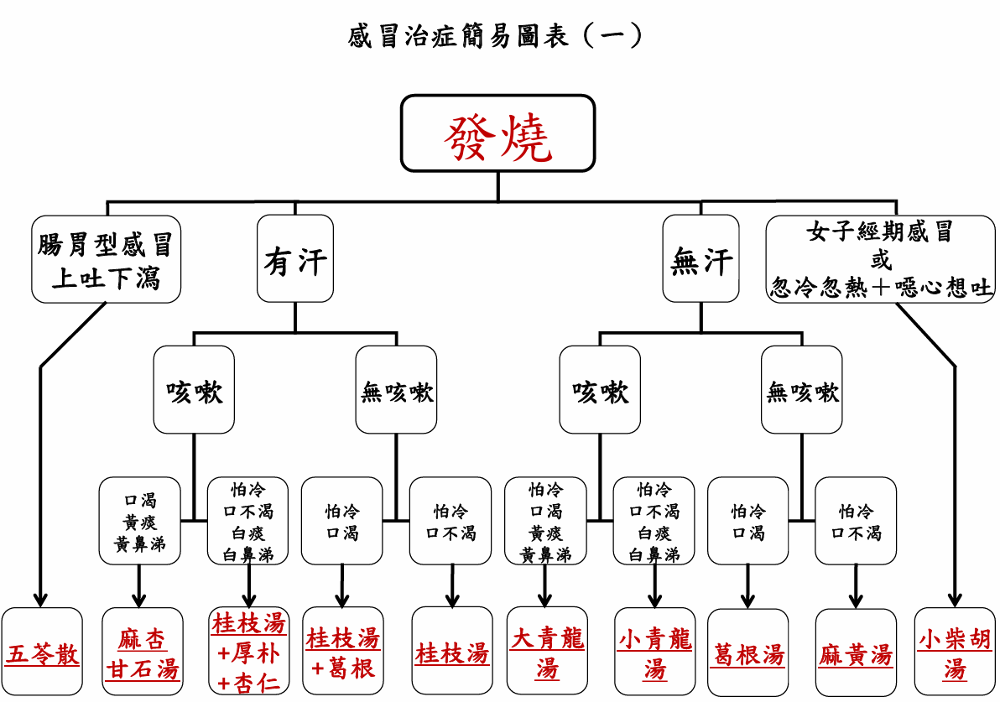
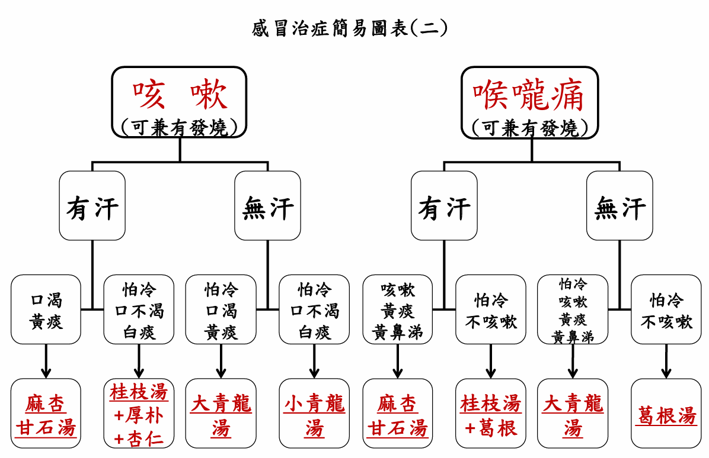
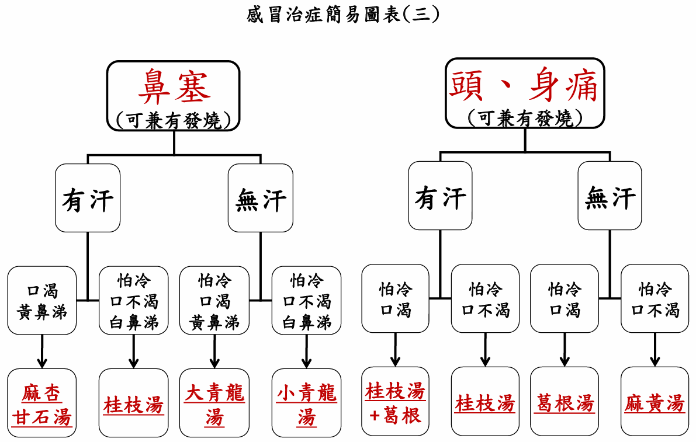
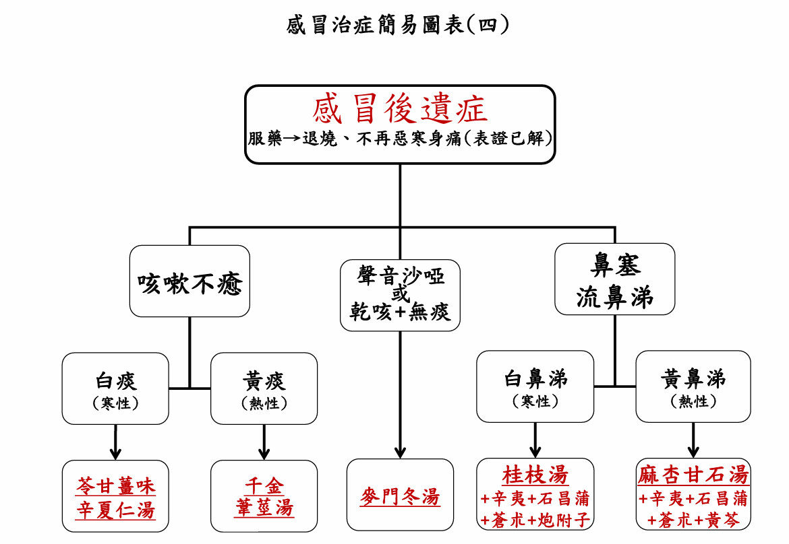

## 感冒治症简易图表

### 图表

請由最上方之有汗無汗開始讀起，再依症狀分支往下走到對應方劑為止（判斷重要性依序由上而下） 

### 附注

感冒治症簡易圖表附註

1. 發燒+有汗+口渴欲飲冷+怕熱 → 白虎湯（陽明熱證）
2. 腸胃型感冒
   - a. 發燒、頭痛、口渴欲飲水、但一喝就吐、或有（拉肚子）水瀉 → 五苓散
   - b. 發燒+瀉肚子（肛門有灼熱感+惡臭）→ 葛根芩連湯（陽明濕熱證）
   - c. 腸病毒/手足口病（施合一醫師經驗效方）→ 葛根芩連湯加五苓散
   - d. 施合一醫師腸胃型感冒治症：近日腸胃型感冒常用藥方 → 附子理中湯、黃連湯、胃苓湯
3. 發燒/咳嗽/喉嚨痛/鼻塞/頭身痛+無汗+口不渴+怕冷+四肢冰冷+疲累 → 麻黃附子細辛湯（少陰證）
4. 女子月經期間感冒宜小柴胡湯加減，或合方使用，若咳嗽加厚朴、杏仁，若喉嚨痛加葛根
5. 嚴重之喉嚨痛（伴有灼熱感），例如扁桃腺化膿，可再另加玄參、馬勃、重樓
6. 若為小青龍湯證，但表證（惡寒、發熱、頭身痛）不明顯 → 射干麻黃湯
7. 鼻塞嚴重可加辛夷、蒼朮、石菖蒲
8. 若咳嗽不癒，表示此人平時即多有痰飲體質；如（津虧）聲啞或乾咳無痰，表示   此人平時多晚睡、貪食炸烤食物，或服抗生素而傷到津液
9. 感冒後容易有後遺症者，請多運動，並維持良好生活作息及飲食習慣 

### 使用说明

药物选择：【科學中藥】使用方便，【水藥】藥效較強

科学中药使用方法

1. 每日服用三次，早中晚餐飯前（空腹）以溫開水送服
2. 若病情較重，可於睡前加服一次 

服用剂量

| 參考年齡     | 科學中藥劑量（公克） |
| ------------ | -------------------- |
| 1歲以下幼兒  | 0.3～0.5             |
| 1～3歲       | 0.5～1.5             |
| 3～6歲       | 1.5～2.0             |
| 6～10歲      | 3.0                  |
| 10～14歲     | 4.0                  |
| 14歲～18歲   | 5.0                  |
| 18歲以上成人 | 6.0                  |

感冒患者必須遵守原則

1. 飲食清淡
2. 少食肉最佳，復原速度將更迅速
3. 感冒癒後應在家多休息一天，可避免外出再次感冒 

科學中藥單方舆複方使用比例原则（以下採18歲成人為例，其餘年龄請依比例自行换算）

1. 每次服用總劑量6公克不變
2. 若使用單一种【複方】(如葛根)，用量即為6公克
3. 若同時使用【複方】及【單方】（如杏仁、厚朴），其中複方估5~4公克，單方则估1~2公克)
   - 舉例1：若為『麻杏甘石湯」證，則每次用量6公克
   - 舉例2：若為『小柴胡湯+葛根」證，比例採(5∶1)，假設喉嚨痛或口渴嚴重，可将比例调整為(4:2)
   - 舉例3：若為『桂枝湯+杏仁+厚朴』證，可依咳嗽嚴重程度調整比例(5∶0.5∶0.5)或(4∶1∶1)
   - 舉例4∶若為『葛根湯+玄参+馬勃+重樓』證，可使用比例(4:0.7∶0.7∶0.7)

湯藥使用方法

各藥方之参考劑量及使用法請詳見後列附件资料，實際使用量請依合格中醫師處方。小孩服用量依照舆成人體重之
比例，如60公斤成人需喝一碗，30公斤小孩则喝半碗感冒治症簡易圖表使用原则若對證下藥，病情多半24小時內可以明顯改善，如連續服用1~2日仍然無效時，應该轉方或停服，並立刻到诊所就醫，避免延誤病情

重要提醒：「浸泡膽巴」或「硫磺薰製」(二氧化硫）的中藥，等同含防腐劑一樣，都會嚴重損傷肝腎，請務必慎選药材

## 方剂

 [DeepSeek - 探索未至之境](https://chat.deepseek.com/)
